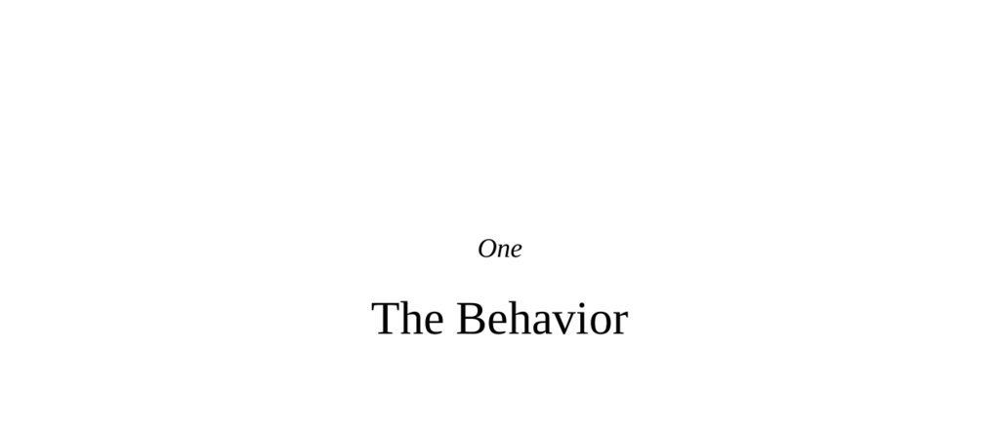

- **One**
  - **The Behavior**
    - The nervous system triggers behavior in response to stimuli occurring from seconds to millions of years prior.  
    - Central behavioral terms such as aggression, violence, compassion, and altruism involve complex and varying definitions across disciplines.  
    - Ideological battles and values distort meanings of key behavioral terms, complicating clear definitions.  
    - Different scientific fields define aggression in multiple ways, including offensive vs. defensive, reactive vs. instrumental, and hot-blooded vs. cold-blooded aggression.  
    - Positive behaviors like empathy, forgiveness, and altruism also present definitional challenges and overlap between moral and biological interpretations.  
    - The debate surrounds whether pure altruism exists, especially in acts like organ donation to strangers which often cause suspicion.  
    - Cold-blooded violence or goodness lacks affective participation, making it psychologically unsettling compared to hot-blooded, passionate acts.  
    - Neuroscientific and psychological studies show that context frames behaviors as good or bad, activating similar brain circuits for “right” acts in different settings.  
    - The chapter emphasizes context dependency in defining behaviors and frames the book’s focus as the biology underlying humans’ best and worst behaviors.  
    - For further reading, see Larissa MacFarquhar’s [The Kindest Cut](https://www.newyorker.com/magazine/2009/01/12/the-kindest-cut).
