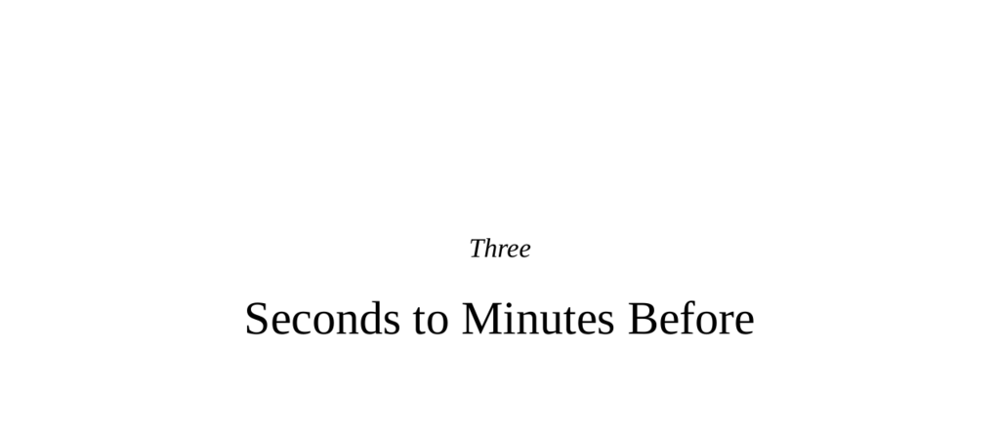

- **Three Seconds to Minutes Before**
  - **Universal Rules versus Knobby Knees**
    - Behaviorism focuses on universal stimulus-response rules and operant conditioning across species.  
    - Ethology emphasizes behavioral variety and species-specific adaptations observed in natural habitats.  
    - Behaviorists conducted experiments mainly on rats and pigeons using Skinner boxes.  
    - Ethologists study animals in natural conditions to understand adaptive value and evolution of behavior.  
    - See [Ethology - Britannica](https://www.britannica.com/science/ethology) for background.
  - **Sensory Triggers of Behavior in Some Other Species**
    - Auditory, visual, olfactory, and other sensory cues trigger animal behaviors such as mating and territorial displays.  
    - Some species detect sensory signals outside human perception, e.g., infrared vision, electric fields, ultrasonic sounds.  
    - Sensory modalities with stronger limbic access often dominate emotional triggers (e.g., olfaction in rodents).  
    - The chapter highlights the importance of studying communication in an animal’s own sensory “language.”  
    - See [Sensory Ecology - Oxford Research Encyclopedia](https://oxfordre.com/neuroscience/view/10.1093/acrefore/9780190264086.001.0001/acrefore-9780190264086-e-195) for further details.
  - **Under the Radar: Subliminal and Unconscious Cuing**
    - Many sensory cues influence behavior below conscious awareness, including subliminal visual, auditory, and olfactory signals.  
    - Subliminal cues affect preferences, pain perception, and decision making, often without recognition by the subject.  
    - racial cues activate the amygdala and fusiform face area differently, correlating with implicit biases.  
    - The amygdala responds quickly to perceived threats, sometimes inaccurately, before cortical inhibition occurs.  
    - See [Implicit Bias and the Brain](https://implicit.harvard.edu/implicit/takeatest.html) for related research.
  - **Interoceptive Information**
    - The brain continuously receives internal bodily signals such as hunger, pain, and muscle tension that influence emotions and behavior.  
    - The James-Lange theory proposes feelings arise from interpreting physiological states, though strict specificity is debated.  
    - Pain amplifies aggression in aggressive individuals but can reduce it in others.  
    - Cognitive exertion reduces self-control, increasing aggression and reducing empathy due to metabolic costs in the frontal cortex.  
    - See [Interoception - Current Biology](https://www.cell.com/current-biology/fulltext/S0960-9822(19)30135-6) for a review.
  - **Unconscious Language Effects**
    - Words and labels unconsciously prime cooperative or competitive behavior, bias moral judgments, and affect decision making.  
    - The framing effect influences choices, such as drug approval rates depending on survival versus mortality phrasing.  
    - Priming with prosocial or aggressive words shifts immediate social behaviors without conscious awareness.  
    - Jury decisions and moral evaluations are affected by subtle changes in wording.  
    - See [Framing Effects in Decision Making](https://www.ncbi.nlm.nih.gov/pmc/articles/PMC2955104/) for more information.
  - **Even Subtler Types of Unconscious Cuing**
    - Environmental cues such as flags, clothing colors, or group language affect social attitudes and helping behaviors.  
    - Group membership primes influence performance on tasks depending on associated stereotypes.  
    - The bystander effect varies by situation; dangerous emergencies see increased intervention with crowd size.  
    - Male behavior changes in presence of women, favoring risk-taking and aggression or generosity depending on mating strategy context.  
    - See [Bystander Effect - Psychology Today](https://www.psychologytoday.com/us/basics/bystander-effect) for elaboration.
  - **A Wonderfully Complicating Piece of the Story**
    - The brain modulates sensory organ sensitivity, making some stimuli more salient under conditions such as stress or hunger.  
    - Amygdala damage reduces attention to eyes and impairs fear recognition; normal brains bias gaze toward eyes.  
    - Psychopaths show amygdala abnormalities, look less at eyes, and have impaired fear recognition.  
    - Culture shapes perception, with individualist and collectivist cultures differing in focus on focal objects versus contextual background.  
    - See [Culture and Perception](https://www.apa.org/monitor/2010/11/culture) for related cultural effects.  
  - **Conclusions**
    - The brain integrates complex external and internal information over seconds to minutes, shaping behavior largely unconsciously.  
    - Subliminal sensory cues, interoception, language, social environment, and cultural context all influence pro- and antisocial actions.  
    - Human decision making is less rational and autonomous immediately preceding significant behaviors than commonly assumed.  
    - Understanding these influences is crucial for interpreting human behavior in social and legal contexts.  
    - For a comprehensive overview, see [Social Neuroscience and Behavior](https://www.ncbi.nlm.nih.gov/books/NBK11448/).
