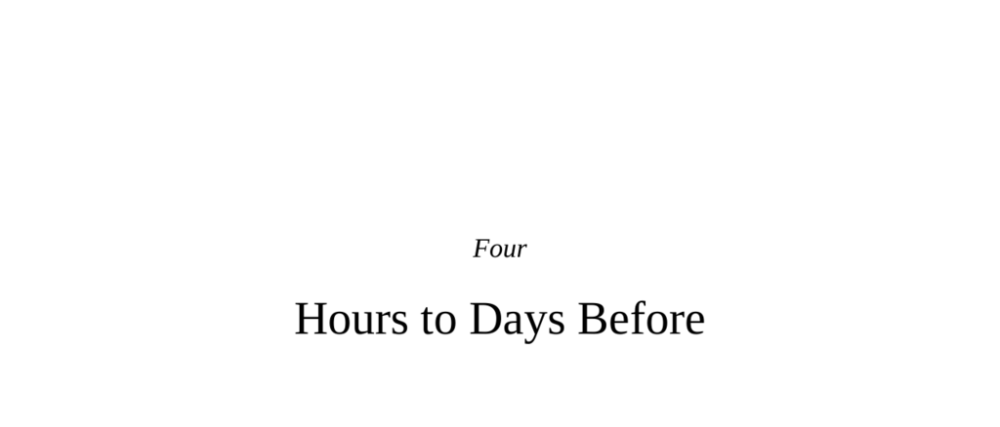

- **We now take the next step back in our chronology, considering events from hours to days before**
  - This section introduces the focus on hormonal influences on behavior over hours to days.
  - It emphasizes testosterone’s complex relationship with aggression and oxytocin’s nuanced role in prosociality.
  - Readers unfamiliar with endocrinology are referred to appendix 2.
- **Testosterone’s bum rap**
  - Testosterone is produced via the hypothalamic/pituitary/testicular axis affecting many body cells including neurons.
  - Testosterone is commonly linked to aggression, especially since males with higher testosterone in many species are more aggressive.
  - The causality between testosterone and aggression is complex and contingent rather than direct or exclusive.
  - [The Challenge Hypothesis](https://en.wikipedia.org/wiki/Challenge_hypothesis)
- **Correlation and Causality**
  - Males in diverse species generally exhibit more aggression correlating with higher testosterone levels during adolescence and mating seasons.
  - Castration reduces aggression but rarely to zero, indicating testosterone-independent aggression.
  - Testosterone supplementation after castration restores aggression levels, yet individual testosterone fluctuations do not reliably predict aggression.
  - High supraphysiological testosterone doses increase aggression, often in predisposed individuals.
- **Subtleties of Testosterone Effects**
  - Testosterone reduces empathic facial microexpressions and impairs emotion recognition.
  - It increases confidence, optimism, risk-taking, impulsivity, and reduces fear and anxiety.
  - Testosterone activates reward pathways involving dopamine in the ventral tegmentum and nucleus accumbens.
  - Its behavioral effects can be interpreted oppositely depending on context.
- **Contingent Testosterone Effects**
  - Testosterone amplifies preexisting social tendencies rather than creating new aggression patterns.
  - It heightens amygdala responses selectively to angry faces and provocation but not baseline aggression or selfishness.
  - Shortens neuronal refractory periods, increasing responsiveness to social stimuli already activating the amygdala.
- **A Key Synthesis: The Challenge Hypothesis**
  - Testosterone rises during social challenges, increasing behaviors necessary to maintain status, not simply aggression.
  - Testosterone levels rise during dominance restructuring, competitive sports, and even when watching favored teams win.
  - Testosterone encourages context-appropriate behavior—aggression or generosity as suits maintaining social rank.
  - Beliefs about testosterone affect behavior independently of actual hormone levels.
- **Oxytocin and Vasopressin: A Marketing Dream**
  - Oxytocin and vasopressin are closely related neuropeptides evolved from a gene duplication event.
  - Initially considered peripheral hormones, they also act extensively in the brain affecting social behavior.
  - Oxytocin prepares females for maternal behavior and bonding; vasopressin supports paternal care in species with male caregiving.
  - They are integral to pair bonding in monogamous mammals and affect human bonding and social interactions.
  - [Oxytocin and social bonding](https://www.ncbi.nlm.nih.gov/pmc/articles/PMC3191273/)
- **Basics**
  - Oxytocin stimulates uterine contraction and milk letdown; vasopressin regulates kidney water retention.
  - Brain projections of hypothalamic neurons releasing these neuropeptides affect regions involved in reward, emotion, and social cognition.
- **Neurobiologists Take Notice**
  - Oxytocin induces maternal behaviors in virgin rats and facilitates mother-infant bonding via olfactory learning.
  - Vasopressin enhances paternal behaviors in paternal species.
  - Species differences in receptor density, not neuropeptide release amount, determine pair-bonding strength in voles.
  - Genetic variants in vasopressin receptors influence social bonding tendencies across species.
- **Human Studies**
  - Circulating oxytocin rises during early human couple bonding and predicts relationship satisfaction.
  - Intranasal oxytocin improves couple communication during conflict and strengthens pair bonds unconsciously.
  - Oxytocin facilitates interspecies bonding illustrated by mutual oxytocin release in dog-human interactions.
- **Prosociality Versus Sociality**
  - Oxytocin and vasopressin enhance social competence and accuracy in reading emotional cues more than universal prosociality.
  - They improve gender-specific social cognition: women in kinship detection, men in dominance assessment.
  - Variations in oxytocin receptor genes affect social processing regions and are linked to autism spectrum disorder traits.
- **Contingent Effects of Oxytocin and Vasopressin**
  - Effects depend on gender, individual predispositions, context, and cultural background.
  - Oxytocin increases giving only in those already charitably inclined.
  - It enhances support-seeking behavior during stress in culturally specific ways.
- **The Dark Side of These Neuropeptides**
  - Oxytocin promotes maternal aggression defending offspring.
  - Vasopressin increases aggression in paternal prairie voles, especially those already aggressive.
  - Oxytocin can reduce cooperation and increase envy or gloating when interacting with strangers.
  - Oxytocin promotes in-group favoritism but ethnocentrism and xenophobia toward out-groups.
  - It exaggerates unconscious biases and modulates moral decisions favoring in-group members.
- **The Endocrinology of Aggression in Females**
  - Female hormone ratios matter more than absolute levels, complicating neuroendocrinology.
  - Hormone levels fluctuate dynamically, particularly around ovulation and childbirth.
  - Female-female aggression is often adaptive and evolutionarily selected, not mere byproduct of androgens.
- **Maternal Aggression**
  - Aggression rises in females during pregnancy, peaking near birth, linked to the risk of infanticide.
  - Estrogen and progesterone facilitate maternal aggression via increased oxytocin release in brain regions.
  - Estrogen has receptor-specific opposing effects on aggression and empathy.
  - Progesterone can both promote maternal aggression (with estrogen) and decrease aggression/anxiety when alone.
- **Bare-Knuckled Female Aggression**
  - Contrary to stereotypes, females engage in aggressive competition for resources and reproductive advantages.
  - Sex-reversal species show females with androgen levels equal or exceeding males and more aggression.
  - Androgen receptor distribution differs between sexes, implying selective evolution.
  - Female aggression relates more to reproductive context than outright androgen levels or fluctuations.
- **Perimenstrual Aggression and Irritability**
  - Premenstrual syndrome (PMS) is a biological reality with mood/behavioral shifts but is often socially pathologized.
  - Evidence supports biological mood changes surrounding menstruation in primates and humans.
  - Theories on PMS causes include progesterone withdrawal and low beta-endorphin, but there is limited consensus.
  - Little evidence supports widespread increased aggression during PMS, although rare severe cases affect behavior.
- **Stress and Imprudent Brain Function**
  - Stress disrupts homeostasis, initiating neural and endocrine responses to maintain it.
  - The acute stress response mobilizes energy and enhances cognition; chronic psychological stress causes health problems.
- **The Basic Dichotomy of the Acute and the Chronic Stress Response**
  - Acute stress triggers fight-or-flight mechanisms optimizing survival.
  - Chronic stress leads to metabolic syndrome, hypertension, reproductive suppression, immunosuppression.
  - Chronic stress is maladaptive in socially complex primates due to anticipatory psychological stress.
- **A Brief Digression: Stress That We Love**
  - Moderate, transient stress in a safe context is stimulating and enjoyable.
  - The inverted U concept describes stress effects: too little causes boredom; moderate improves function; too much impairs it.
- **Sustained Stress and the Neurobiology of Fear**
  - Stress increases amygdala excitability, especially in basolateral amygdala, enhancing fear learning.
  - Stress strengthens fear memory consolidation but impairs extinction by weakening PFC control.
  - Positive feedback loop between stress hormones and amygdala excitability exists.
- **Sustained Stress, Executive Function, and Judgment**
  - Chronic stress impairs working memory, attention shifting, and frontal cortical synchronization.
  - Stress causes perseveration and habitual behaviors, reducing adaptive flexibility.
  - Stress increases impulsivity and alters risk-taking differently by gender.
  - Poor incorporation of new information under stress impairs risk assessment.
- **Sustained Stress and Pro- and Antisociality**
  - Stress heightens fear, muddles thinking, reduces empathy, and impairs prosocial behavior.
  - Stress-induced displacement aggression is common and lowers stress hormones in aggressive individuals.
  - Economic and societal stress correlate with increased domestic violence and displacement aggression.
  - Stress increases egoistic moral decisions in emotionally intense personal scenarios.
- **Some Important Debunking: Alcohol**
  - Alcohol induces aggression only in individuals predisposed to aggression or who believe alcohol causes aggression.
  - Alcohol’s effects vary across individuals; it does not universally increase aggression.
- **Summary and Some Conclusions**
  - Hormones have versatile and prolonged effects influencing behaviors relevant to aggression and sociality.
  - Testosterone amplifies preexisting aggressive or status-maintaining behaviors depending on context; it does not directly cause aggression.
  - Oxytocin and vasopressin promote bonding, anxiety reduction, and prosocial behavior limited to in-group members.
  - Female aggression is biologically adaptive and hormonally complex, with nuanced effects of estrogen, progesterone, and androgens.
  - PMS-related aggression is rare and often socially exaggerated.
  - Sustained stress adversely affects amygdala and frontal cortex functions, impairing cognition, empathy, and increasing reactive aggression.
  - Alcohol-related aggression requires predisposition and belief factors; it is not a simple cause-effect.
  - Hormonal effects are contingent and facilitative rather than deterministic or causative.
  - Reducing stress is beneficial for individual and social well-being.
