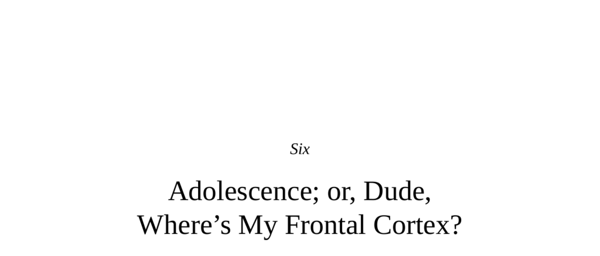

- **Introduction to Adolescence and Frontal Cortex Development**
  - The frontal cortex is the last brain region to fully mature, completing development in the mid-twenties.
  - Adolescent behavior is heavily influenced by the asynchronous maturation of the frontal cortex relative to limbic, autonomic, and endocrine systems.
  - This biological delay explains the characteristic risk-taking, impulsivity, and emotional intensity seen in adolescents.
  - Further reading: [Neuroscience of Adolescence](https://www.ncbi.nlm.nih.gov/pmc/articles/PMC2971509/)

- **The Reality of Adolescence**
  - Adolescence is a distinct biological phase, not merely a cultural construct.
  - Traditional cultures recognize adolescence as a transitional period with some adult rights and responsibilities.
  - The Western concept of adolescence is the longest and often characterized by intergenerational conflict.
  - Adolescence is not universally a turbulent period; many navigate it without major psychological issues.
  - Further reading: [Adolescence as a Cultural Construct](https://www.tandfonline.com/doi/abs/10.1080/00918369.2009.10112946)

- **The Nuts and Bolts of Frontal Cortical Maturation**
  - Adolescent frontal cortex shows decreased gray matter volume due to synaptic pruning optimizing neural circuits.
  - Myelination of axons in the frontal cortex increases throughout adolescence, enhancing connectivity and communication speed.
  - Hormonal fluctuations during puberty alter frontal cortex structure and neurotransmitter receptor levels.
  - Early adolescent frontal cortex is less efficient and partly compensated by other brain regions such as the ventral striatum.
  - Further reading: [Neural Pruning and Myelination](https://www.ncbi.nlm.nih.gov/pmc/articles/PMC4500787/)

- **Frontal Cortical Changes in Cognition in Adolescence**
  - Adolescents improve working memory, executive organization, and inhibitory control during adolescence.
  - Increasing frontal lobe activity during cognitive tasks predicts better accuracy in adolescents.
  - Adolescents show enhanced mentalization and improved abstract cognitive perspective taking.
  - Further reading: [Cognitive Development in Adolescents](https://www.sciencedirect.com/science/article/abs/pii/S1053811917308779)

- **Frontal Cortical Changes in Emotional Regulation**
  - Older adolescents experience more intense emotions due to greater amygdala activation and less vmPFC regulation.
  - Reappraisal strategies improve during adolescence, shifting from ventral striatum engagement to prefrontal cortex regulation.
  - Enhanced emotional regulation correlates with decreasing amygdala reactivity as adolescence progresses.
  - Further reading: [Emotion Regulation in Adolescence](https://www.frontiersin.org/articles/10.3389/fpsyg.2016.01957/full)

- **Adolescent Risk Taking**
  - Adolescents show less prefrontal activation during risky decisions, leading to poorer risk assessment.
  - Feedback about bad outcomes is often discounted by adolescents compared to adults.
  - Adolescents display increased novelty seeking and sensation seeking, linked to dopaminergic reward system changes.
  - The adolescent ventral striatum shows exaggerated activity for large rewards and aversion to small rewards.
  - Further reading: [Risk Taking and Reward in Adolescence](https://journals.sagepub.com/doi/10.1177/1745691614528522)

- **Peers, Social Acceptance, and Social Exclusion**
  - Peer presence significantly increases adolescent risk-taking behavior, mediated by decreased vmPFC and increased ventral striatal activity.
  - Adolescents have a pronounced need to belong, reflected in larger social networks and emotional responsiveness.
  - Social exclusion elicits stronger negative emotional and neural responses in adolescents due to weaker vlPFC regulation.
  - Neural correlates of peer conformity include premotor activation linked to imitation of emotional expressions.
  - Further reading: [Peer Influence in Adolescence](https://www.sciencedirect.com/science/article/abs/pii/S0149763416304009)

- **Empathy, Sympathy, and Moral Reasoning**
  - Adolescents excel at first-person perspective taking but are less proficient than adults at third-person perspective.
  - Moral reasoning in adolescence shifts from egalitarian to meritocratic but remains less complex than in adults.
  - Adolescents increasingly differentiate intentional from accidental harm, engaging frontal areas more in moral judgment.
  - Intense empathic responses can lead to personal distress, which hampers prosocial action unless regulated effectively.
  - Further reading: [Adolescent Moral Development](https://www.sciencedirect.com/science/article/abs/pii/S0272735816301719)

- **Adolescent Violence**
  - Violence peaks in late adolescence and early adulthood and is associated with emotional intensity, peer influence, and immature frontal cortex function.
  - Adolescent violence is not directly caused by testosterone surges or distinct neurobiology from adult violence.
  - U.S. Supreme Court rulings recognize adolescents’ reduced maturity and responsibility due to poor self-regulation and judgment.
  - Further reading: [Adolescent Violence and Brain Development](https://jamanetwork.com/journals/jamapsychiatry/fullarticle/1107471)

- **A Final Thought: Why Can’t the Frontal Cortex Just Act Its Age?**
  - Delayed frontal cortex maturation is likely an evolutionary adaptation enabling plasticity and experience-dependent development.
  - The frontal cortex’s late development allows complex social intelligence and emotional regulation to be shaped by life experience rather than genetics alone.
  - Social success in primates correlates more with frontal cortex-mediated social skills than with physical dominance.
  - This developmental delay improves the brain’s capacity for nuanced decision-making and social navigation in adulthood.
  - Further reading: [Evolutionary Perspectives on Brain Development](https://www.ncbi.nlm.nih.gov/pmc/articles/PMC3657685/)
