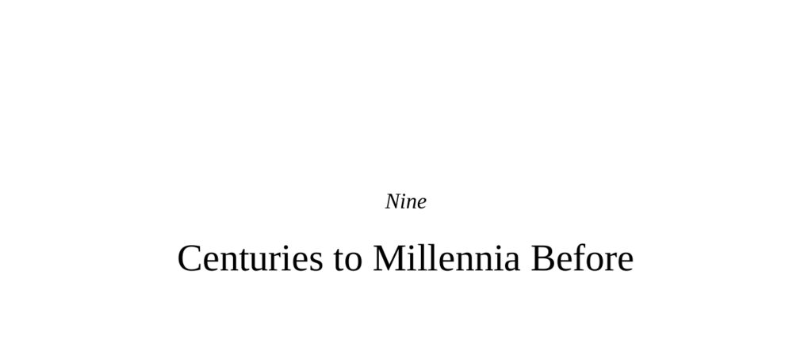

- **Nine Centuries to Millennia Before**
  - **Introductory Discussion on Sex Differences in Math Ability**
    - Males outperform females at mathematics in extreme score percentiles, evidenced by an 11:1 boys-to-girls ratio at the highest SAT math percentile in 1983.  
    - Testosterone influences brain development related to math skills, but cultural gender equality reduces or eliminates this discrepancy.  
    - Cross-national data in 40 countries show more gender-equal countries display smaller math score differences; Iceland girls outperform boys.  
    - Culture shapes behavior over long timescales, with historical examples linking corruption, population density, and agricultural adoption to modern sociopolitical outcomes.  
    - See [Culture, Gender, and Math](https://bit.ly/2o88s4O).
  - **Definitions, Similarities, and Differences in Culture**
    - Edward Tylor’s classical definition: culture encompasses knowledge, belief, customs, and habits acquired as a member of society.  
    - Nonhuman animals like chimpanzees exhibit tool use with social transmission but lack cumulative cultural progression.  
    - Contemporary anthropologists emphasize culture as affecting ideas, symbols, and moral emotions, often restricting full cultural status to humans.  
    - Donald Brown lists numerous human cultural universals, including marriage, language, art, and moral distinctions.  
    - Cross-cultural differences yield breathtaking disparities in life expectancy, literacy, violence rates, and gender equality.  
  - **Collectivist Versus Individualist Cultures**
    - Collectivist cultures emphasize group harmony, interdependence, and conformity; individualist cultures prioritize autonomy and personal achievement.  
    - Psychological and neural differences manifest: East Asians show less self-focused medial prefrontal activation and greater holistic perception.  
    - Ecological and historical factors influence these cultural styles—Asian rice cultivation requires cooperative labor, fostering collectivism; U.S. immigration and frontier settlement promote individualism.  
    - Genetic variant DRD4 7R, linked to novelty seeking, is rare in East Asia but common in populations with high migratory histories, correlating with cultural styles.  
    - See [Evidence of Positive Selection Acting at the Human Dopamine Receptor D4 Gene Locus](https://bit.ly/2nsuHz9).
  - **Pastoralists and Southerners**
    - Nomadic pastoralists inhabit harsh environments, with cultures emphasizing militarism, warrior status, polygamy, and authoritarian parenting.  
    - Pastoralist religions favor monotheism with interventionist gods valuing valor and war.  
    - Cultures of honor emphasize retributive violence to protect reputation, prominently seen in the U.S. South with high rates of rural, honor-related violence.  
    - Empirical studies show Southerners exhibit elevated testosterone and stress responses to social provocation relative to Northerners.  
    - Honor killings predominantly occur in traditional Muslim, Hindu, and Sikh communities targeting young women resisting patriarchal norms.  
    - See [Culture of Honor: The Psychology of Violence in the South](https://bit.ly/2neHKTg).
  - **Stratified Versus Egalitarian Cultures**
    - Inequality emerged with agriculture, animal domestication, surplus production, and inheritance systems, generally favoring stratified cultures.  
    - Stratified societies exhibit less social capital, trust, cooperation, and participation in organizations compared to egalitarian cultures.  
    - Higher income inequality correlates with worse health, increased psychosocial stress, and amplified violent crime.  
    - Two explanatory models: psychosocial stress theory (lack of social support increases stress hormones) and neomaterialist theory (wealthy secede from public goods, worsening public infrastructure).  
    - Income inequality exacerbates antisocial punishment and bullying in economic games.  
  - **Population Size, Density, and Heterogeneity**
    - Majority of humans now live in urban areas, generally improving health and wealth, while fostering innovation and social networks.  
    - Larger populations increase amygdala reactivity to social stress and require mechanisms such as third-party punishment and belief in moralizing "Big Gods."  
    - Higher population densities correlate with cultural tightness—strict norms and autocratic governance—both presently and historically.  
    - John Calhoun’s rat experiments erroneously linked crowding with social pathology; in humans, density effects on violence vary widely.  
    - Ethnic heterogeneity outcomes depend on spatial distribution of groups; patch size and border clarity predict intergroup violence, as shown in pre-war Balkans analyses.  
    - See New England Complex Systems Institute study on ethnic patch size and conflict.
  - **The Residues of Cultural Crises**
    - Chronic threats such as food scarcity, environmental degradation, disease, and frequent pandemics increase cultural tightness and restrict openness to outsiders.  
    - Climate phenomena like El Niño contribute to civil conflict by inducing drought and food shortages.  
    - Droughts can reduce aggression by increasing survival demands in traditional societies and baboons.  
    - Global warming is projected to increase both interpersonal and group violence substantially by 2050 due to heat stress and resource depletion.  
    - See Jared Diamond’s *Collapse: How Societies Choose to Fail or Succeed*.
  - **Religion**
    - Religion evolves from human social brain adaptations, fostering in-group cooperation through moralizing gods and rituals.  
    - Religious systems vary widely in deity number, gender, morality, afterlife beliefs, and goals concerning expansion or retention.  
    - Ecological factors influence religion: desert cultures favor monotheism; pastoralists associate gods with war; large societies foster “Big Gods.”  
    - Religion effectively transmits cultural values and shapes the spectrum of human prosocial and antisocial behaviors.  
  - **Hobbes or Rousseau**
    - Anatomically modern humans date to about 200,000 years ago; behavioral modernity arose 40,000 to 50,000 years ago; agriculture 12,000 years ago.  
    - Archaeological evidence from mass graves and trauma suggests prehistoric warfare dating back over 12,000 years.  
    - Keeley and Pinker argue for prehistoric violence’s ubiquity; critics contend selective data use, alternative explanations, and variable evidence.  
    - Contemporary tribal societies almost universally engage in warfare, with lethal outcomes and some support for reproductive advantages for successful warriors.  
    - Controversies exist over statistics and interpretations, notably concerning the Yanomamö studied by Napoleon Chagnon, and counter-evidence from other tribal groups.  
    - See *War Before Civilization: The Myth of the Peaceful Savage* by Lawrence Keeley and *The Better Angels of Our Nature* by Steven Pinker.
