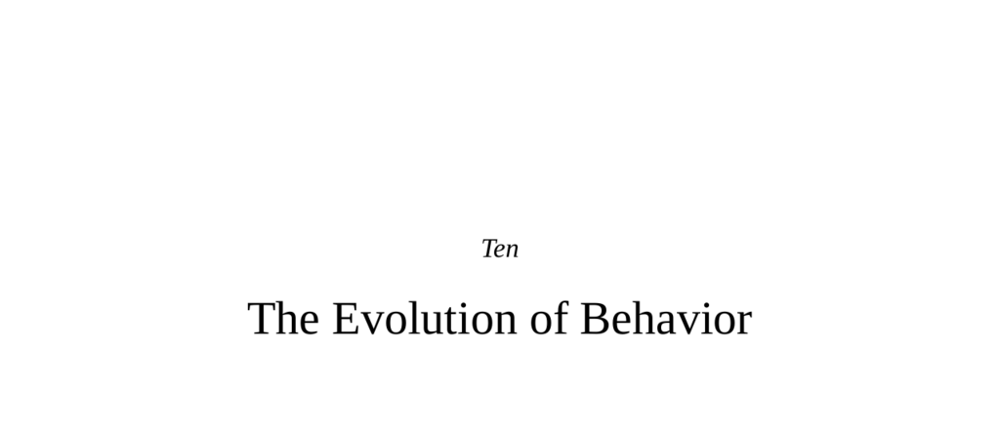

- **The Evolution of Behavior**
  - **Evolution 101**
    - Evolution requires heredity, mutation/recombination causing variation, and differential fitness increasing fit variants in populations.
    - Common misconceptions include survival of the fittest, directional complexity increase, preadaptations selection, species being "better" than extinct ones, and evolution as "just a theory".
    - Evidence for evolution includes observed gene frequency changes, fossil intermediates, molecular homology, geographic distributions, and vestigial structures.
    - See [Dobzhansky's evolution principle](https://www.nature.com/scitable/topicpage/nothing-in-biology-makes-sense-except-in-the-468) for foundational context.
  
  - **Evolution Sculpts Traits**
    - Natural selection optimizes traits for reproduction, including behavior alongside anatomy and physiology.
    - Sexual selection and natural selection may oppose; traits favored by one may be costly in the other.
    - Multiple versions of traits can be maintained by frequency-dependent or balanced selection.
    - For example, large vs. small horns in sheep reflect trade-offs between dominance and survival costs.

  - **Behavior Can Be Shaped by Evolution**
    - Natural selection influences behavioral traits to be adaptive, similar to physiological traits.
    - Sociobiology studies the evolutionary optimization of social behavior, with evolutionary psychology as an offshoot.
    - See [E.O. Wilson's Sociobiology](https://www.penguinrandomhouse.com/books/713410/sociobiology-by-edward-o-wilson/).

  - **The Demise of Group Selection**
    - The idea that animals behave for the good of the species (group selection) is rejected by empirical and theoretical work.
    - Key figures (Williams, Hamilton) showed group selection incompatible with standard genetic systems except in eusocial insects.
    - Animals behave to maximize gene copies, not the species' benefit; classic example is the old wildebeest situation debunked.
    - [Williams 1966 on group selection](https://www.nature.com/articles/2111043a0) elaborates on this topic.

  - **Individual Selection**
    - Individual selection explains behavior that maximizes personal reproductive success.
    - Infanticide in langurs, lions, and other species exemplifies competitive individual selection.
    - Females have evolved counterstrategies like pseudoestrus and the Bruce effect to mitigate male infanticide.
    - Humans show parallels in stepparent abuse ("Cinderella effect") linked to individual genetic interests.
    - For more, see [Hrdy's work on primate infanticide](https://www.ncbi.nlm.nih.gov/pmc/articles/PMC1693282/).

  - **Kin Selection**
    - Kin selection theory quantifies altruism weighted by genetic relatedness (Hamilton's rule).
    - Animals preferentially cooperate with closer relatives, demonstrated in nursing, grooming, and alarm calling across species.
    - Pheromonal signals (MHC genes) facilitate innate kin recognition in rodents.
    - Humans show cultural kinship systems and behaviors reflecting kin selection but often with cognitive and irrational components.
    - See [Hamilton's original kin selection paper](https://www.sciencedirect.com/science/article/abs/pii/S0022519369910684).

  - **Recognizing Relatives**
    - Kin recognition uses innate systems (pheromones), sensory imprinting, or cognitive inference depending on species.
    - Green-beard effect theorizes cooperation based on conspicuous shared traits rather than full genealogical relatedness.
    - Humans exhibit green-beard traits manifesting as parochialism and xenophobia.
    - Refer to [green-beard gene theory](https://www.nature.com/articles/nrg2329) for details.

  - **Reciprocal Altruism**
    - Reciprocal altruism explains cooperation among unrelated individuals based on mutual benefit and expected reciprocation.
    - The iterated Prisoner's Dilemma model clarifies when cooperation or defection is optimal.
    - The Tit for Tat strategy features initial cooperation, punishing defectors, forgiveness, and simplicity.
    - Signal errors can cause breakdowns in reciprocity; modified strategies address these issues.
    - Empirical analogues exist in fish and mammals, though direct proof in animals remains limited.
    - For foundational reading, see Trivers' paper on reciprocal altruism ([1971](https://www.sciencedirect.com/science/article/abs/pii/S0022519371900298)).

  - **Starting Cooperation**
    - Cooperation among defectors is difficult to establish without initial clusters of cooperators.
    - Green-beard traits and spatial proximity help cooperators find each other and propagate cooperation.
    - Founder populations encourage cooperation via inbreeding and kin selection, supporting cooperation spread.
    - This problem is central to the evolution of sociality and is revisited in the final chapter.

  - **Standing on Three Legs**
    - Three foundations of behavioral evolution: individual selection, kin selection, and reciprocal altruism.
    - These explain behaviors like infanticide, kin cooperation, and altruism toward nonrelatives.
    - Examples include vampire bats feeding unrelated colony members.
    - This triad forms a model for understanding social behavior across species.

  - **Pair-Bonding Versus Tournament Species**
    - Species with sexually dimorphic males (tournament species) exhibit high male-male aggression, high variance in mating success, and low parental investment.
    - Pair-bonding species have less sexual dimorphism, more male parental care, selective mating, and more cooperative breeding.
    - Traits cluster logically within species; humans fall intermediate between these extremes.
    - See [Smith 1984 on mating systems](https://www.journals.uchicago.edu/doi/10.1086/284369).

  - **Parent-Offspring Conflict**
    - Conflicts arise because offspring and parents have partially divergent genetic interests.
    - Examples include weaning conflict in primates and metabolic negotiations between fetus and mother.
    - Hormonal mechanisms manage maternal-fetal nutrient allocation.

  - **Intersexual Genetic Conflict**
    - Paternal and maternal imprinted genes engage in an evolutionary tug-of-war affecting fetal growth.
    - Tournament species exhibit more imprinted genes favoring fetal resource acquisition, while pair-bonders exhibit less.
    - Human imprinting patterns are intermediate.
    - Haig's work on imprinting explains these phenomena ([Haig 1996](https://www.nature.com/articles/ng1096-365)).

  - **Multilevel Selection**
    - Debate exists on the primary level of selection: gene, genome, phenotype, or groups.
    - Dawkins champions gene-level selection ("selfish gene"), others emphasize phenotypic selection.
    - Multilevel selection embraces multiple concurrent levels (gene to group).
    - Evidence shows group competition can favor traits maladaptive at individual level but beneficial at group level.
    - See [Wilson 2012 on multilevel selection](https://www.ncbi.nlm.nih.gov/pmc/articles/PMC3442333/).

  - **The Resurrection of Group Selection**
    - Neo-group selection revises earlier discredited group selection ideas with scientific rigor.
    - Cooperation at group-level can evolve despite individual costs if group competition is intense.
    - Human cultural practices intensify between-group selection via ethnocentrism and warfare.
    - David Sloan Wilson and E.O. Wilson collaborated in reframing sociobiology to incorporate multilevel selection.

  - **And Us**
    - Humans share ~98-99% DNA with bonobos and chimps, but are not descended directly from either.
    - Human behaviors do not fully conform to either pair-bonded or tournament species extremes.
    - Humans show mixed sexual dimorphism measures and mating patterns.
    - Male violence related to reproductive competition exists, but many forgo reproduction for ideology.
    - Human behavior reflects complex evolutionary interplay beyond single models.

  - **Individual Selection in Humans**
    - Examples include polygamous reproductive success in historical figures and male-male competition.
    - The Cinderella effect suggests stepparents more likely to abuse children, supporting individual selection theory.
    - Criticisms of this effect include socioeconomic confounds and detection bias.

  - **Kin Selection in Humans**
    - Human societies emphasize kinship with complex cultural kinship terms and obligations.
    - Kinship influences many social behaviors, inheritance, and alliance formation.
    - Human kin recognition is primarily cognitive and emotional, often irrational (e.g., Westermarck effect).
    - Kin recognition is inconsistent with strict biological relatedness, resulting in pseudokinship phenomena.

  - **Reciprocal Altruism and Neo–Group Selectionism in Humans**
    - Humans exhibit unprecedented cooperation among unrelated strangers fueled by reciprocal altruism.
    - Hunter-gatherer groups show only ~40% relatedness, indicating cooperation beyond kin selection.
    - Cultural group selection and between-group competition underpin complex human prosociality.

  - **The Usual: Where Are the Genes?**
    - Critics demand identification of genes underlying complex social behaviors, which remain elusive.
    - Sociobiologists argue parsimony favors gene-based evolutionary explanations over alternative theories.

  - **Is Evolutionary Change Continuous and Gradual?**
    - Traditional sociobiology views evolution as gradual; punctuated equilibrium challenges this with rapid change interspersed with stasis.
    - Punctuated equilibrium is based on fossil record showing stasis and sudden morphological shifts.
    - Gradualists counter with molecular mechanisms allowing rapid change during bottlenecks and highlight fossil record limits.
    - Experimental examples of rapid evolution exist in artificially-selected foxes and feral Moscow dogs.
    - For further details, see [Gould and Eldredge's punctuated equilibrium](https://www.pnas.org/doi/10.1073/pnas.0703999104).
