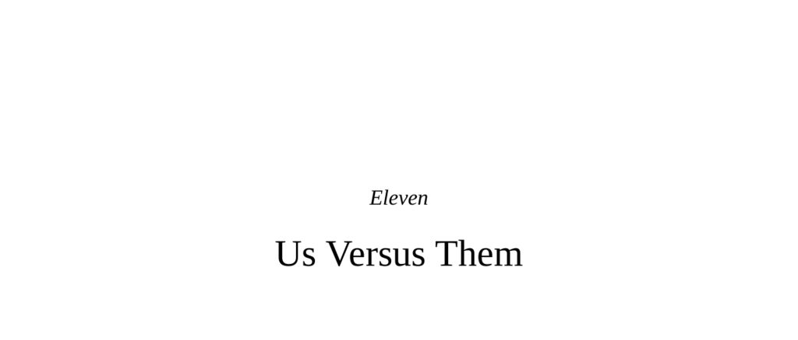

- **Eleven**
  - **Us Versus Them**
    - The chapter examines the universal human and animal tendency to form Us/Them dichotomies and their implications.
    - It discusses biological, psychological, and social factors that underpin in-group favoritism and out-group bias.
    - Key experimental methodologies, such as the Implicit Association Test (IAT), reveal automatic prejudices.
    - Explores how hormones like oxytocin amplify cooperation within Us and hostility toward Them.
    - For additional insights, see [The Social Psychology of Ingroup and Outgroup Behavior](https://www.annualreviews.org/doi/10.1146/annurev.psych.58.110405.085525).

  - **The Strength of Us/Them**
    - Us/Them dichotomies form rapidly and automatically in the brain, often within milliseconds.
    - Oxytocin selectively increases trust and generosity toward in-group members while promoting aggression toward out-groups.
    - Similar patterns of Us/Them bias are observed in other primates and across species.
    - Minimal group paradigms demonstrate that arbitrary group assignments trigger in-group favoritism.
    - The mesolimbic dopamine system can cause arbitrary symbols linked to Us to gain intrinsic rewarding value.

  - **Us**
    - Us-ness entails inflating the moral and intellectual merits of the in-group and its markers.
    - Mutual obligations and reciprocity characterize in-group relationships, enhancing trust and cooperation.
    - In-group loyalty can lead to helping Us by either aiding them or harming Them.
    - Group membership varies from contractual (e.g., sports teams) to sacred and immutable (e.g., ethnicity, religion).
    - The tension between loyalty and equality influences attitudes and behaviors toward in-group and out-group members.

  - **Those Thems**
    - Out-groups (Thems) are frequently perceived as threatening, untrustworthy, disgusting, or ridiculous.
    - Different brain regions (amygdala, insula) process fear-based and disgust-based responses to Thems.
    - Essentialism leads to stereotyping Thems as homogeneous, immutable, and undifferentiated.
    - Cognition often rationalizes pre-existing affective biases against Thems through confirmation biases.
    - Hormonal states and unconscious primes modulate implicit attitudes toward Thems.

  - **Thoughts Versus Feelings About Them**
    - Us/Them perceptions originate primarily from fast, automatic emotional processes rather than conscious cognition.
    - Rationalizations for biases emerge post-hoc to justify affect-driven prejudices.
    - Experimental manipulations can unconsciously alter attitudes toward Thems.
    - Historical examples like the Cagots illustrate prejudice without known rational basis.
    - Authoritarian temperament is linked to broad-spectrum out-group prejudices.

  - **Individual Intergroup Interactions Versus Group Intergroup Interactions**
    - Groups exhibit heightened collective hostility and rivalry compared to individuals.
    - An inverse relationship exists between intra-group conflict and inter-group aggression.
    - Threats from out-groups may increase internal group cohesion.
    - The economist Samuel Bowles advances the concept of "Conflict: Altruism's Midwife" regarding this dynamic.

  - **Unique Realms of Human Us/Them-ing**
    - Humans belong simultaneously to multiple, overlapping Us/Them categories whose salience shifts contextually.
    - Racial categorizations are variable, culturally constructed, and often trumped by other dimensions such as gender or occupation.
    - Historical and anecdotal examples show rapid recategorization overriding entrenched Us/Them boundaries.
    - The “honorable enemy” phenomenon illustrates nuanced attitudes toward rivals within shared categories.
    - See [Social Identity Theory](https://psycnet.apa.org/record/1985-98467-001) for foundational framework.

    - **Multiple Us-es**
      - Individuals carry multiple identities related to species, ethnicity, gender, and interests that form competing Us/Them distinctions.
      - Race is often considered primary but is biologically continuous and culturally defined.
      - Salience of particular group identities can be primed and reversed experimentally.
      - Recategorization can override Us/Them boundaries, as in historical wartime examples involving secret shared affiliations.
      - Rapid shifts demonstrate the malleability of group categorization.

    - **Cold and/or Incompetent**
      - The stereotype content model categorizes out-groups by warmth and competence dimensions.
      - Groups perceived as high warmth/high competence elicit pride (Us), while low warmth/low competence elicit disgust.
      - Other combinations evoke pity (high warmth/low competence) or envy (low warmth/high competence).
      - Group shifts along these dimensions explain changes in attitudes, from protectiveness to hostility.
      - Neuroimaging shows distinct brain activation patterns correlating with these stereotype categories.

    - **Some of My Best Friends**
      - Humans uniquely experience ambivalence and contextual expression of Us/Them attitudes.
      - Children demonstrate explicit preferences but learn social norms about expressing them around age ten.
      - Frontal cortex activity moderates expression and regulation of implicit biases.
      - Executive control plays a role in interracial interactions, affecting both dominant and minority group members.
      - Experimental studies reveal complexity in when and how biases manifest behaviorally.

  - **Manipulating the Extent of Us/Them-ing**
    - Subliminal priming can exacerbate or reduce Us/Them biases rapidly and persistently.
    - Conscious strategies that reduce bias include perspective-taking, counterstereotype focus, and acknowledgement of implicit bias.
    - Changing which group identity is prioritized shifts automatic categorization but may not eliminate bias.
    - Intergroup contact under specific conditions (equal status, shared goals, neutral settings) reduces hostility.
    - Antiessentialist framing undermines acceptance of inequalities linked to group differences.

  - **Hierarchy**
    - Steeper and more overt social hierarchies increase Us/Them antagonisms and justify status inequalities.
    - High social dominance orientation correlates with greater automatic prejudice and tolerance for hierarchical inequalities.
    - Cultural myths and tropes support system justification, stabilizing status differences.
    - Multiple and overlapping hierarchies (economic, racial, cultural) complicate group identity and assimilation perspectives.
    - Research links income inequality with increased condescension and perpetuation of stereotypes.

  - **Conclusions**
    - Us/Them distinctions are biologically ingrained and cannot be eliminated without adverse effects.
    - The benefits of group belonging include safety, identity, and motivation to act for collective good.
    - Vigilance against essentialism, rationalization, and unconscious bias is critical.
    - Practices recommended include perspective-taking, individuation, and focusing on shared values.
    - The chapter urges alignment with ethical “sides” and solidarity in collective challenges, referencing cultural motifs for unity.
