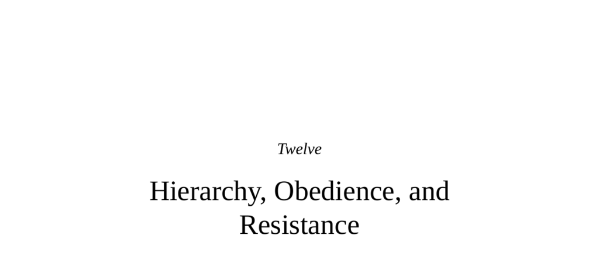

- **Hierarchy, Obedience, and Resistance**  
  - The chapter compares Us/Them-ing and hierarchical relations in humans and other species.  
  - Hierarchies formalize unequal access to resources and exist in many social species.  
  - Human hierarchies are unique due to leadership choice and multiple overlapping hierarchies.  
  - For further reading: [Hierarchy in Animal Societies](https://www.ncbi.nlm.nih.gov/pmc/articles/PMC4190381/).

- **The Nature and Varieties of Hierarchies**  
  - Hierarchies establish stable rank orders to reduce conflict over resources.  
  - Not all species have linear hierarchies; hierarchies and ranks vary widely among species.  
  - Social competence and brain size, particularly neocortex expansion, are linked to social complexity.  
  - Fission-fusion social structures increase hierarchy complexity and cognitive demands.  
  - For further reading: [Robin Dunbar’s Social Brain Hypothesis](https://www.annualreviews.org/doi/10.1146/annurev.anthro.32.032402.095019).

- **Rank and Hierarchy in Humans**  
  - Human hierarchies resemble other species but include multiple hierarchies and specialized rankings.  
  - Social group size correlates with neocortex size; Dunbar’s number approximates average human social group size (~150).  
  - Socioeconomic status uniquely formalizes human hierarchy and impacts health and behavior.  
  - Internal standards and psychological factors affect perceptions and effects of rank.  
  - For further reading: [Dunbar’s Number and Human Social Networks](https://www.nature.com/articles/35082129).

- **The View from the Top, the View from the Bottom**  
  - Humans and other primates rapidly detect and respond to dominance cues via facial and bodily indicators.  
  - Prefrontal and temporal brain regions mediate hierarchy recognition and social cognition.  
  - Attaining and maintaining rank involves social intelligence, perspective-taking, and impulse control rather than raw physical power.  
  - Stress effects vary by rank, social context, stability of hierarchy, and personality traits.  
  - For further reading: [Sapolsky on Stress and Social Hierarchy](https://www.ncbi.nlm.nih.gov/pmc/articles/PMC3335292/).

- **Your Brain and Your Own Status**  
  - High rank correlates with increased mesolimbic dopamine signaling and expansion of theory-of-mind brain regions.  
  - Brain changes both influence and follow attainment of status, indicating bidirectional causality.  
  - For further reading: [Status and Brain Plasticity in Primates](https://www.cell.com/trends/cognitive-sciences/fulltext/S1364-6613(14)00194-7).

- **Your Body and Your Own Status**  
  - Testosterone levels do not rigidly determine rank; relationships depend on hierarchy stability and sexual activity.  
  - Chronic stress hormone (glucocorticoid) levels differ by rank, but effects are moderated by social factors and personality.  
  - Both dominants and subordinates can experience elevated stress, depending on context and hierarchy dynamics.  
  - For further reading: [Sapolsky’s Challenge Hypothesis](https://www.pnas.org/content/106/Supplement_1/10040).

- **And Us**  
  - Social dominance orientation (SDO) correlates negatively with empathy-related brain activation.  
  - High-status humans show lower stress hormone levels, moderated by autonomy and authority.  
  - Socioeconomic status predicts health gradients robustly across societies, driven largely by psychological stress and inequality.  
  - For further reading: [SES and Health Gradient](https://www.ncbi.nlm.nih.gov/pmc/articles/PMC3600280/).

- **A Really Odd Thing That We Do Now and Then**  
  - Humans uniquely select leaders who ideally act for the common good.  
  - Leadership selection incorporates conscious criteria (competence) and unconscious biases (facial attractiveness, likability).  
  - Implicit preferences start early in childhood and influence democratic choices.  
  - For further reading: [Trait Inferences from Faces and Leadership](https://www.science.org/doi/10.1126/science.1142994).

- **Politics and Political Orientations**  
  - Political ideologies tend to form stable, internally consistent packages across disparate issues.  
  - Political orientations are influenced by cognitive style, affective responses, and implicit psychological factors.  
  - Conservatives show stronger needs for closure, structure, and react more to threat and disgust; liberals display greater cognitive complexity and openness.  
  - Biological correlates include differences in brain regions mediating disgust, threat perception, and empathy.  
  - Genetic studies suggest modest heritability and gene-environment interactions for political orientation.  
  - For further reading: [Haidt’s Moral Foundations Theory](https://moralfoundations.org/).

- **Obedience and Conformity, Disobedience and Nonconformity**  
  - Obedience is extending conformity to authority, involving loyalty, admiration, and compliance ranging from superficial to internalized.  
  - Obedience and conformity have deep evolutionary roots, present in many species and early human development.  
  - The brain processes dissonance and conformity using limbic and prefrontal networks, reinforcing alignment with group norms.  
  - For further reading: [Conformity and Obedience Neuroscience](https://www.ncbi.nlm.nih.gov/pmc/articles/PMC4489324/).

- **Asch, Milgram, and Zimbardo**  
  - Asch demonstrated conformity to incorrect group norms in perceptual tasks.  
  - Milgram showed majority obedience to authority resulting in harm to others in shock experiments.  
  - Zimbardo’s Stanford Prison Experiment revealed rapid adoption of abusive roles in simulated prison conditions.  
  - These studies underscore powerful situational influences on conformity and obedience, with significant ethical and scientific controversies over methods and interpretations.  
  - For further reading: [Milgram’s Obedience Experiments](https://www.simplypsychology.org/milgram.html).

- **Situational Forces and What Lurks in All of Us**  
  - Situational pressures strongly drive conformity and obedience even in ordinary individuals.  
  - Moral disengagement and diffusion of responsibility facilitate acts that individuals would normally reject.  
  - Incremental steps and anonymity greatly increase compliance with harmful acts.  
  - For further reading: [The Banality of Evil, Hannah Arendt](https://plato.stanford.edu/entries/arendt/).

- **Some Different Takes**  
  - Milgram’s results were partly inflated, with many participants doubting the authenticity of shocks.  
  - The Stanford Prison Experiment was influenced by researcher involvement, participant personality selection, and has poor replicability.  
  - The 2001 BBC prison study produced contrasting results with prisoner resistance and power shifts.  
  - Resistance to conformity occurs despite pressures, highlighting individual differences and cultural influences.  
  - For further reading: [BBC Prison Study](https://www.sciencedirect.com/science/article/pii/S0140197103000132).

- **Modulators of the Pressures to Conform and Obey**  
  - Authority legitimacy, proximity, prestige, and group size influence compliance levels.  
  - The nature and context of demands, including incrementalism and diffusion of responsibility, alter obedience.  
  - Victim individuation and perspective-taking reduce compliance with harmful orders.  
  - Personality traits such as low neuroticism and skepticism toward authority predict resistance.  
  - Stress and cultural context modulate conformity and obedience rates.  
  - For further reading: [Factors Influencing Obedience](https://www.sciencedirect.com/topics/psychology/obedience).

- **Summary and Conclusions**  
  - Humans share with other species attunement to status but have unique cultural hierarchies with complex psychological underpinnings.  
  - Hierarchy navigation requires cognitive and emotional skills tied to brain structures.  
  - Status impacts physiology through social meaning and personality factors, not rank alone.  
  - Political ideologies embed cognitive and affective styles and are influenced by implicit biases and biological factors.  
  - Conformity and obedience facilitate social order but can lead to harmful outcomes; resistance and heroism are accessible to ordinary individuals.  
  - For further reading: [Sapolsky’s Social Hierarchy and Stress](https://www.pnas.org/content/106/Supplement_1/10040).
