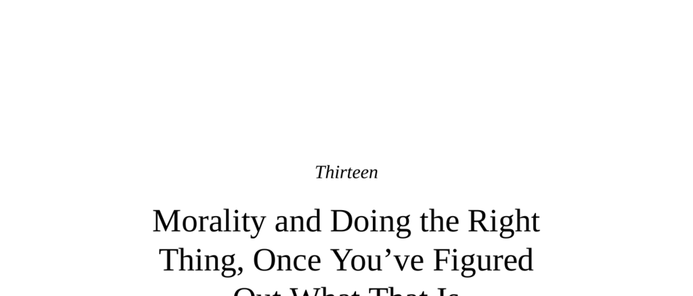

- **The Primacy of Reasoning in Moral Decision Making**  
  - Moral decision making involves cognition, reasoning, and logical operations.  
  - Application of moral rules requires perspective-taking, Theory of Mind, and distinguishing intent from outcome.  
  - Brain regions like dlPFC and temporoparietal junction (TPJ) are key to moral reasoning and intent evaluation.  
  - Fault lines exist in reasoning, such as weighing harm caused by action more heavily than omission.  
  - For more, see [Kohlberg’s Stages of Moral Development](https://plato.stanford.edu/entries/moral-development/).

- **Social Intuitionism**  
  - Moral decisions are often intuitive, emotion-driven, and post-hoc rationalized.  
  - Emotional brain areas (amygdala, vmPFC, insula) activate during moral judgments more than dlPFC alone.  
  - Damage to emotional areas of the brain results in more pragmatic, less empathetic moral judgments.  
  - "Moral dumbfounding" illustrates people’s inability to justify strong moral intuitions.  
  - Jonathan Haidt's work exemplifies social intuitionism; see [The Righteous Mind](https://jonathanhaidt.com/books/the-righteous-mind/).

- **Again with Babies and Animals**  
  - Infants show rudimentary moral biases, including preference for fairness and punishing wrongdoers.  
  - Other primates exhibit reactions to unfair treatment and inequity, such as capuchins refusing unequal pay.  
  - Chimpanzees demonstrate some fairness in economic games, though inconsistently.  
  - Evidence supports morality’s roots preceding human cultural institutions.  
  - For deeper insight, see Frans de Waal’s research on primate morality.  

- **Mr. Spock and Joseph Stalin**  
  - Moral judgment should be rooted in reasoning for impartiality, according to many philosophers.  
  - However, emotional intuition anchors moral judgments concerning kinship and social bonds.  
  - People with vmPFC damage disregard kinship distinctions in moral dilemmas, endorsing harming relatives equally with strangers.  
  - Social intuition underlies key widely held moral judgments that reasoning alone does not ensure.  

- **Context**  
  - Moral decision making reflects a continuum with overlap between reasoning and intuition.  
  - Contextual factors, such as emotional proximity and intentionality, influence reliance on intuition or reasoning.  
  - Neuroethics studies of trolley dilemmas show different brain regions activated based on moral context.  
  - Moral intuitions diminish with psychological and physical distance, affecting judgments like helping nearby versus distant children.  
  - See Dan Ariely’s [Predictably Irrational](https://danariely.com/book/predictably-irrational/) for related context effects.

- **“But This Circumstance Is Different”**  
  - People judge moral failings differently for themselves versus others, often exempting themselves.  
  - Different brain regions activate for self-assessment (vmPFC) versus judging others (insula, dlPFC).  
  - Stress increases egoistic rationalizations and reduces utilitarian judgments on personal moral dilemmas.  
  - Self-judgment is based on internal motives; judging others focuses on external actions.  
  - This asymmetry explains frequent self-exemption from moral condemnation.

- **Cultural Context**  
  - Moral judgments vary dramatically across cultures despite some near-universal moral laws.  
  - Richard Shweder and Jonathan Haidt identify moral domains related to autonomy, community, and divinity.  
  - Cross-cultural morality shows universals and variability in sanctity, fairness, and authority respect.  
  - Michael Shermer advocates provisional morality based on widespread cross-cultural agreement.  
  - See [Michael Shermer’s works](https://michaelshermer.com/) for exploration of provisional morality.

- **Cooperation and Competition**  
  - Economic games reveal universal prosocial behaviors but variable punishment norms.  
  - “Antisocial punishment” penalizes generosity and correlates with low social capital in societies.  
  - Market integration, community size, and worldwide religious affiliation correlate with fairer offers and more punishment of cheaters.  
  - Prosociality increases with cultural complexity and market reliance, contrary to primate legacy explanations.  
  - See B. Herrmann et al., “Antisocial Punishment Across Societies” [Science 319 (2008)](https://www.science.org/doi/10.1126/science.1153808).

- **Honor and Revenge**  
  - Cultures of honor emphasize revenge for personal affronts to prevent larger conflicts.  
  - Pastoralist societies have elevated moral emphasis on maintaining honor and conducting proportional revenge.  
  - High murder rates in some cultures are linked to unresolved honor-related conflicts.  
  - Honor cultures shape differing legal and social responses to crimes of personal affront.  

- **Shamed Collectivists and Guilty Individualists**  
  - Collectivist cultures enforce morality through shame (external judgment); individualistic cultures use guilt (internal judgment).  
  - Shame targets group membership and honor; guilt targets personal conscience and acts.  
  - Shame requires a conformist population; guilt requires respect for law and privacy.  
  - Modern shaming remains useful in holding the powerful accountable but risks anonymity-fueled cruelty online.  
  - Authors Herant Katchadourian and Jennifer Jacquet explore these moral emotions in depth.

- **Fools Rush In: Applying the Findings of the Science of Morality**  
  - The three main moral philosophies are virtue ethics (focus on actor), deontology (focus on act), and consequentialism (focus on outcome).  
  - Deontologists reject using people as means; consequentialists accept it for utilitarian ends.  
  - Moral brain activations correspond to these philosophies: intuitive/emotional areas to deontology, cognitive dlPFC to consequentialism.  
  - Utilitarianism is strong in theory but limited by practical issues like predicting outcomes and slippery slopes.  
  - Best moral decisions integrate intuition and reasoning, exemplifying “pragmatic utilitarianism.”  

- **Slow and Fast: The Separate Problems of “Me Versus Us” and “Us Versus Them”**  
  - “Me versus Us” dilemmas involve cooperation within groups; “Us versus Them” involve intergroup conflicts over differing moral codes.  
  - Rapid intuitive decisions promote cooperation within groups; deliberation reduces selfishness in in-group contexts.  
  - Intergroup moral conflicts result from entrenched, rationalized differing moral intuitions.  
  - To resolve “Us versus Them” conflicts, reasoned perspective-taking and deep pragmatism are required.  
  - Greene’s “Moral Tribes” expands on these distinctions; see [Moral Tribes](https://moraltribesbook.com/).

- **Veracity and Mendacity**  
  - Dishonesty is context-dependent; lying varies widely in social acceptability.  
  - Nonhuman primates practice tactical deception without moral judgment, while humans uniquely rationalize and finesse lying.  
  - Studies show cross-cultural variation in deception correlated with societal corruption and political fraud.  
  - Brain areas involved in deception include dlPFC (for strategizing lies) and ACC (for monitoring cognitive conflict).  
  - Resisting dishonesty involves neurobiological effort; some people never cheat due to implicit automaticity, not struggle.  
  - See Thomas Baumgartner and Ernst Fehr’s studies on brain activation during deception.  

- **Which Dead White Male Was Right?**  
  - Virtue ethics, deontology, and consequentialism have dominated moral philosophy debates.  
  - The trolley problem exemplifies the tension between deontological intuitions and utilitarian reasoning.  
  - Empirical evidence shows moral judgments are heterogeneous and context dependent.  
  - Combining intuition and reasoning leads to more sophisticated, long-term moral deliberation.  
  - Moral intuitions are learned and internalized through cultural exposure and reasoning over time.

- **Summary of Key Concepts and Applications**  
  - Moral reasoning and intuition interact dynamically, influenced by context, culture, emotion, and social setting.  
  - Infants and animals provide evidence for evolutionary roots of morality but also show limits compared to humans.  
  - Cultural variables like market integration, religion, and social capital predict variations in moral behavior.  
  - Shame and guilt function differently across cultures to enforce morality.  
  - Applying moral science requires integrating knowledge of brain mechanisms, social intuitions, and cultural contexts for better outcomes.
