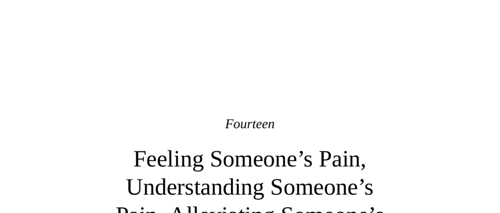

- **Feeling Someone’s Pain, Understanding Someone’s Pain, Alleviating Someone’s Pain**
  - **“For” Versus “As If” and Other Distinctions**
    - Primitive forms of resonance with others’ pain include sensorimotor contagion, mimicry, and emotional contagion.
    - Sympathy involves feeling sorry without understanding, while empathy includes cognitive perspective taking.
    - Compassion is defined as resonance that leads to actual helping behavior.
    - Empathy cannot be forced or induced by guilt or obligation, distinguishing it from ersatz forms.
    - Further reading: [Empathy, Sympathy, and Compassion](https://plato.stanford.edu/entries/empathy/)
  - **Emotionally Contagious, Compassionate Animals**
    - Many non-human animals exhibit rudimentary empathic behaviors including mimicry, emotional contagion, and consolation.
    - Rodents show social modulation of pain sensitivity and proactive helping of cagemates.
    - Consolation behaviors have been documented in primates, dogs, elephants, and corvids, involving both cognitive tracking and affiliative motivation.
    - Prosocial behavior in animals may be self-interested or compassionate, with genetic and experiential factors influencing help.
    - Further reading: [Empathy in Nonhuman Animals](https://www.ncbi.nlm.nih.gov/pmc/articles/PMC3922128/)
  - **Emotionally Contagious, Compassionate Children**
    - Empathic development progresses from sensorimotor contagion to perspective taking and moral sensitivity.
    - Brain maturation involves increasing coupling among ACC, vmPFC, insula, amygdala, and Theory of Mind regions.
    - Early empathic responses occur before Theory of Mind develops, shifting from self-oriented to other-oriented perspectives.
    - Affective and cognitive components co-develop enabling nuanced understanding and compassionate action.
    - Further reading: [Development of Empathy in Children](https://www.ncbi.nlm.nih.gov/pmc/articles/PMC3027031/)
  - **Affect and/or Cognition?**
    - The anterior cingulate cortex (ACC) is central to empathy, processing interoceptive signals and conflict monitoring related to pain.
    - The ACC integrates self-focused pain processing with representations of others’ pain, facilitating empathic learning.
    - The insula and amygdala interact with ACC, engaging more strongly during empathic states involving injustice or blame.
    - Cognitive regions including dlPFC and temporoparietal junction are recruited for understanding causation, intentionality, and perspective taking.
    - Socioeconomic status and in-group/out-group biases modulate the neural and behavioral expression of empathy.
    - Further reading: [Neural Bases of Empathy](https://www.ncbi.nlm.nih.gov/pmc/articles/PMC4561837/)
  - **A Mythic Leap Forward**
    - Mirror neurons were discovered in rhesus monkeys’ premotor cortex, activating both during action execution and observation.
    - Mirror neurons encode intentionality beyond motor acts, suggesting roles in imitation and motor learning.
    - Hypotheses propose mirror neurons contribute to understanding others’ actions and intentions, aiding Theory of Mind, but causal evidence is lacking.
    - The “broken mirror” hypothesis of autism remains unconfirmed by meta-analyses.
    - Scientific consensus views mirror neurons as insufficient to explain complex social cognition like empathy.
    - Further reading: [The Myth of Mirror Neurons](https://www.garymarcus.com/books/myth-of-mirror-neurons)
  - **The Core Issue: Actually Doing Something**
    - Empathic states do not necessarily lead to compassionate action due to self-oriented distress and cognitive overload.
    - Heart rate patterns predict prosociality: decreased rates indicate detached empathy conducive to helping.
    - Buddhist compassion training results in decreased amygdala activity and increased mesolimbic dopamine, fostering prosocial motivation.
    - Further reading: [Compassion Training and Neuroscience](https://www.nature.com/articles/nrn.2016.78)
  - **Doing Something Effectively**
    - Pathological altruism and empathy fatigue can impair effective helping behaviors.
    - Empathy often leads to preferential helping of appealing individuals rather than distant or unfamiliar groups.
    - Clinical professions train workers to regulate empathic distress to maintain effectiveness.
    - Further reading: [Against Empathy by Paul Bloom](https://press.princeton.edu/books/hardcover/9780691175436/against-empathy)
  - **Are There Ever Any Bloody Altruists?**
    - Prosocial acts activate reward systems, and voluntary giving generates more dopaminergic activation than enforced giving.
    - Self-interest in altruism includes reputation, moral self-definition, and spiritual beliefs.
    - Studies show dopaminergic activation correlates both with receiving money and voluntarily giving, highlighting mixed motives.
    - Purely selfless altruism without any self-interest appears rare.
    - Further reading: [The Neural Basis of Altruistic Reward](https://science.sciencemag.org/content/324/5929/900)
  - **Conclusions**
    - Empathic states are widespread across species, but converting empathy into compassionate action is complex.
    - Helping distant or unfamiliar others is cognitively demanding due to evolved biases for local, familiar pain.
    - Self-interest and reciprocity are intertwined with altruistic behaviors, often facilitating prosocial acts.
    - Effective compassion requires balance: sufficient detachment to act without overwhelming distress but enough engagement to motivate.
    - Further reading: [The Empathy Gap](https://www.scientificamerican.com/article/the-empathy-gap/)
