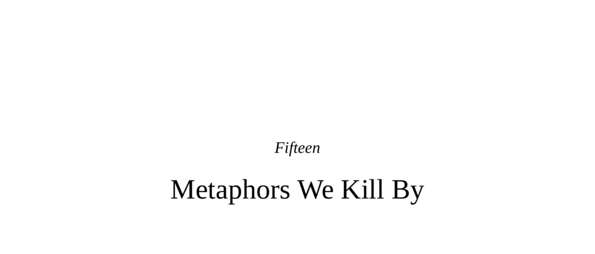

- **Examples of Symbolic Violence**
  - **Cartoons of Muhammad and Resulting Violence**
    - Publishing cartoons of Muhammad in Denmark and Sweden provoked deadly protests, attacks on Western embassies, and assassination plots.
    - Islamic groups consider images of Allah and Muhammad highly offensive, enforcing aniconism.
    - Incidents include the Charlie Hebdo massacre and an attack at an anti-aniconist event in Texas.
    - See [Jyllands-Posten Muhammad cartoons controversy](https://en.wikipedia.org/wiki/Jyllands-Posten_Muhammad_cartoons_controversy).
  - **Battle of Gettysburg Flag Capture**
    - Confederate soldier John Eakin was shot carrying the flag, which was successively carried and lost by several men before being captured by a Union soldier.
    - Soldiers carrying flags were preferential targets because of the symbolic importance of the colors.
    - The capture of the flag represented a tactical and symbolic victory in battle.
  - **Symbolism in Clothing, Hunger Strikes, and Songs**
    - Tavin Price was killed for wearing rival gang colors, showing clothing as symbolic markers of group identity.
    - Irish Republican hunger strikes protested prison conditions and political status, resulting in several deaths.
    - The Frank Sinatra song "My Way" was removed from Philippine karaoke clubs due to violence triggered by its arrogant lyrics.
    - These examples demonstrate the lethal potency of symbolic items and acts.

- **Human Uniqueness in Symbolism**
  - **Emergence of Behavioral Modernity and Symbolic Art**
    - Anatomically modern humans appeared around 200,000 years ago, with behavioral modernity emerging 150,000 years later.
    - Early examples include composite tools, ornamentation, ritual burials, and cave paintings like the Lascaux horse.
    - Symbolic representation reduces the distance between the object and its image, imbuing the symbol with power.
    - Relevant resource: [René Magritte’s "The Treachery of Images"](https://en.wikipedia.org/wiki/The_Treachery_of_Images).
  - **Language and Metaphor as Symbolic Mastery**
    - Language separates message from meaning, allowing representation of past, future, and abstract ideas.
    - Metaphors pervade language, transferring information by mapping one concept onto another.
    - Cognitive linguist George Lakoff emphasizes that language is fundamentally metaphorical.
    - Example: political metaphors like "family values" shape thought and identity.

- **Neurobiology of Metaphor and Symbolism**
  - **Empathy and Pain Processing**
    - Anterior cingulate cortex (ACC) processes both literal physical pain and social pain such as rejection.
    - Observing others’ pain activates the ACC but not sensory-specific pain regions.
    - Neurotransmitter substance P links physical pain and depression, showing biochemical overlap between bodily and psychic pain.
    - ACC activation also occurs during experiences of schadenfreude, reflecting emotional complexity.
    - See [Brain regions involved in empathy](https://www.ncbi.nlm.nih.gov/pmc/articles/PMC3166406/).
  - **Disgust and Moral Purity**
    - The insular cortex mediates responses to physical disgust (e.g., rancid food) and moral disgust (e.g., norm violations).
    - Moral disgust can elicit visceral reactions like nausea, linking physical and moral domains.
    - Studies reveal social conservatives have lower thresholds for visceral disgust compared to progressives.
    - The “Macbeth effect” describes increased cleansing behaviors after recalling immoral acts.
    - Cultural variation exists; East Asians tend to cleanse the face rather than hands after moral failings.
    - Moral and physical purity intertwine, influencing judgment and social attitudes.
    - Reference: [The Neural Basis of Disgust and its Role in Morality](https://www.sciencedirect.com/science/article/pii/S1364661312010376).
  - **Confusion Between Literal and Metaphorical Sensations**
    - Haptic sensations (weight, texture) influence social judgments, such as perceiving people as more serious when holding heavy objects.
    - Temperature sensations modulate perceptions of social warmth and trust.
    - Interoceptive states like hunger affect generosity and decision-making.
    - Cognitive processing varies with perceived psychological distance, affecting data interpretation.
    - The brain reuses physical sensation circuits to process metaphorical concepts, illustrating neural improvisation.

- **Evolutionary Tinkering and Neural Reuse**
  - **Improvisation in Brain Function**
    - The brain evolved symbolic and moral processing by repurposing existing regions such as the ACC and insula.
    - Von Economo neurons, implicated in empathy and social cognition, reside prominently in these areas.
    - This neural reuse exemplifies exaptation, where structures adapt to new roles over evolutionary time.
    - Some non-human species (apes, elephants, cetaceans) possess von Economo neurons, suggesting shared precursors to symbolic capacities.
    - Further reading: [Neural reuse theory](https://www.sciencedirect.com/science/article/pii/S0896627319303537).

- **The Metaphorical Dark Side: Dehumanization and Genocide**
  - **Rwandan Genocide and Symbolic Hate**
    - The 1994 Rwandan genocide involved mass killings of Tutsis following the assassination of President Habyarimana.
    - Propaganda dehumanized Tutsis as “cockroaches,” engaging the insula to provoke visceral disgust and violence.
    - Violence was predominantly carried out with machetes and blunt weapons, without modern military equipment.
    - The genocide’s speed and brutality surpassed the Holocaust by killing rate.
    - Dehumanizing metaphors enabled mass participation in atrocities.
    - See [Rwandan genocide overview](https://en.wikipedia.org/wiki/Rwandan_genocide).

- **Symbolic Power in Peacebuilding**
  - **Sacred Values and Conflict Resolution**
    - Sacred values define group identity and resist material compromise in conflicts such as Israel-Palestine.
    - Symbolic concessions, including apologies and respectful recognition of sacred values, facilitate peace.
    - Jordan-Israel peace treaty combined instrumental agreements with symbolic acts.
    - The assassination of Yitzhak Rabin and King Hussein’s eulogy exemplified symbolic gestures fostering reconciliation.
    - Reference: [Sacred values in conflict resolution (Science, 2007)](https://science.sciencemag.org/content/317/5841/1755).
  - **Northern Ireland and South Africa Peace Processes**
    - The Good Friday Agreement addressed both material issues and sacred symbols, such as parades.
    - Political leaders Martin McGuinness and Peter Robinson’s handshake symbolized overcoming deep-seated hatred.
    - Nelson Mandela embraced Afrikaans culture and language to foster reconciliation, including sporting symbolism in rugby.
    - Mandela’s secret negotiations with General Viljoen prevented civil war by respecting sacred values.
    - These examples demonstrate the positive use of symbolic power for peace and unity.
