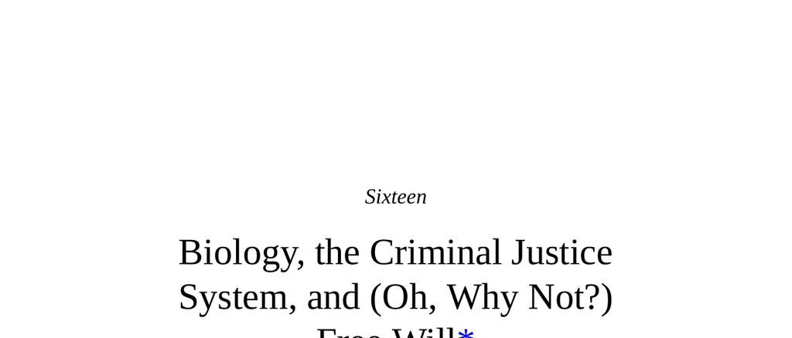

- **Introduction and Background**
  - **Soliciting Provocative Ideas and Neurolaw**
    - A foundation invited submissions for provocative ideas linking neuroscience and law, resulting in a conference fostering interdisciplinary collaborations.
    - Neuroscientists and legal professionals learned to navigate differences in terminology and approach.
    - The author's original proposal argued for abolishing the criminal justice system due to neuroscience insights.
    - Neurolaw emerged as a field studying interactions between neuroscience and the legal system.
- **Issues in Criminal Justice Reform and Neuroscience**
  - **Ignored Hot-Button Topics**
    - Topics like implicit bias, admissibility of neuroimaging, lie detection techniques, IQ cutoffs for execution, cognitive biases in jurors, precrime detection, and judges’ physical state effects are acknowledged but largely set aside.
    - DNA exonerations highlight the need for science over pseudoscience in courts.
    - Legal and scientific perspectives diverge on these complex ethical and practical issues.
- **Liberal Reforms and the Witch Justice System Analogy**
  - **Historical Witchcraft Legal Tests**
    - Three classical tests for witches: flotation test, devil’s-spot test, and tear test.
    - Johann Weyer proposed reform noting elderly women could fail the tear test due to lachrymal gland atrophy, risking false convictions.
    - This analogy serves to highlight the limitations of partial scientific reform within irrational legal systems.
- **Three Perspectives on Free Will and Biology**
  - **Complete Free Will**
    - Assertion that humans have total control over behavior is widely rejected as impractical.
    - Examples like epileptic seizures demonstrate the inadequacy of this view.
  - **No Free Will**
    - View disregarded in this text in favor of a middle ground.
  - **Somewhere In Between (Compatibilism / Mitigated Free Will)**
    - Free will coexists with biological constraints; behavior results from a combination of a "spirit" or "homunculus" and brain function.
    - The homunculus metaphor represents a control center influenced but not fully determined by biology.
- **Legal Foundations of Mitigated Free Will**
  - **The M’Naghten Rule**
    - Established in 1842, it exonerates persons unable to distinguish right from wrong due to "defect of reason from disease of the mind."
    - Remains foundational for insanity defenses, despite political backlash and reforms.
  - **The Homunculus Model**
    - Depicts free will as a decision-making agent insulated somewhat from biological determinism.
    - Recognizes constraints like seizures or injuries that impair its function.
- **Age, Maturity, and Responsibility**
  - **Legal Rulings on Juvenile Sentencing**
    - Supreme Court decisions prohibit death sentences for crimes committed under age 18, citing adolescent brain immaturity.
    - Debate exists regarding individual maturity versus group-level age thresholds.
    - Differing views from justices emphasize challenges in defining maturity and culpability.
- **Brain Damage and Criminal Responsibility**
  - **Extent of Impairment as a Mitigation Factor**
    - Severe frontal cortex damage can negate responsibility due to impaired reasoning.
    - Determining the threshold where damage sufficiently impairs responsibility remains debated.
    - Many death row inmates have histories of early brain damage.
- **Responsibility: Brain vs. Social Levels**
  - **Michael Gazzaniga’s Social-Level Responsibility**
    - Posits free will is an illusion but responsibility exists at the social level.
    - Suggests responsibility can be maintained despite deterministic brain processes.
    - Implies possible homunculus-like construct operating socially rather than biologically.
- **The Time Course of Decision Making**
  - **Deliberative vs. Impulsive Actions**
    - Free will is more relevant in slow, reasoned decisions; biological impulses dominate split-second choices.
    - Adolescent brain immaturity affects impulse control more than reflective decisions.
    - Resolves apparent contradictions in legal stances based on decision timing.
- **Causation and Compulsion**
  - **Distinction Between Causes of Behavior**
    - "Causation" encompasses all behavior influences; "compulsion" refers to overwhelming forces compromising control.
    - Legal systems differentiate between volitional acts and those compelled by severe psychiatric symptoms.
    - Examples include schizophrenia auditory hallucinations causing criminal acts.
- **Starting vs. Halting Behavior (Libet Experiment)**
  - **Neuroscientific Findings on Readiness Potentials**
    - Brain activity predicting movement precedes conscious decision by about half a second.
    - Interpretation challenges free will by suggesting unconscious initiation of action.
    - Libet hypothesized "free won’t," the capacity to veto actions after unconscious initiation.
- **Lines in the Sand in Mitigated Free Will**
  - **Biological Determinism vs. Free Will Boundaries**
    - Debate centers on where biological causation ends and free volition begins.
    - Homunculus metaphor illustrates the challenge of reconciling deterministic biology with human experience of choice.
- **“You Must Be So Smart” vs. “You Must Have Worked So Hard”**
  - **Psychology of Praise and Motivation**
    - Praise for effort promotes resilience; praise for innate ability can undermine motivation.
    - Attribution of aptitude to biology and effort to free will exemplifies the dualistic model.
    - Examples include natural talent and extraordinary effort (e.g., Wilma Rudolph).
  - **Dualism in Morality and Criminality**
    - Biological predispositions underlie destructive urges; resisting them is attributed to free will.
    - Case study of pedophilia illustrates distinction between unchosen urges and chosen actions.
- **Limits of Neuroscience in Predicting Behavior**
  - **Explaining Versus Predicting Individual Actions**
    - Brain injuries and genetics explain behaviors better at group than individual level.
    - Complex multifactorial influences reduce predictive accuracy for social behaviors.
    - Analogies contrast reliable prediction in somatic medicine with unpredictability in behavioral neuroscience.
- **Rapid Expansion of Neuroscience Knowledge**
  - **Growing Research on Biology and Social Behavior**
    - Increased scientific publications on oxytocin, social behavior, decision-making, and aggression.
    - Most biological factors influencing behavior have only recently been discovered or understood.
- **View of Humans Without Free Will**
  - **Historical Parallel with Epilepsy and Witch Hunts**
    - Epilepsy once attributed to demonic possession, leading to persecution.
    - Analogous misunderstanding today risks misattributing biological conditions to moral failings.
    - Advocates for societal humility and caution in judgments pending scientific advances.
- **Practical Implications for Criminal Justice**
  - **Protection, Rehabilitation, and Punishment**
    - Society must protect against dangerous individuals even without free will.
    - Punishment as a moral virtue is challenged; it should be instrumental and non-retributive.
    - Overcoming innate human pleasure in punishment is a significant societal challenge.
  - **Prevention and Deterrence Issues**
    - Deterrence remains pragmatic despite rejection of free will.
    - Maintaining effective deterrence without punitive virtue requires new approaches.
- **Analogy of Mechanical Failure and Moral Judgment**
  - **Viewing Damaged Humans as Broken Machines**
    - Comparing malfunctioning behavior to mechanical faults promotes humane treatment.
    - Rejection of demonizing language in favor of scientific compassion.
- **Postscript: Accepting the Denial of Free Will in Positive Traits**
  - **Challenges in Applying No Free Will to Praise and Achievement**
    - Recognizing achievements as products of biology and circumstance conflicts with common praise habits.
    - Social and cultural influences shape perceptions of free will in talent and effort.
    - Full acceptance may be unachievable, but critical in contexts of moral judgment.
- **References for Further Study**
  - [M’Naghten Rule](https://en.wikipedia.org/wiki/M%27Naghten_rules)
  - [Libet Experiment](https://en.wikipedia.org/wiki/Libet_experiment)
  - [Neurolaw](https://en.wikipedia.org/wiki/Neurolaw)
  - [Carol Dweck’s Work on Motivation](https://www.apa.org/research/action/dweck)
