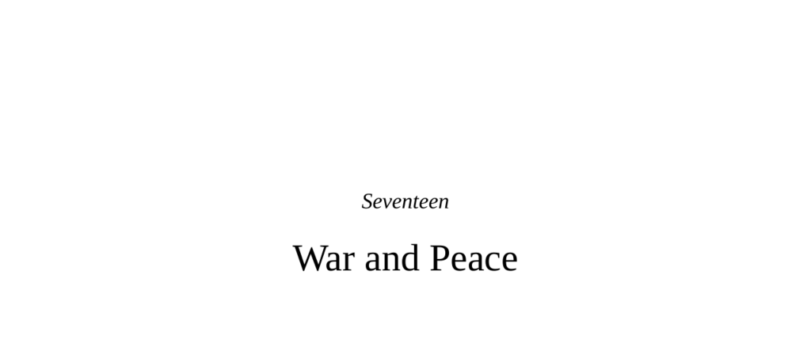

- **Seventeen**
  - **War and Peace**
    - Summarizes biological and psychological challenges to human compassion and morality.
    - Outlines the chapter’s goals: evidence of behavioral improvements, strategies for further improvement, emotional support, and thematic justification for the title.
  - **Somewhat Better Angels**
    - Documents historical declines in violence, slavery, child labor, and mistreatment worldwide.
    - References Pinker’s *The Better Angels of Our Nature* as a seminal work on violence decline.
    - Discusses controversies about origins and decline of violence, including criticisms of Pinker’s views.
    - Population-corrected and duration-corrected analyses show some twentieth-century conflicts remain among the deadliest.
  - **Some Traditional Routes**
    - **Moving**
      - Nomadic band fluidity reduces tension by allowing individuals or groups to relocate.
      - Facilitates cooperative individuals associating with each other.
    - **Trade and Commerce**
      - Trade integration creates interdependence that reduces likelihood of war.
      - Examples include Thomas Friedman's "Golden Arches Theory" of peace.
      - Trade’s peace-promoting effects are not absolute, with notable historical exceptions.
    - **Cultural Diffusion**
      - Spread of civil liberties and media freedom correlated with digital access across countries.
      - Neighboring countries’ civil liberties amplify these effects.
  - **Religion**
    - Religiosity has both intensely personal and communal dimensions influencing behavior differently.
    - Religious belief reduces anxiety via explanations and rituals, linked neurobiologically to ACC and mesolimbic systems.
    - Religiosity promotes prosociality within in-groups but often fosters out-group hostility.
    - The presence of moralizing, punitive gods increases prosociality and decreases cheating.
    - Religiously based violence and terrorism tend to persist longer than secular conflicts.
    - Frequent communal worship attendance predicts support for extreme views more than personal prayer frequency.
    - Religious primes increase aggression even in nonbelievers.
    - The distinction between private and communal religiosity critically affects social outcomes.
  - **Contact**
    - Intergroup contact reduces prejudice when groups are treated equally and share goals.
    - Equal status settings, neutral venues, and institutional oversight enhance positive contact effects.
    - Workplace contact generalizes reduced prejudice beyond immediate groups.
    - Sustained contact is necessary; transient effects are common without ongoing engagement.
    - Individual examples demonstrate empathy breaking down categorical barriers.
    - Meta-analyses support contact theory’s broad applicability across race, religion, and sexual orientation.
  - **Burning and Unburning Bridges**
    - Rebel groups and child soldier recruitment often force symbolic or literal burning of prior cultural ties.
    - Reintegration with family or community improves outcomes for former child soldiers.
    - Pseudospeciation propaganda manipulates empathy and dehumanizes foes, with the example of the fabricated Nayirah incubator testimony influencing U.S. war decisions.
    - Manipulation of empathy for political ends is a significant risk.
  - **Cooperation**
    - Foundational mechanisms include kin selection in founder populations and green-beard effects.
    - Humans uniquely cooperate extensively with nonrelatives across cultures.
    - Types of cooperation that enhance human collaboration:
      - Open-ended play with an indefinite future encourages cooperation.
      - Multiple simultaneous games create spillover trust.
      - Open-book play, reputation visibility, and gossip promote indirect reciprocity.
    - Cooperation is value-neutral and can be used for both constructive and destructive ends.
  - **Punishment**
    - Costly punishment promotes cooperation but must balance costs and benefits.
    - Third-party punishment enforces norms effectively but involves complex social costs.
    - Systems of secondary punishment and social sharing distribute costs and reduce free riding.
    - Corporate social responsibility models increase prosocial consumer behavior when individual contributions are transparent.
  - **Choosing Your Partner**
    - Cooperators flourish when they can identify and preferentially interact with other cooperators.
    - Introducing markers (green beards) increases cooperation and reduces reliance on punishment.
  - **Reconciliation, and Things That Are Not Synonymous With It**
    - Chimpanzee-style reconciliation involves quick, direct repair after conflict.
    - Human reconciliation involves complex institutions like Truth and Reconciliation Commissions (TRCs).
    - TRCs focus on pragmatic peacebuilding rather than individual remorse or forgiveness.
    - The South African TRC granted amnesty to some perpetrators without requiring remorse.
    - Apologies vary in effectiveness depending on context, sincerity, and victim orientation.
    - Reparations can solidify sincerity but may also offend if perceived as transactional.
    - Forgiveness is self-reported, varies by motivation, and benefits victims’ health.
    - Truth-telling is vital for victims and societal healing.
  - **Recognizing Our Irrationalities**
    - Humans consistently deviate from purely rational decision-making in moral and social domains.
    - Implicit biases influence behavior beyond conscious awareness and require monitoring.
    - Irrational optimism can be adaptive but dangerous in warfare contexts.
    - Sacred values can impede peace despite rational incentives.
  - **Our Incompetence at and Aversion to Killing**
    - Most combatants avoid close-range killing despite battlefield dangers.
    - Psychological resistance to killing varies by proximity and method.
    - Drone pilots experience PTSD despite no physical danger, due to intimate nature of remote killing.
    - Military training progressively reduces natural inhibitions to kill.
    - Future warfare might involve autonomous weapons reducing human killing roles.
  - **The Possibilities**
    - Introduction of “peaceology” as a scientific study of factors promoting peace.
    - Emphasis on emotional as well as intellectual commitment to change.
  - **Rousseau with a Tail**
    - Case study of a savanna baboon troop shifting from aggressive to affiliative behavior.
    - Change followed removal of aggressive males via tuberculosis outbreak.
    - Social culture transmitted through relaxed female reception of new males.
    - Illustrates primate behavioral flexibility and potential parallels to human change.
  - **One Person**
    - Individuals can catalyze broad societal change (e.g., Mandela, Gandhi, Bouazizi).
    - Examples include Zenji Abe’s WWII apology and Hugh Thompson’s intervention at My Lai.
    - My Lai Massacre detailed, with recognition of individual variation in participation and resistance.
    - John Newton’s gradual and inconsistent moral awakening toward abolitionism illustrates human frailty and slow change.
  - **Finally—the Potential for Collective Power**
    - Historical anecdotes of fraternization among enemy soldiers in wars including Peninsular War, American Civil War, and Crimean War.
    - 1914 Christmas Truce and Live and Let Live phenomenon demonstrate spontaneous peace behaviors under certain conditions.
    - Factors enabling truces include static trench warfare, repeated interaction, shared culture, and religious holidays.
    - Ritualized non-aggression and mutual restraint sustained these truces despite occasional violations.
    - Additional documentation available in Tony Ashworth’s *Trench Warfare: 1914–1918* and other military histories.
