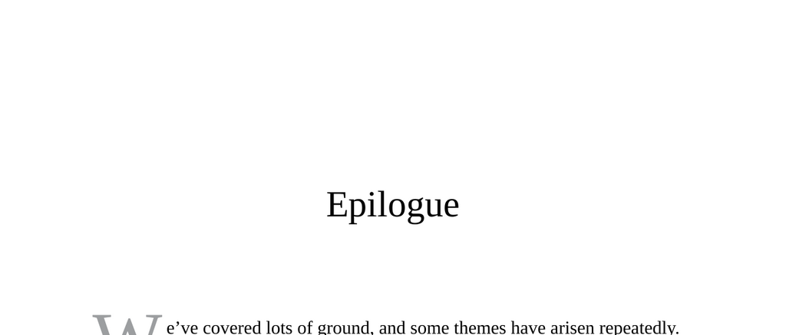

- **Epilogue**
  - **Importance of Variation and Averages**
    - Scientific facts often concern averages rather than absolutes, acknowledging significant variation.
    - Individual differences and exceptions exist widely across scientific observations.
    - Repeated use of terms like “average,” “typically,” and “generally” reflects this variation.
    - For further context, see [Statistics and Scientific Method](https://www.ncbi.nlm.nih.gov/pmc/articles/PMC4761016/).
  - **Key Scientific Themes**
    - Self-control is more effective when good habits become automatic rather than relying on willpower.
    - Brain plasticity is essential for its functioning and adaptability.
    - Childhood adversity impacts biology and culture deeply but can be reversed more than previously thought.
    - Brains and cultures evolve together in a continuous feedback loop.
    - Morality often begins with nonconforming ideas, not intuitive norms.
    - Biological factors modulate behavior by lowering thresholds for environmental triggers.
    - Cognition and emotion interact, sometimes with one dominating the other.
    - Genes express effects differently depending on environmental context and values.
    - Intense love and hate are biologically linked; indifference is their true opposite.
    - Adolescence is a stage of brain development shaped mainly by experience rather than genes.
    - Arbitrary categorical boundaries aid understanding but remain inherently artificial.
    - Anticipation often drives pleasure more than the actual experience.
    - Aggression requires understanding fear and amygdala function.
    - Genes determine potentials and vulnerabilities, not certainties.
    - Gene-environment interactions largely regulate evolutionary outcomes.
    - Humans mentally divide the world into Us versus Them, easily biasable.
    - Humans evolved between pair-bonding and tournament species, enhancing social flexibility.
    - The “homunculus” concept in metaphysics lacks scientific support.
    - Hunter-gatherer societies were less violent than often assumed; modern societies introduce anonymity and stranger interaction.
    - Assessments of biological systems as “working well” are value-neutral and require effort.
    - Moral judgments are highly context-dependent.
    - Compassion and morality have deep evolutionary roots beyond civilization.
    - Beware of dehumanizing views portraying others as contagious or inferior.
    - Socioeconomic status introduced unprecedented hierarchical subordination.
    - In-group prosociality is easier than inter-group cooperation.
    - Rationalization fosters tolerance of harmful acts despite initial opposition.
    - Present-day moral certainty may appear flawed to future generations and oneself.
    - Empathy and complex moral reasoning do not always lead to brave or compassionate actions.
    - Humans may kill or die for sacred symbolic values; respecting these aids peace.
    - Human behavior is influenced by subtle, often unconscious stimuli and internal forces.
    - Both worst and best human behaviors have biological roots.
    - Ordinary individuals exemplify humanity’s finest qualities.
    - For more on gene-environment interactions, see [Gene Environment Interaction](https://www.nature.com/scitable/topicpage/gene-environment-interactions-809/).
  - **Two Last Thoughts**
    - The world’s complexity defies simple causality; all factors modulate and influence each other.
    - Scientific understanding evolves constantly, revealing unintended consequences of interventions.
    - Around half of scientific studies on major issues often disagree, making solutions seem elusive.
    - Despite complexity, individuals with education and resources are well-positioned to effect change.
    - Scientific rigor and compassionate action are not mutually exclusive.
    - For insights on complexity and scientific uncertainty, see [Complexity Science](https://www.cambridge.org/core/journals/european-journal-of-complexity/article/complexity-science/39245C64E919C1DDE2654D6849543E8E).
