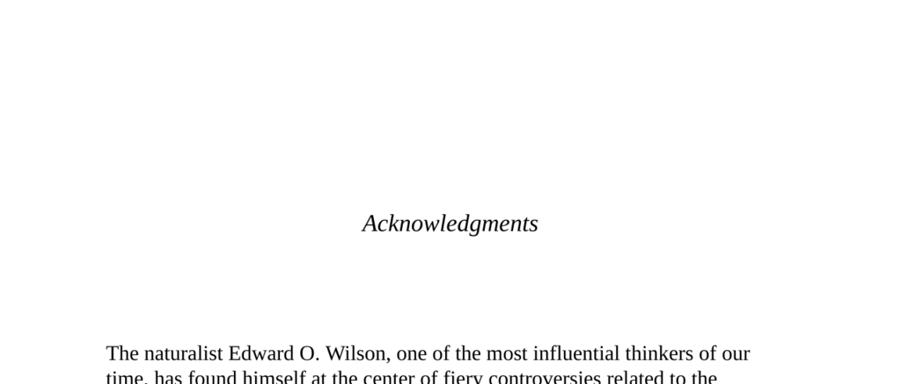

- **Acknowledgments**
  - **Edward O. Wilson and scholarly controversies**
    - Edward O. Wilson is a naturalist known for influential work on human social behavior.
    - He has faced significant controversies regarding the evolution of human social behavior.
    - Wilson credits his opponents for driving him to new intellectual directions.
    - Further reading: [Edward O. Wilson on Evolutionary Biology](https://www.britannica.com/biography/Edward-O-Wilson)
  - **Acknowledgment of scholarly friends**
    - The author thanks numerous academic colleagues who reviewed and critiqued the manuscript.
    - These friends helped correct errors, update knowledge, and improve interpretations.
    - They include scholars from diverse universities and fields related to social behavior.
    - Further reading: [Academic Peer Review Process](https://www.elsevier.com/reviewers/what-is-peer-review)
  - **Acknowledgment of students’ contributions**
    - Graduate and undergraduate students at Stanford University contributed to the book.
    - Their roles included library assistance, research help, and seminar participation.
    - This interaction helped enhance the author’s understanding and the book’s quality.
  - **Acknowledgment of publishing and editorial support**
    - The author thanks individuals who helped finalize the book’s presentation and content.
    - Specific thanks go to editorial staff, agents, and assistants who facilitated publication.
    - Support included title suggestions, manuscript shaping, and encouragement through gestation.
  - **Family support**
    - The author expresses gratitude and love for family members.
    - Family support was crucial in enduring work interruptions and project demands.
