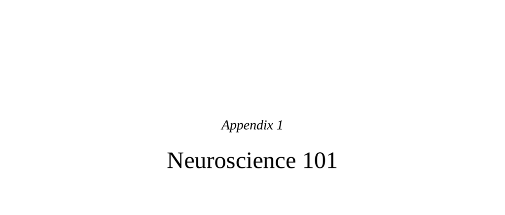

- **Consider two different scenarios**
  - The brain’s rapid signaling enables survival in urgent situations, unlike slower biological processes.  
  - The nervous system emphasizes sharp contrasts between activity and inactivity, requiring significant energy.  
  - For further reading, see [The Human Brain Book](https://www.nationalgeographic.com/science/article/human-brain).

- **One neuron at a time**
  - Neurons are highly asymmetrical cells with dendrites (inputs) and axons (outputs).  
  - Electrical signals propagate as graded potentials in dendrites and as digital action potentials in axons.  
  - Resting potential is a maintained negative internal charge using energy-intensive ion pumps.  
  - Summation of inputs at dendritic spines is necessary to reach the action potential threshold at the axon hillock.  
  - For more, consult [Neuroscience Online](https://nba.uth.tmc.edu/neuroscience/).

- **Two neurons at a time: synaptic communication**
  - Neurons communicate across synapses via neurotransmitters released in response to action potentials.  
  - The "neuron doctrine" states neurons are discrete, separated by synaptic gaps.  
  - Neurotransmitters bind to specific receptors in a lock-and-key mechanism to influence postsynaptic neurons.  
  - Neurotransmitter clearance occurs by reuptake pumps or enzymatic degradation, regulating signal duration.  
  - Dale’s Principle states a neuron releases the same neurotransmitter type at all its axon terminals.  
  - For detailed review, see [Principles of Neural Science](https://www.mheducation.com/highered/product/principles-neural-science-kandel-bennett/M9780071390118.html).

- **More than two neurons at a time**
  - Neuromodulation occurs when one neuron influences neurotransmitter release at another neuron's axon terminal.  
  - Circuits using negative feedback, feed-forward inhibition, and lateral inhibition sharpen signals temporally and spatially.  
  - Pain pathways involve distinct fast and slow fiber circuits that modulate the perception of sharp versus throbbing pain.  
  - Artificial stimulation of fast pain fibers can inhibit chronic pain, demonstrating clinical applications.  
  - Associative networks of neurons underlie recognition, metaphor, and creativity through convergent and divergent projections.  
  - For a comprehensive overview, reference [Neural Circuits and Behavior](https://www.ncbi.nlm.nih.gov/pmc/articles/PMC4523791/).

- **One more round of scaling up**
  - Brain regions cluster neurons with related functions into nuclei connected by white matter fiber tracts.  
  - Lesions in specific brain areas reveal functional roles but interpretations depend on whether cell bodies or fiber tracts are affected.  
  - Most brain functions arise from networks of interconnected regions rather than isolated centers.  
  - Understanding brain architecture requires integrating neuronal and network-level analyses.  
  - Additional information is available at [BrainFacts.org](https://www.brainfacts.org/).
