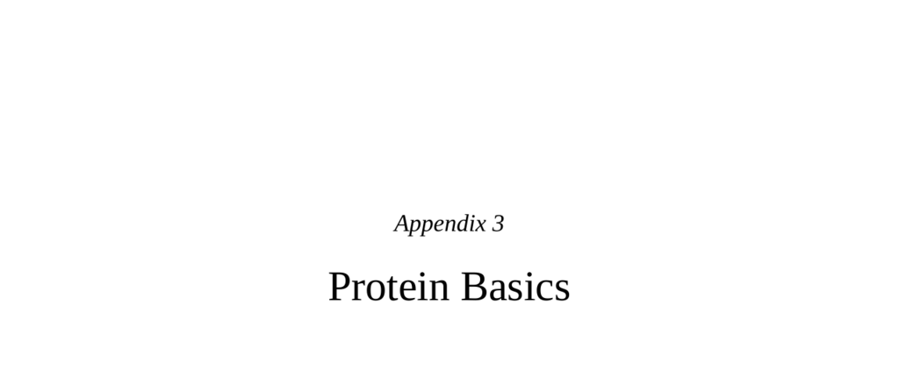

- **Proteins and Their Importance**
  - **Role and abundance of proteins**
    - Proteins are the most abundant molecules in living systems and fundamental to biological functions.
    - Numerous hormones, neurotransmitters, immune system messengers, receptors, enzymes, and cellular scaffolding are proteins.
    - Protein function depends critically on its shape.
    - Environmental factors such as temperature and acidity can subtly alter protein shape.
    - For further reading, see [Proteins at Nature Education](https://www.nature.com/scitable/topicpage/proteins-14021435/).

- **Protein Structure and Function**
  - **Shape determines function**
    - Protein shapes are unique and specific to their diverse functions, including scaffolding and hormone interaction.
    - Protein receptors bind hormones or neurotransmitters in a lock-and-key manner.
    - Some proteins alternate between two conformations to perform functions like enzyme catalysis.
    - Typical proteins are about 300 amino acids long, providing immense sequence variability.
    - Environmental influences can modify protein conformation beyond amino acid sequences.

  - **Amino acid sequences**
    - Proteins are composed of strings of about 20 different amino acids.
    - Any given protein’s amino acid sequence is unique and influences its shape.
    - The number of possible sequences is extraordinarily large, much greater than atoms in the universe.
    - Genes determine the amino acid sequence of proteins.

- **DNA as the Blueprint for Proteins**
  - **DNA Structure and Codons**
    - DNA contains 4 nucleotide types; codons are triplets of nucleotides coding for amino acids.
    - There are 64 possible codons, with 61 coding for 20 amino acids, creating redundancy.
    - Multiple codons often specify the same amino acid, generally differing by a single nucleotide.
    - Example: Alanine is coded by GCA, GCC, GCG, and GCT.
    - For further reading, see [Genetic Code Overview](https://www.genome.gov/genetics-glossary/Genetic-Code).

  - **Genes and genome**
    - A gene is the nucleotide stretch coding a single protein type.
    - The genome consists of all DNA and genes in an organism, divided into chromosomes.
    - Human genomes have about twenty thousand genes.
    - Genes are located in the nucleus, while proteins are synthesized throughout the cell.
  
  - **RNA’s role in protein synthesis**
    - RNA serves as a manageable copy of the DNA gene for protein construction.
    - RNA copies a single gene’s nucleotide sequence and transports it to protein synthesis sites.
    - This role enables protein production distant from the nucleus, e.g., in neuron axon terminals.
    - The central dogma: DNA sequence determines RNA sequence, which determines amino acid sequence, which determines protein shape and function.
    - For further reading, see [Central Dogma of Molecular Biology](https://www.ncbi.nlm.nih.gov/books/NBK26829/).

- **Mutations and Polymorphisms**
  - **Definition and inheritance of mutations**
    - Mutations are errors in DNA copying passed to offspring if uncorrected.
    - They occur within the billions of nucleotides involved in genome replication.
    - Types include point mutations, deletion mutations, and insertion mutations.

  - **Point mutations**
    - Point mutations alter a single nucleotide; effects depend on redundancy of DNA code.
    - Mutations can be neutral if the amino acid remains the same or similar.
    - Significant amino acid changes may alter protein shape and function drastically.
    - Point mutations can lead to evolutionary variation if they affect reproductive success.
    - Genes with multiple alleles arise due to such polymorphisms.

  - **Deletion and insertion mutations**
    - Deletion mutations remove nucleotides, potentially causing frameshifts with drastic effects.
    - Insertions duplicate nucleotides, also causing frameshift mutations or new sequences.
    - Large deletions or insertions may involve entire genes or gene duplications.
    - Both mutation types often have major functional consequences but can occasionally produce novel proteins.

  - **Distinction between human and chimpanzee gene similarity versus sibling gene sharing**
    - Humans share about 98% of genes with chimps at a gene type level, not specific alleles.
    - Siblings share approximately 50% of gene variants.
    - Gene similarity with chimps relates to traits, while sibling similarity involves different allele versions of shared genes.
    - For further reading, see [Human-Chimpanzee Genetics Comparison](https://www.nature.com/scitable/topicpage/human-and-chimpanzee-genome-variation-282/).
