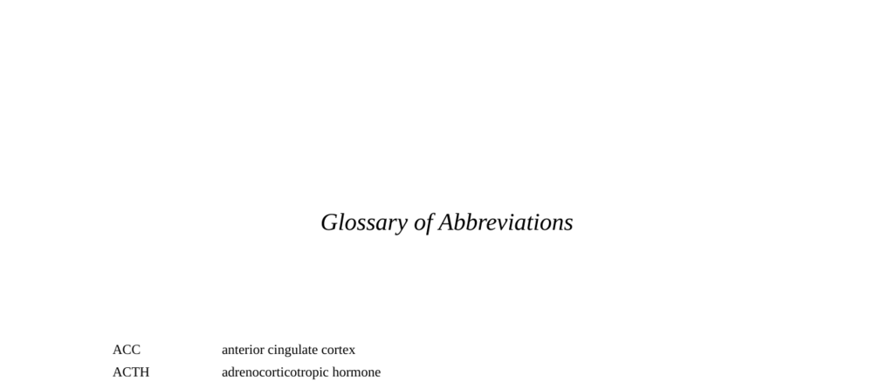

- **Glossary of Abbreviations**
  - **ACC to ASD**
    - The section defines abbreviations related to brain regions and psychological disorders.
    - It includes terms like anterior cingulate cortex (ACC) and autism spectrum disorders (ASD).
    - Abbreviations cover both anatomical and clinical terminology.
    - For detailed definitions, see [Neuroscience Glossary](https://nba.uth.tmc.edu/neuroscience/m/s1/glossary.html).
  - **BDNF to BNST**
    - This part lists neurotransmitters, brain regions, and body metrics.
    - Entries include brain-derived neurotrophic factor (BDNF) and body mass index (BMI).
    - It provides a bridge between molecular biology and brain anatomy.
    - Refer to [BrainInfo Glossary](https://braininfo.rprc.washington.edu/glossary.aspx) for more.
  - **CAH to CRH**
    - Covers hormonal and therapeutic abbreviations, such as congenital adrenal hyperplasia (CAH) and corticotropin-releasing hormone (CRH).
    - Includes psychological treatment terms like cognitive behavioral therapy (CBT).
    - Emphasizes endocrine and behavioral health terminology.
    - Consult [Endocrine Society Resources](https://www.endocrine.org/education-and-career/glossary) for further info.
  - **DAT to DZ**
    - Defines terms related to neurotransmitters and genetics, including dopamine transporter (DAT) and dizygotic (DZ).
    - Highlights genetic and biochemical markers relevant to neuroscience.
    - Suggests links between genetic factors and brain function.
    - See [Genetics Home Reference](https://medlineplus.gov/genetics/understanding/) for additional context.
  - **EEA to ERPS**
    - Lists abbreviations for psychological assumptions and neurophysiological measurements like EEG and event-related potentials (ERPS).
    - Connects psychological methods with underlying brain activity measurement techniques.
    - Underlines research tools in cognitive neuroscience.
    - Explore [Society for Psychophysiological Research](https://sprweb.org/) for deeper understanding.
  - **fMRI to FTD**
    - Defines major imaging and neurological disease terms, such as functional magnetic resonance imaging (fMRI) and frontotemporal dementia (FTD).
    - Links neuroimaging techniques to clinical neurodegenerative disorders.
    - Emphasizes diagnostic and research applications.
    - For imaging methodologies, see [RadiologyInfo.org](https://www.radiologyinfo.org/en/info/fmrimr).
  - **GABA to GWAS**
    - Details neurotransmitter, hormonal, physiological, and genetic study terms including gamma-aminobutyric acid (GABA) and genomewide association studies (GWAS).
    - Merges biochemical foundations with genetic epidemiology approaches.
    - Highlights multidisciplinary approaches in brain and behavior research.
    - Refer to [NIH Genetic Association Studies](https://www.ncbi.nlm.nih.gov/gap) for extended reading.
  - **HG to LL**
    - Lists social and personality psychology and hormonal abbreviations like hunter-gatherer (HG) and low warmth/low competence (LL).
    - Captures constructs from evolutionary psychology and social perception.
    - Illustrates interplay between hormonal and social behavioral sciences.
    - Additional insights at [Social Psychology Network](https://www.socialpsychology.org/).
  - **LTD to LTP**
    - Defines synaptic plasticity terms: long-term depression (LTD) and long-term potentiation (LTP).
    - These processes underpin learning and memory mechanisms.
    - Integral to understanding neurophysiological adaptations.
    - For more, visit [Neuroscience Online](https://nba.uth.tmc.edu/neuroscience/m/s2/chapter04.html).
  - **MAO-A to MZ**
    - Lists gene and twin study abbreviations: monoamine oxidase-A (MAO-A), major histocompatibility complex (MHC), and monozygotic (MZ).
    - Shows importance of genetics and immunology in behavioral neuroscience.
    - Includes methodology for genetic influences on behavior.
    - See [Twin Studies Overview](https://www.ncbi.nlm.nih.gov/pmc/articles/PMC3905814/) for elaboration.
  - **NCAM to PMS**
    - Covers neural adhesion, brain areas, and mood disorder terms including neural cell adhesion molecule (NCAM) and premenstrual syndrome (PMS).
    - Links molecular components with affective neuroscience.
    - Highlights neurobiological factors in mood disorders.
    - For clinical details, review [National Institute of Mental Health](https://www.nimh.nih.gov/health/topics/premenstrual-dysphoric-disorder-pmdd).
  - **PNS to PVN**
    - Includes autonomic nervous system parts and hypothalamic nuclei: parasympathetic nervous system (PNS) and paraventricular nucleus (PVN).
    - Represents regulatory brain structures and peripheral systems.
    - Important for stress and homeostatic control understanding.
    - See [Autonomic Nervous System](https://www.ncbi.nlm.nih.gov/books/NBK538272/) for further study.
  - **RNA to RWA**
    - Lists molecular biology and political psychology abbreviations, such as ribonucleic acid (RNA) and right-wing authoritarianism (RWA).
    - Shows interdisciplinary range from genetics to social attitudes.
    - Emphasizes diverse applications of abbreviations.
    - Explore [Political Psychology Journal](https://onlinelibrary.wiley.com/journal/14679221) for context.
  - **SDO to SSRI**
    - Defines social dominance orientation (SDO) and selective serotonin reuptake inhibitor (SSRI).
    - Links social personality constructs with pharmacological treatments.
    - Highlights the intersection of psychology and medicine.
    - Refer to [American Psychological Association on SSRI](https://www.apa.org/topics/ssri) for details.
  - **STG to TRC**
    - Covers brain region and socio-political terms: superior temporal gyrus (STG) and truth and reconciliation commission (TRC).
    - Connects neuroscience with societal healing processes.
    - Reflects broad application of abbreviations.
    - See [Neuroscience and Society](https://www.frontiersin.org/articles/10.3389/fnins.2020.00117/full).
  - **vlPFC to vmPFC**
    - Lists specific prefrontal cortex areas: ventrolateral (vlPFC) and ventromedial (vmPFC).
    - Critical for decision making and emotional regulation.
    - Highlights functional subdivisions of PFC.
    - For neuroanatomy, visit [BrainFacts.org PFC overview](https://brainfacts.org/brain-anatomy-and-function/regions-of-the-brain/prefrontal-cortex).
