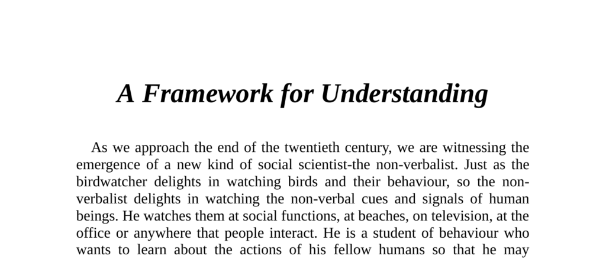

- **A Framework for Understanding**
  - The emergence of "non-verbalists" as social scientists began in the 1960s and public awareness grew after a 1970 book on body language.  
  - Silent movie actors like Charlie Chaplin pioneered non-verbal communication skills in film.  
  - Charles Darwin’s 1872 work laid foundational ideas for the study of facial expressions and body language.  
  - Researchers like Mehrabian and Birdwhistell quantified the impact of non-verbal communication, showing it often outweighs verbal content.  
  - For further details, see [The Definitive Book of Body Language](https://www.example.org).

- **Perceptiveness, Intuition and Hunches**
  - Perceptiveness and intuition involve reading non-verbal cues and contrasting them with verbal signals to detect truth or falsehood.  
  - Gestures such as crossed arms or disengaged body language provide clues about audience reception.  
  - Women generally exhibit higher perceptiveness, often termed "women’s intuition," especially developed through early child-rearing.  
  - Intuition arises from the subconscious interpretation of subtle non-verbal signals.  
  - Additional insights available at [Women’s Intuition and Body Language](https://www.example.org).

- **Inborn, Genetic, Learned and Cultural Signals**
  - Non-verbal signals derive from inborn, genetic, learned, and cultural origins.  
  - Studies of blind and deaf children confirm some gestures like smiling are innate.  
  - Crossed arms and coat-wearing styles demonstrate possible genetic or cultural learning influences.  
  - Cultural differences impact gesture interpretation, necessitating awareness of background context.  
  - Explore more in [Nonverbal Communication Across Cultures](https://www.example.org).

- **Some Basics and Their Origins**
  - Universal gestures include smiling for happiness, frowning for sadness or anger, nodding for yes, and head shaking for no.  
  - Many gestures have evolutionary roots from animal behavior, such as baring teeth or shoulder shrugging.  
  - Cultural variations affect the meaning of gestures such as the ring/OK sign, thumb-up, and V sign.  
  - Misinterpretation across cultures can cause embarrassment or misunderstanding.  
  - For comparative study, consult [Gestures and Their Cultural Meanings](https://www.example.org).

- **Gesture Clusters**
  - Accurate body language interpretation requires analyzing groups of gestures rather than isolated movements.  
  - Gesture clusters act like sentences conveying complex messages, often revealing true feelings.  
  - Congruence between verbal statements and non-verbal cues enhances communication reliability; incongruence signals deception or discomfort.  
  - Observing clusters avoids misinterpretation caused by singular ambiguous gestures.  
  - See [Reading Body Language: Gesture Clusters](https://www.example.org) for detailed methodology.

- **Congruence**
  - Congruence occurs when non-verbal signals match verbal communication, indicating honesty or agreement.  
  - Incongruence suggests lying or concealed attitudes, with non-verbal cues given greater weight.  
  - Examples include politicians’ defensive postures contradicting their spoken messages.  
  - Freud emphasized unconscious revealing gestures such as fiddling with a wedding ring signaling inner conflict.  
  - More on congruence in communication can be found at [Nonverbal Communication and Congruence](https://www.example.org).

- **Gestures in Context**
  - Context is essential to interpret gestures accurately; physical environment and situation influence gesture meaning.  
  - Similar gestures (like crossed arms) can indicate coldness or defensiveness depending on circumstances.  
  - Gesture interpretations must incorporate physical conditions or emotional context.  
  - Ongoing contextual awareness refines understanding of body language signals.  
  - Further reading: [Contextual Interpretation of Body Language](https://www.example.org).

- **Other Factors Affecting Interpretation**
  - Physical limitations (e.g., arthritis) and clothing restrictions influence gesture execution.  
  - Handshakes like the "dead fish" may signal weakness or be a protective adaptation to physical conditions.  
  - Status and socioeconomic factors affect gesticulation frequency; higher status individuals tend to use fewer gestures.  
  - Age influences gesture clarity and speed, with deceptive gestures becoming subtler over time.  
  - See [Physical and Social Influences on Body Language](https://www.example.org) for comprehensive analysis.

- **Faking Body Language**
  - Faking body language is difficult due to microgestures and lack of congruence between body and speech.  
  - Incongruent signals such as contradictory facial expressions betray insincerity.  
  - Actors, politicians, and pageant contestants can fake positive gestures temporarily but not indefinitely.  
  - Facial signals are a critical yet complex area of analysis in detecting deception.  
  - Recommended: [Face Language by Robert L. Whiteside](https://www.example.org).

- **How To Tell Lies Successfully**
  - Successful deception requires hiding the body to avoid contradictory non-verbal cues.  
  - Microgestures such as pupil contraction, sweating, and increased blinking reveal deceit.  
  - Highly trained liars suppress or refine gestures but cannot eliminate all signals.  
  - Situational placement (e.g., behind desks, out of view) facilitates successful lying.  
  - For interrogation techniques and lie detection, see [Detecting Lies and Deception](https://www.example.org).

- **How To Learn Body Language**
  - Dedicated daily practice observing others’ gestures improves body language literacy.  
  - Public places, social events, and television with muted sound provide optimal learning environments.  
  - Cross-checking non-verbal interpretations against verbal communication enhances accuracy.  
  - Developing conscious awareness of one’s own gestures is equally important.  
  - Additional resources: [Learning Body Language Effectively](https://www.example.org).
