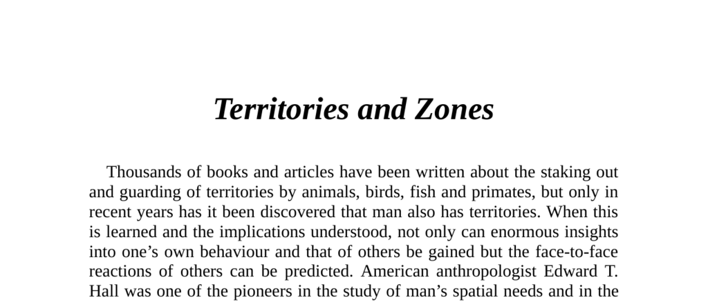

- **Territories and Zones**  
  - Thousands of books and articles cover territorial behavior in animals and primates.  
  - It is recently discovered that humans also have territories affecting behavior and social interactions.  
  - Edward T. Hall pioneered the study of human spatial needs and introduced "proxemics."  
  - For further reading, see [Proxemics - Wikipedia](https://en.wikipedia.org/wiki/Proxemics).

- **Personal Space**  
  - Most animals have personal air space shaped by factors such as population density.  
  - Humans carry a portable personal air bubble whose size is culturally influenced.  
  - Status and upbringing location affect personal space size.  
  - Edward T. Hall's research established foundational concepts in this area.  
  - For more, consult [Personal Space - Encyclopedia Britannica](https://www.britannica.com/science/proxemics).

  - **Zone Distances**  
    - Four distinct zones exist: Intimate (15–45 cm), Personal (46 cm–1.22 m), Social (1.22–3.6 m), and Public (over 3.6 m).  
    - The intimate zone is fiercely guarded and limited to close relations or hostile intrusions.  
    - The social zone is typical for strangers and acquaintances.  
    - Public zone distance is used when addressing large groups.

  - **Practical Applications of Zone Distances**  
    - Intrusion into the intimate zone causes physiological stress responses such as increased heart rate and adrenaline.  
    - Social relationships influence permissible distances within zones.  
    - Crowded public spaces trigger adherence to strict unwritten behavioral rules to avoid conflict.  
    - Police use territory invasion tactics during interrogations to break resistance.  
    - For additional detail, see [Personal Space and Behavior](https://psychologytoday.com/us/basics/personal-space).

  - **Spacing Rituals**  
    - People choose spatial positions based on maximizing distance and harmony among strangers in public settings.  
    - The midway principle applies in cinemas and public toilets to avoid offense or intimidation.  
    - The purpose of spatial rituals is to maintain social harmony and personal comfort.

  - **Cultural Factors Affecting Zone Distances**  
    - Cultural background significantly influences intimate distances; e.g., Danes prefer narrower zones than Australians.  
    - Eye contact frequency interacts with spatial behavior leading to misunderstandings.  
    - Cross-cultural interactions often involve unconscious spatial negotiation, sometimes perceived as pushy or cold.  
    - Recognizing these variations is crucial to avoid misinterpretations.  
    - Refer to [Cross-Cultural Communication - Hofstede](https://geerthofstede.com/culture-geert-hofstede-gert-jan-hofstede/).

  - **Country v City Spatial Zones**  
    - Rural individuals require greater personal space (up to 6 meters) compared to city dwellers.  
    - Handshake distances reflect upbringing: city dwellers have about 46 cm “bubble,” rural up to 100 cm or more.  
    - Negotiation tactics should adapt to spatial preferences of rural versus urban clients.  
    - For further reading, see [Rural-Urban Differences in Personal Space](https://www.tandfonline.com/doi/abs/10.1080/00207594.2010.541019).

- **Territory and Ownership**  
  - Property such as homes, offices, and cars constitute private territories with marked boundaries.  
  - Individuals mark subterritories with possessions or frequent usage to indicate ownership.  
  - Inadvertent invasion of personal territories, such as sitting in a favorite chair, can cause agitation.  
  - Awareness of territorial boundaries can prevent negative social interactions.  
  - See [Territoriality in Human Society](https://link.springer.com/chapter/10.1007/978-3-642-85010-1_17).

- **Motor Vehicles**  
  - Drivers extend their personal space to encompass a large area around the vehicle, up to 10 times normal size.  
  - Cutting off a driver triggers strong territorial aggression, unlike in other social contexts.  
  - Cars can serve as protective cocoons affecting driver behavior and territorial claims.  
  - These amplified territorial instincts explain varying road behaviors between contexts.

- **Summary**  
  - Personal space and territorial behavior depend on cultural, social, and environmental factors.  
  - Correct understanding of spatial zones defines appropriate social interactions and prevents conflict.  
  - Misreading spatial cues can cause misunderstandings in multicultural or mixed social settings.  
  - Observation and inquiry can clarify ambiguous social spatial behavior.
