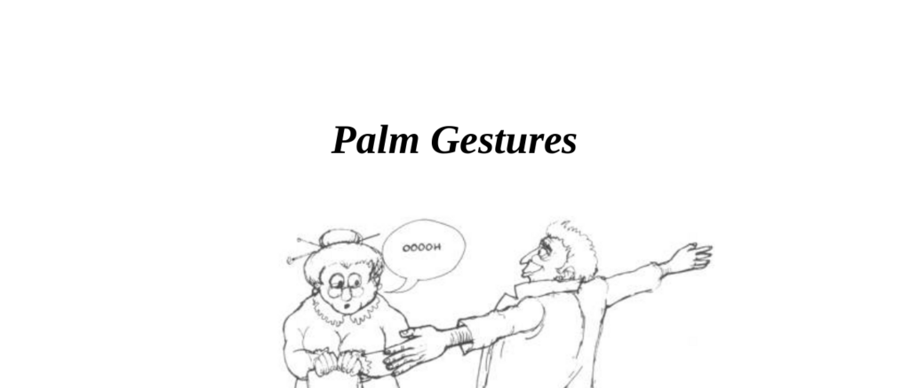

- **Openness and Honesty**  
  - The open palm has historically symbolized truth, honesty, allegiance, and submission.  
  - Two basic palm positions are common: palm up indicates pleading or openness, palm down implies restraint or control.  
  - Exposed palms during communication signal honesty, while hidden palms suggest concealment or deceit.  
  - Salespeople interpret exposed palms as indicators of valid reasons from clients.  
  - Use [Body Language Expert](https://www.bodylanguageexpert.co.uk) for deeper understanding of honesty gestures.  

- **Intentional Use of Palms to Deceive**  
  - Lies told with visible palms may still seem insincere due to conflicting negative gestures.  
  - Professional liars refine their nonverbal cues to align with verbal deception.  
  - Practicing open palm gestures can increase perceived credibility and reduce dishonesty tendencies.  
  - Open palm use encourages openness in others and suppresses false information.  
  - Refer to [The Definitive Book of Body Language](https://www.amazon.com/Definitive-Book-Body-Language/dp/0553804723) for detailed deception analysis.  

- **Palm Power**  
  - Palm gestures confer authority through silent command when used consciously.  
  - Three primary palm commands: palm-up (submissive), palm-down (authoritative), palm-closed finger-pointed (aggressive).  
  - Palm-up gestures invite cooperation without pressure; palm-down gestures impose authority and can provoke resistance.  
  - The pointed finger is an irritant and evokes submission, often undermining rapport.  
  - Explore [Power Dynamics in Body Language](https://psychologenie.com/body-language-and-power-psychology) for expanded insights.  

- **Shaking Hands**  
  - The handshake evolved from a caveman ritual showing no hidden weapons by exposing palms.  
  - Commonly performed on greeting and departure with 5–7 palm interlocks.  

  - **Dominant and Submissive Handshakes**  
    - Dominance is shown by a palm-down handshake signaling control and authority.  
    - Submission is shown by a palm-up handshake yielding control to the other party.  
    - Equal status handshake features palms vertical in a vice-like grip signaling mutual respect.  
    - Stepping forward with the left foot allows disarming of dominant handshakes by invading personal space.  
    - See [Handshake Psychology](https://www.psychologytoday.com/us/blog/body-language-expert/201110/what-your-handshake-really-says) for related concepts.  

  - **Who Reaches First?**  
    - Initiating a handshake uninvited may be unwelcome and cause negative reactions.  
    - Consider physical conditions (arthritis, hand use in profession) that affect handshake style.  
    - In absence of handshake initiation, a nod may be a polite alternative.  
    - Refer to [Interpersonal Communication Tips](https://www.mindtools.com/pages/article/handshake.htm) for appropriate handshake etiquette.  

  - **Hand Shake Styles**  
    - The palm-down thrust is the most aggressive, forcing submission from the receiver.  
    - Countermeasures include stepping to the right or grasping the opponent's hand from above for dominance.  
    - The glove handshake appears trustworthy but causes suspicion if used with strangers.  
    - The dead fish handshake is weak and universally disliked, associated with low character.  
    - The knuckle grinder is an aggressive, hard grip with no effective nonverbal counters.  
    - The stiff-arm thrust maintains distance and is typical in rural cultures with larger personal space.  
    - The fingertip grab suggests enthusiasm but reveals underlying insecurity.  
    - Pulling the receiver closer can indicate insecurity or cultural norms of intimacy.  
    - Double-handed handshake signals sincerity and trust but risks suspicion if overused or misapplied.  
    - Deeper left hand holds (elbow, shoulder) indicate closer emotional bonds and involve intimate zones.  
    - Visit [Handshaking Styles](https://www.sciencedirect.com/science/article/abs/pii/S0191308514001347) for academic analysis on handshake types.
