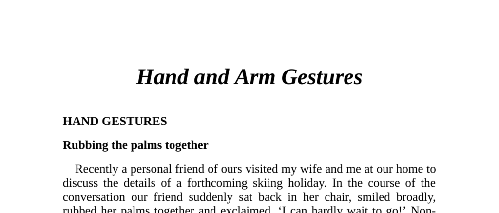

- **Hand Gestures**
  - **Rubbing the Palms Together**
    - This gesture non-verbally communicates positive expectation or anticipation.
    - The speed of rubbing indicates whose benefit is expected: fast rubbing favors the other person, slow rubbing suggests self-interest.
    - Context and situation, such as cold weather, may affect interpretation.
    - Use fast palm rubbing to avoid defensive reactions in sales situations.
    - For deeper understanding: [The Definitive Book of Body Language](https://www.goodreads.com/book/show/40529.The_Definitive_Book_of_Body_Language)
  - **Thumb and Finger Rub**
    - Rubbing the thumb against the fingertips signals money expectancy or financial dealings.
    - Commonly used by salespeople or those requesting money, and should be avoided professionally with clients.
    - This gesture directly relates to financial anticipation or negotiation.
  - **Hands Clenched Together**
    - Indicates frustration or hostility despite a possible outwardly positive appearance.
    - The gesture varies by hand position: in front of face signals stronger negativity.
    - It signals holding back negative attitudes and increases in intensity with hand height.
    - Action is needed to unlock hands to reduce hostility.
  - **Steepling Hands**
    - Commonly used alone as a confident or superior gesture, frequent in authority figures.
    - There are two forms: raised steeple (giving opinions) and lowered steeple (listening).
    - Interpretation depends on preceding body language; can signal positive engagement or dismissiveness.
    - The gesture signals confidence but may be perceived as arrogance with head tilt.
  - **Gripping Hands, Arms and Wrists**
    - Palm-in-palm behind the back signals confidence, authority, and fearlessness.
    - Used by royalty, police without firearms, and authority figures to project calm and control.
    - Hand gripping wrist or arm is a self-control gesture signaling frustration and nervousness.
    - The height of the grip correlates with anger intensity.
  - **Thumb Displays**
    - Thumbs convey strength, dominance, superiority, or aggression, often as part of  gesture clusters.
    - Used frequently by confident or high-status individuals and influenced by clothing.
    - Protruding thumbs from pockets signal hidden dominance; women have adopted male thumb gestures.
    - Arms folded with thumbs pointing up combine defensiveness and superiority.
    - Thumb pointing or shaking is a gesture of ridicule or disrespect, often provoking conflict and disapproval.
    - For more on thumb-related body language: [What Every Body Is Saying](https://www.goodreads.com/book/show/702.Avoiding_Lies)
