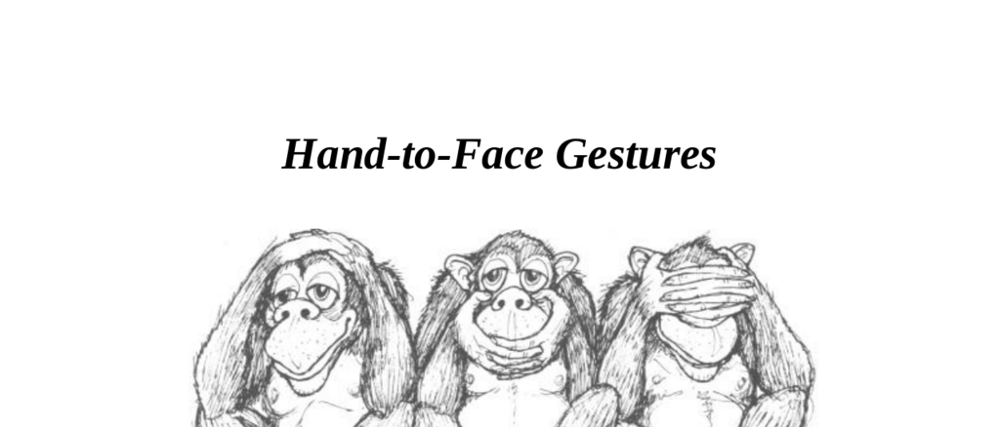

- **Hand-to-Face Gestures**
  - **Deceit, Doubt, Lying**
    - Non-verbal deceit gestures often involve covering mouth, eyes, or ears with hands based on the "see no evil, hear no evil, speak no evil" concept.  
    - Children display obvious deceit gestures openly; adults show more refined hand-to-face gestures when lying or doubting.  
    - Hand-to-face gestures alone do not confirm lying; they require correlation with other gestures.  
    - Research shows liars, such as nurses in role-plays, increase hand-to-face gestures compared to truth-tellers.  
    - Further reading: [The Definitive Book of Body Language](https://www.goodreads.com/book/show/21554.The_Definitive_Book_of_Body_Language) by Allan and Barbara Pease.  
  - **The Mouth Guard**
    - The mouth guard gesture involves covering the mouth with the hand, often pressing the thumb against the cheek, signaling an attempt to suppress deceitful words.  
    - It can appear as partial finger coverage or a closed fist and is sometimes disguised by a fake cough.  
    - The speaker’s mouth guard signals lying; if the listener covers mouth while hearing, they may doubt the speaker’s words.  
    - Audience use of this gesture during a speech suggests disagreement or disbelief.  
  - **Nose Touching**
    - Nose touching is a disguised form of the mouth guard gesture, consisting of light rubs or quick touches below the nose.  
    - It may originate as a subconscious retreat from covering the mouth or from nerve tingling caused by lying.  
    - Deliberate nose scratching for itch differs from the subtle nose touch signaling deceit or doubt.  
    - Like the mouth guard, it may be used by speakers or listeners to indicate dishonesty or disbelief.  
  - **The Eye Rub**
    - The eye rub gesture attempts to "see no evil" by blocking or avoiding deceitful visual input.  
    - Men tend to rub eyes vigorously, while women use gentle strokes to avoid smudging makeup.  
    - It often accompanies gaze aversion, especially looking down or at the ceiling.  
    - Combined with clenched teeth and a false smile, it signals insincerity but such clusters are rare in reality.  
  - **The Ear Rub**
    - The ear rub gesture mimics the childlike attempt to "hear no evil" by covering or manipulating the ear.  
    - Variations include rubbing behind the ear, finger drills inside the ear, pulling the earlobe, or bending the ear forward.  
    - Bending the ear forward signals having "heard enough" or readiness to speak.  
  - **The Neck Scratch**
    - The neck scratch involves about five quick scratches below the earlobe or on the neck, signaling doubt or uncertainty.  
    - It often appears when verbal and non-verbal messages conflict, such as agreeing verbally but doubting non-verbally.  
  - **The Collar Pull**
    - The collar pull gesture reflects tingling sensations and heat in the neck caused by lying or nervousness.  
    - It is also used to release frustration or anger by allowing cooler air circulation on the neck.  
    - When observed, clarifying questions may expose deception.  
  - **Fingers in the Mouth**
    - Placing fingers in the mouth is an unconscious regression to childlike security behaviors under pressure.  
    - It shows a need for reassurance rather than deceit, differing from other hand-to-mouth gestures linked with lying.  
    - Adults may substitute fingers with objects like cigarettes or pens.  
  - **Interpreting and Misinterpreting**
    - Accurate interpretation of hand-to-face gestures requires contextual observation and time to distinguish between doubt, deceit, uncertainty, or exaggeration.  
    - Wrong conclusions arise when interpreting gestures in isolation without considering preceding signals or situation context.  
    - Examples illustrate how these gestures clarified uncertain or deceitful states during interviews and games.  
- **Cheek and Chin Gestures**
  - **Boredom**
    - Supporting the head with the hand signals boredom, ranging from slight support to full head resting on a surface indicating extreme disinterest.  
    - Finger drumming and foot tapping are impatience signals, not boredom, and require speaker engagement to prevent negative audience influence.  
  - **Evaluation**
    - A closed hand resting on the cheek with the index finger upwards signals evaluation or interest.  
    - Altering this to palm support indicates feigned interest or polite respect masking actual boredom.  
    - Pointing the index finger up the cheek with thumb supporting the chin shows negative or critical thoughts requiring speaker action.  
    - Longer duration of this gesture correlates with sustained critical attitude.  
  - **Chin Stroking**
    - Chin stroking indicates decision-making after evaluation phases in a conversation or presentation.  
    - Subsequent gestures reveal decision quality; crossed arms and leaning back indicate a negative decision, while readiness gestures signal positive outcomes.  
  - **Variations of Decision-Making Gestures**
    - Glasses wearers may place an arm of their frame in their mouth instead of chin stroking during decision-making.  
    - Pipe smokers insert their pipe instead of stroking the chin.  
    - Objects in the mouth following a decision prompt suggest uncertainty and a stall in immediate decision-making.  
  - **Combination Hand-to-Face Clusters**
    - Combinations of evaluation and decision-making gestures simultaneously show mixed attitudes.  
    - Transition from evaluation on cheek to chin stroking reflects movement from assessing to decision-making.  
    - Loss of interest is signaled when the head begins resting on the hand with thumb support.  
- **Head-Rubbing and Head-Slapping Gestures**
  - Palm rubbing the back of the neck (pain-in-the-neck gesture) signals lying, frustration, or anger, accompanied by gaze aversion and looking downward.  
  - Head-slapping gestures differ by location; forehead slaps signal non-intimidation, neck slaps communicate frustration with the situation or person.  
  - Frequent neck rubbers tend to be negative or critical; habitual forehead rubbers are generally easiergoing and open.
