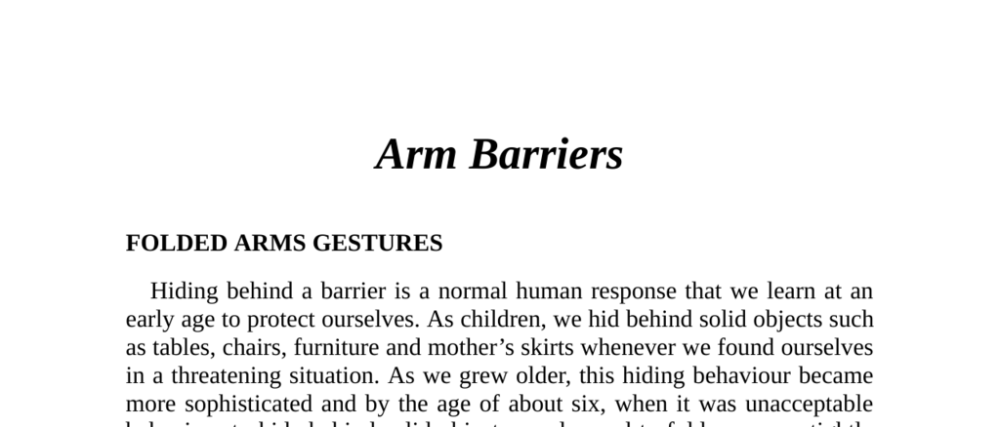

- **Arm Barriers**
  - **Folded Arms Gestures**
    - Folding arms across the chest is a learned defensive behavior to block out perceived threats.  
    - The gesture originates from childhood hiding behaviors, evolving to more subtle forms with age.  
    - People with nervous, negative, or defensive attitudes typically fold their arms firmly across their chest.  
    - Folding arms during lectures resulted in 38% less retention and increased negativity toward the speaker in a study.  
    - Training centers should provide chairs with arms to encourage open posture.  
    - [Body Language: How to Read Others' Thoughts by Their Gestures](https://www.pamelahelland.com/body-language-reading-others-thoughts)  
  - **Standard Arm-Cross Gesture**
    - Both arms folded across the chest signify a defensive or negative attitude universally.  
    - This gesture commonly appears among strangers or people feeling insecure in public settings.  
    - About 90% of an audience folded their arms immediately after hearing a verbal attack in a US seminar.  
    - The arm-crossed position signals disagreement despite possible verbal agreement.  
    - Effective speakers use ice breakers to move audiences into more receptive postures.  
  - **Breaking the Folded-Arms Position**
    - Giving a person an object like a pen or book prompts unfolding arms and a more open attitude.  
    - Asking questions with visible palms encourages honesty and openness.  
    - Salespeople should identify reasons behind folded arms before proceeding with presentations.  
  - **Reinforced Arm-Cross**
    - Clenched fists combined with folded arms indicate a hostile and potentially aggressive attitude.  
    - This cluster may be accompanied by clenched teeth and flushed face suggesting imminent verbal or physical attack.  
    - A submissive, palms-up approach helps uncover the cause of hostility.  
  - **Arm Gripping Gesture**
    - Arms tightly gripping upper arms reinforce the barrier and resist unfolding.  
    - Often observed in nervous or restrained individuals such as first-time air travelers or patients in waiting rooms.  
    - Clenched fists suggest a more aggressive stance, whereas arm gripping suggests restraint.  
    - Status influences arm folding: superiors rarely fold arms, whereas subordinates often do out of nervousness.  
    - A defensive thumbs-up arm cross signals self-confidence while maintaining protection.  
  - **Partial Arm-Cross Barriers**
    - The partial arm cross is a subtler alternative, used to avoid appearing fearful around others.  
    - One arm crosses the body to touch or hold the other arm, forming a partial barrier.  
    - The “holding hands with oneself” gesture relives childhood emotional security under stress.  
  - **Disguised Arm-Cross Gestures**
    - Disguised arm crosses involve touching objects like handbags, watches, or adjusting clothing to hide nervousness.  
    - Such gestures maintain the barrier while appearing socially acceptable to observers.  
    - Women often use handbags or hold drinks with both hands to form subtle arm barriers.  
    - These gestures are nearly universal and often unconscious among public figures and everyday people.  
    - [The Definitive Book of Body Language](https://www.amazon.com/Definitive-Book-Body-Language/dp/0553804723) by Allan and Barbara Pease
