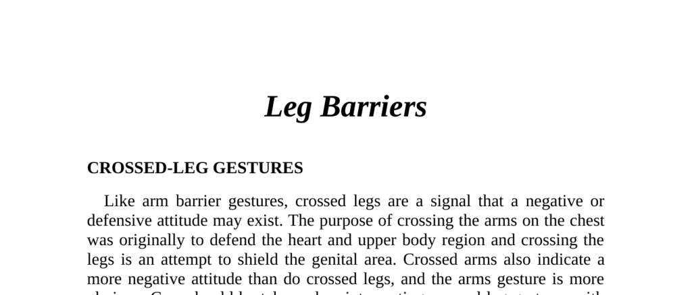

- **Leg Barriers**
  - **Crossed-Leg Gestures**
    - Crossing legs indicates a negative or defensive attitude, similar to arm barrier gestures.
    - Crossing legs attempts to shield the genital area, while crossed arms defend the heart and upper body.
    - Crossed arms signify a stronger negative attitude than crossed legs.
    - Cultural norms, such as women being taught to "sit like a lady," can affect interpretation.
    - See [Body Language: Crossed Arms](https://www.psychologytoday.com/us/basics/body-language) for related gestures.
  - **The Standard Leg-Cross Position**
    - One leg is crossed over the other, usually right over left, common in European, British, Australian, and New Zealand cultures.
    - Indicates nervousness, reservation, or defensiveness, but often supportive in combination with other gestures.
    - Common in settings like lectures, uncomfortable chairs, or cold weather.
    - Combined with crossed arms, it signals withdrawal from conversation.
    - Crossed leg gesture is popular among women to express displeasure with male partners.
  - **The American Figure 4 Leg Lock Position**
    - Indicates argumentative or competitive attitudes, typical among competitive American males.
    - Easier to interpret when used by British citizens due to cultural differences.
    - Shown in a New Zealand meeting where managers shifted to this pose during debates.
    - In selling, it advises against immediate closing and suggests inviting the buyer’s opinion.
    - Women wearing trousers or jeans sometimes adopt this position.
  - **Figure 4 Leg Clamp**
    - The figure 4 leg lock is locked tightly with one or both hands acting as clamps.
    - Signifies a tough-minded, stubborn individual requiring special approaches.
  - **Standing Leg Cross Gestures**
    - Small groups of people unfamiliar with each other tend to stand with arms and legs crossed and maintain greater distance.
    - Individuals personally known to each other stand openly with unfolded arms, exposed palms, and relaxed postures.
    - Closed arms and legs stance can coexist with relaxed facial expressions and conversation, indicating underlying defensiveness.
  - **The ‘Opening-Up’ Procedure**
    - Comfort in a group develops through stages from defensive crossed limbs to relaxed open postures.
    - The five stages progress from arms and legs crossed to leaning back and pointing at an interlocutor.
    - Alcohol can accelerate or bypass some stages.
    - Studies confirm this process is consistent across Australia, New Zealand, Canada, and America.
  - **Defensive or Cold?**
    - People often claim crossed limbs are due to feeling cold, but these postures differ from defensive stances.
    - Cold-related limb crossing involves hands in armpits and stiff, tightly pressed legs.
    - Defensive postures tend to have more relaxed leg positions.
    - Habitual crossers attribute it to comfort rather than nervousness or defensiveness.
  - **The Ankle-Lock Gesture**
    - Crossing or folding legs at the ankles signals a negative or defensive attitude.
    - Male and female versions differ slightly in posture and hand placement.
    - Often indicates the individual is mentally restraining negative feelings, fear, or nervousness.
    - Unlocking ankles corresponds to opening up emotionally or revealing withheld information.
    - Important in negotiations to identify hidden concessions.
    - Habitual use may reinforce a defensive or reserved attitude.
    - Legislation should consider fashion influences, particularly among women, in interpreting this gesture.
  - **The Foot Lock**
    - Almost exclusively used by women, where one foot locks around the other leg.
    - Denotes a strong defensive attitude and mental retreat.
    - Common in shy or timid women and requires a warm, friendly approach to open up.
    - Misinterpretation of this gesture can affect sales and social interactions.
    - See [Nonverbal Communication in Sales](https://hbr.org/2015/04/what-salespeople-can-learn-from-body-language) for application.
