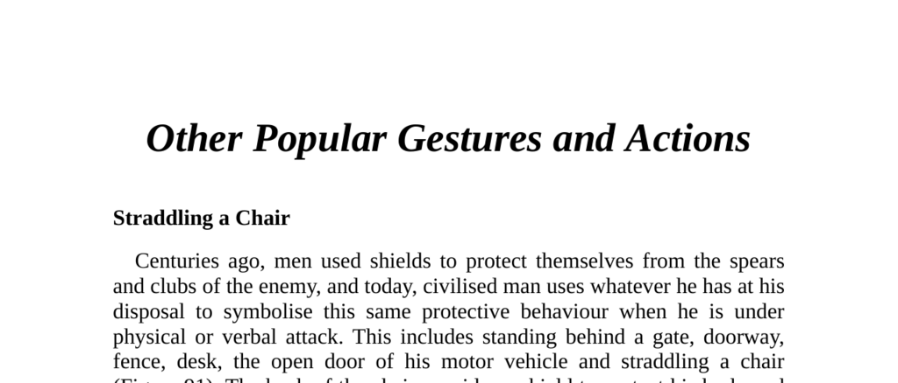

- **Other Popular Gestures and Actions**
  - **Straddling a Chair**
    - Straddling a chair symbolizes protective behavior reminiscent of using shields in battle.
    - It indicates dominance and an attempt to control conversations or groups.
    - Disarming the straddler involves standing behind him to expose his back and cause him to change position.
    - In one-on-one situations with swiveling chairs, standing above and within personal space disconcerts the straddler.
    - Fixed chairs with arms prevent the straddler from assuming this position.
  - **Picking Imaginary Lint**
    - Picking invisible lint signals disapproval or withheld opinions despite verbal agreement.
    - This displacement gesture usually involves looking away and performing a minor irrelevant action.
    - To reveal hidden objections, open-palm invitations to speak should be extended and observed.
    - Persistent lint-picking despite verbal agreement requires direct questioning.
    - For more on displacement gestures, see [Nonverbal Communication](https://www.psychologytoday.com/us/basics/nonverbal-communication).
  - **Head Gestures**
    - The head nod universally signals affirmation and may be an inborn gesture.
    - The head shake usually means negation and might be innate or learned from infancy.
    - Contradictory head shakes during verbal agreement indicate disguised objections.
    - Three basic head positions exist: head up (neutral), tilted (interest), and down (negative or judgmental).
    - Speakers should aim to elicit head-tilted positions to indicate audience engagement.
  - **Both Hands Behind Head**
    - Indicates confidence, dominance, superiority, or territorial claim.
    - Common among professionals like accountants, lawyers, and managers.
    - Can signal a "know-it-all" attitude and provoke irritation.
    - Handling includes leaning forward with open palms to prompt comment or copying the gesture to show agreement or equality.
    - Often used in peer presence but rarely with superiors, indicating hierarchical awareness.
- **Aggressive and Readiness Gestures**
  - **Hands-on-Hips Pose**
    - Universally signals aggression, readiness to act, or dominance.
    - Used by children arguing, athletes waiting, and boxers before bouts.
    - Mimics bird feather-fluffing to appear larger and challenge rivals.
    - Context and preceding gestures (e.g., coat open or closed) clarify intensity of aggression.
    - Closed coat signals frustration; open coat signals fearless aggression.
  - **Seated Readiness**
    - Demonstrates readiness to act, important in negotiation and sales contexts.
    - When following decision-making gestures, it correlates with successful sales.
    - Opposite arm-crossed posture after decision-making often indicates failure to close.
    - Critical to observe for managing interpersonal encounters and negotiations.
  - **The Starter’s Position**
    - Leaning forward gripping knees or chair signals desire to end interaction.
    - Recognizing this can allow a conversational lead and psychological control.
  - **Sexual Aggressiveness**
    - Thumbs tucked into belt or pockets highlight sexual dominance and territoriality.
    - Commonly portrayed in media to indicate virility.
    - Combined with pupil dilation and foot orientation toward a female, it signals male sexual interest.
    - Females can use variations of this gesture when wearing pants or jeans.
  - **Male-Male Aggression**
    - Hands-on-hips and thumbs-in-belt gestures used to size up rivals.
    - Relaxed body posture and turned angles reduce likelihood of confrontation.
    - Direct facing with planted feet increases probability of conflict.
    - Open palm gestures signal relaxation and goodwill.
    - For further analysis on male aggression signals, see [Body Language of Men](https://www.psychologytoday.com/us/blog/nurturing-self-compassion/201807/the-body-language-men-show-power).
