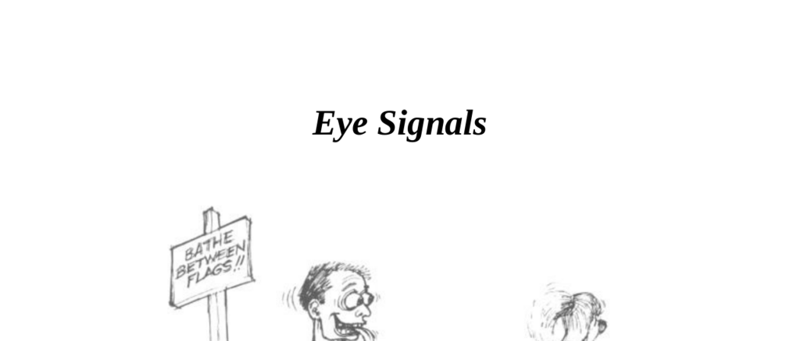

- **Eye Signals**
  - **Pupil Size and Mood**
    - Pupils dilate or contract depending on mood and attitude under given light conditions.  
    - Excitement causes pupils to dilate up to four times normal size; anger causes contraction.  
    - Pupil reactions are often unconscious and are used in courtship and emotional communication.  
    - [The Tell-Tale Eye](https://www.example.org) by Hess explains eyes as revealing communication signals.  
  - **Pupil Response to Stimuli**
    - Pornographic films cause pupil dilation up to three times normal size in men and even more in women.  
    - Babies and children have larger pupils which dilate more when adults are present for attention.  
    - Experts detect pupil dilation signals to gain advantage in card games unless opponents wear dark glasses.  
    - Historical use includes ancient Chinese gem traders and prostitutes using belladonna to dilate pupils.  
  - **Gaze Behaviour**
    - Eye contact duration influences trust and rapport; less than one-third gaze signals deceit or withholding.  
    - Gaze above two-thirds can signal interest with dilated pupils or hostility with constricted pupils.  
    - Cultural differences affect gaze norms, such as Southern Europeans’ frequent gaze and Japanese gaze at the neck.  
    - [Nonverbal Communication and Culture](https://www.example.org) provides cultural context on gaze behavior.  
  - **Types of Gazes**
    - The Business Gaze targets a triangle on the forehead to create seriousness and control.  
    - The Social Gaze focuses between the eyes and mouth creating a social atmosphere.  
    - The Intimate Gaze moves from eyes to chest or crotch and signals romantic or sexual interest.  
    - Sideways Glance combined with facial expressions communicates either interest (raised eyebrows, smile) or hostility (furrowed brow).  
    - [Body Language: How to Read Mind](https://www.example.org) details gaze types and effects.  
  - **Eye Block Gesture**
    - Eye block gesture involves prolonged eyelid closure and signals boredom, disinterest, or perceived superiority.  
    - Combined with head tilt, it appears as “looking down one’s nose,” indicating superiority.  
    - Presence of eye block suggests communication requires a tactical change to regain engagement.  
  - **Controlling a Person’s Gaze in Presentations**
    - 87% of information to the brain is via eyes, 9% ears, 4% others.  
    - Looking at visual aids while listening reduces message absorption unless messages relate precisely to visuals.  
    - Effective method: point at visual aid while speaking, then hold pointer between listener’s eyes and speaker’s eyes to fix gaze.  
    - Visible palm of other hand reinforces engagement and trust.  
    - [Presentation Skills Training](https://www.example.org) elaborates on managing audience gaze.
