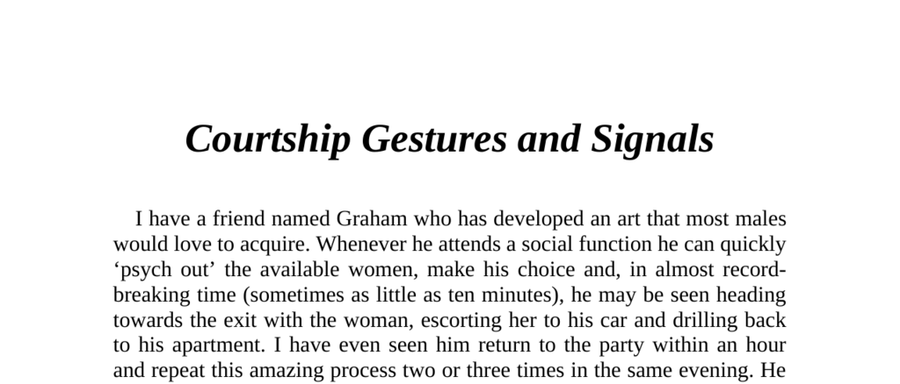

- **Introduction to Graham's Courtship Success**  
  - Graham rapidly identifies and pursues interested women at social events.  
  - He uses courtship signals effectively to attract women and quickly initiates intimate encounters.  
  - His success contrasts with male peers' perception of him as aggressive and arrogant.  
  - For more on human courtship success strategies, see [The Evolution of Human Mating](https://www.ncbi.nlm.nih.gov/pmc/articles/PMC2800045/).

- **Animal Courtship Behaviour and Human Parallels**  
  - Animal courtship consists of specific, predetermined gestural patterns unique to each species.  
  - Males display elaborate physical and vocal signals to gain female attention while females often appear passive.  
  - Human courtship behaviours share similarities with animal rituals, involving both obvious and subtle gestures.  
  - Darwin's study on sexual selection offers foundational insights: [The Descent of Man](https://ebooks.adelaide.edu.au/d/darwin/charles/descent/).

- **Courtship Signals in Humans**  
  - Sending and recognizing courtship signals is critical for successful sexual encounters.  
  - Women are generally more perceptive of courtship gestures than men.  
  - Men often fail to notice female courtship signals, impairing their success.  
  - [Nonverbal Communication in Human Courtship](https://www.sciencedirect.com/science/article/abs/pii/S1740144516300279) expands on these dynamics.

- **Physiological Changes During Courtship**  
  - Entering the presence of an opposite-sex individual triggers automatic muscle tone increase and posture improvement.  
  - Facial features become more youthful; sagging disappears and chest protrudes.  
  - These changes begin when gaze is made and revert after passing the person.  
  - Dr. Albert Scheflen’s research highlights these unconscious physiological adaptations.  

- **Male Courtship Gestures**  
  - Males perform preening behaviors such as adjusting ties or smoothing hair when females approach.  
  - Dominant displays include thumbs-in-belt, turning towards the female, extended gaze, and open leg posture.  
  - Males often use gestures to show physical size and readiness for involvement.  
  - Despite these, men are generally less effective than women at courtship signalling.  
  - Further reading: [Male Courtship Displays](https://www.psychologytoday.com/us/blog/the-attraction-doctor/201401/the-subtle-signals-your-brain-sends-sexual-interest).

- **Female Courtship Gestures and Signals**  
  - Women share some male preening gestures but apply them with greater subtlety.  
  - Female signals include head toss, exposed wrists, flushed cheeks, and an extended intimate gaze.  
  - Pupil dilation and wet lips simulate sexual arousal; lipstick enhances this effect.  
  - Specific gestures such as sideways glance, mouth slightly open, and fondling cylindrical objects are common.  
  - Women use leg positions (knee point, shoe fondle, leg twine) to communicate interest and attraction.  
  - Additional signals include slow leg crossing and thigh stroking paired with low voice.  
  - These gestures function as unconscious sexual invitations based on biological and evolutionary factors.  
  - For detailed explanations, see [Female Courtship Behaviour: A Study](https://www.sciencedaily.com/releases/2019/03/190311113430.htm).
