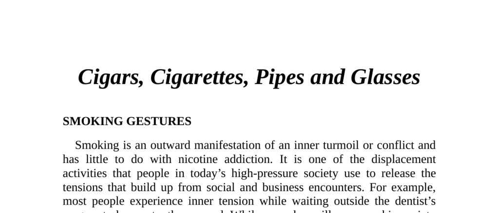

- **Smoking Gestures**
  - **General Context**
    - Smoking functions as a displacement activity to relieve inner tension or conflict rather than solely nicotine addiction.
    - Non-smokers display other reassurances such as grooming or nail-biting during tense situations.
    - Understanding smoking behaviors can reveal a person’s attitude and emotional state.
    - Further reading: [Nonverbal Communication in Everyday Life](https://www.communicationtheory.org/nonverbal-communication/)
  - **Pipe Smokers**
    - Pipe smokers perform a ritual of cleaning, lighting, tapping, filling, packing, and puffing to relieve stress.
    - They generally take longer to make purchasing decisions and use the pipe ritual during tense moments to stall.
    - Hiding a pipe before sales interviews can encourage quicker decisions from pipe smokers.
    - Further reading: [Pipe Smoking Rituals and Psychology](https://psychologyofsmoking.com/pipe-smoking)
  - **Cigarette Smokers**
    - Cigarette smoking also displaces tension and allows some stalling, but decisions are made faster than with pipe smokers.
    - Rituals include tapping, twisting, flicking, and waving, indicating above-normal tension.
    - The direction of exhaled smoke signals attitude: upward smoke indicates confidence or positivity, while downward smoke indicates negativity or secrecy.
    - Blowing smoke from the nostrils signals confidence or superiority.
    - Faster smoke exhalations correspond to stronger positive or negative feelings.
    - Observing smoke direction during sales can help assess customer decisions and tailor responses.
    - Further reading: [The Meaning of Smoking Gestures](https://bodylanguageproject.com/smoking-gestures/)
  - **Cigar Smokers**
    - Cigars symbolize superiority, status, and celebration due to their cost and size.
    - Business executives and leaders frequently use cigars to signify high status and mark achievements.
    - The majority of cigar smoke exhalations are directed upward, indicating positive feelings.
    - Further reading: [History and Symbolism of Cigars](https://www.cigaraficionado.com/article/the-history-of-cigars-21422)
  - **General Smoking Signals**
    - Tapping the cigar or cigarette end signals inner conflict and need for reassurance.
    - Prematurely extinguishing a cigarette signals a desire to end a conversation.
    - Recognizing this termination signal allows better conversation control.
    - Further reading: [Nonverbal Cues in Communication](https://www.psychologytoday.com/us/basics/nonverbal-communication)
- **Gestures with Glasses**
  - **Glasses-in-Mouth**
    - Placing a glasses arm in the mouth is a reassurance gesture linked to infantile security behaviors.
    - This gesture is used to stall or delay decisions, especially near a negotiation close.
    - Cleaning lenses repeatedly also functions as a stalling mechanism.
    - After such gestures, putting glasses back on means the person wants to review information; folding and putting glasses away signals ending the conversation.
    - Further reading: [Body Language of Reassurance Gestures](https://www.bodylanguageexpert.co.uk/)
  - **Peering Over Glasses**
    - Looking over glasses traditionally portrays judgmental or critical attitudes, as used in early 20th-century films.
    - This look can cause defensive responses like folded arms and a negative attitude in listeners.
    - Glasses wearers should remove glasses when speaking and wear them to listen to maintain control and reduce tension.
    - Further reading: [Interpreting Facial and Eye Gestures](https://www.ncbi.nlm.nih.gov/pmc/articles/PMC3995340/)
