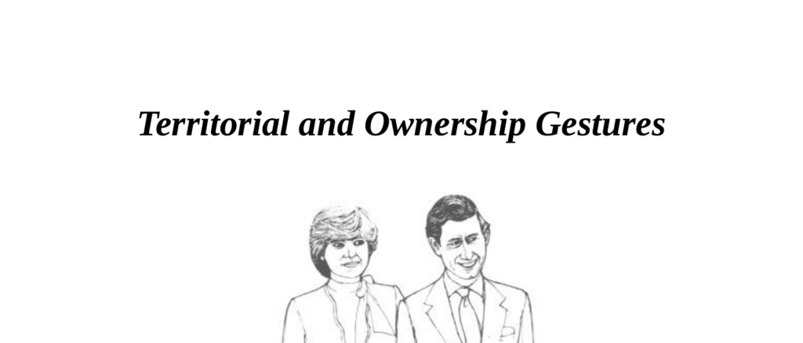

- **Territorial Gestures**
  - **Lean to show territorial claim**
    - People lean against people or objects to claim them as their territory.
    - Leaning can demonstrate dominance or intimidation, especially when the object belongs to someone else.
    - Touching an object makes it an extension of one’s body, signaling ownership.
    - [Nonverbal Communication and Territoriality](https://www.communicationtheory.org/territoriality-in-nonverbal-communication/)
  - **Public displays of possession or claim**
    - Lovers hold hands or put arms around each other to show mutual claim.
    - Executives put feet on desks or lean against office doorways to claim office space.
    - Such gestures publicly indicate possession and control of personal or professional spaces.
  - **Intimidation by misuse of other's property**
    - Leaning on, sitting upon, or using others’ possessions without permission is a form of territorial intimidation.
    - Examples include sitting in someone's chair or leaning in the doorway of another’s office.
    - Asking “Which seat is yours?” avoids unintentional intimidation during visits.
  - **Habitual doorway leaners**
    - Some individuals habitually lean in doorways to intimidate from the first introduction.
    - An erect stance with palms visible creates a more favorable first impression.
    - First impressions form 90% of opinions in the first ninety seconds.
    - [First Impressions in Communication](https://www.psychologytoday.com/us/basics/first-impressions)

- **Ownership Gestures**
  - **Management-related ownership gestures**
    - Newly promoted managers often adopt ownership gestures they seldom used before promotion.
    - These gestures include postures signaling control or relaxed dominance over a space.
  - **Leg-over-chair gesture**
    - The leg-over-chair position signals ownership of the chair or space and relaxed etiquette.
    - Among close friends, it indicates ease and joviality.
    - In workplace settings, it can imply indifference or lack of concern, especially during serious discussions.
  - **Boss’s body language during employee discussions**
    - A boss leaning back with one leg over the chair during an employee’s personal problem discussion signals indifference.
    - The boss may maintain a concerned facial expression to mask disinterest.
    - This gesture often precedes dismissing the employee’s concerns.
  - **Feet-on-desk and subtle territorial claims**
    - Bosses may put feet on desks or foot on desk drawers to mark territory.
    - More subtle claims occur if a superior is present.
    - Such gestures can annoy during negotiations and affect attitudes.
  - **Changing dominant postures**
    - Interrupt dominant postures by handing objects beyond reach or light-heartedly pointing out visual cues (e.g., a torn trouser).
    - Changing posture can reduce hostility or indifference in communication.
    - [Body Language and Power Gestures](https://www.ncbi.nlm.nih.gov/pmc/articles/PMC3689466/)
