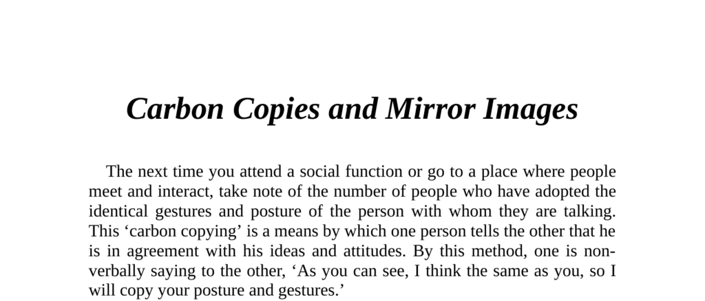

- **Introduction to Carbon Copies and Mirror Images**
  - This section defines carbon copying as the adoption of identical gestures and postures to signal agreement.
  - It explains that mimicry is a non-verbal method to express shared ideas and attitudes.
  - Mimicry serves as a social signal for liking and agreement between individuals.
  - For more details on non-verbal communication, see [The Definitive Book of Body Language](https://www.naturalconfidence.com/definitive-book-of-body-language/).

- **Observing Unconscious Mimicry**
  - Two men mirroring each other’s gestures indicate shared thoughts and feelings.
  - Mimicry continues as long as agreement exists, including movements such as changing posture or putting hands in pockets.
  - Close relationships and social equals often exhibit this mimicry naturally.
  - Strangers typically avoid mutual postures, underscoring the link between mimicry and familiarity.

- **Social Functions of Mimicry**
  - Carbon copying serves as an important non-verbal cue for mutual liking and agreement.
  - Copying gestures signals positive regard and facilitates social bonding.
  - Mimicry can be consciously used to communicate understanding and affinity.
  - See [Nonverbal Communication in Human Interaction](https://www.amazon.com/Nonverbal-Communication-Human-Interaction-Judee/dp/0495602955) for comprehensive coverage.

- **Using Mimicry to Build Rapport**
  - Employers can create a relaxed atmosphere by copying an employee’s posture.
  - Employees may mirror a boss’s gestures to demonstrate agreement and respect.
  - Copying positive gestures influences a person’s receptiveness during face-to-face encounters.
  - Effective mimicry leads to stronger rapport and smoother communication.

- **Sales Technique: Mimicry for Cold Prospects**
  - Deliberately copying a prospect’s movements establishes rapport for sales presentations.
  - When the prospect begins to copy back, it signals readiness to close a sale.
  - Mimicry helps overcome initial barriers in customer interactions.
  - For sales psychology, see [To Sell Is Human](https://www.danpink.com/books/to-sell-is-human/).

- **Cautions in Mimicry During Negotiations**
  - Relationship context is vital before mirroring others’ gestures in negotiations.
  - Copying dominant postures of a superior can intimidate or offend and risk job security.
  - Dominant postures include T-cross arm positions and figure 4 leg locks.
  - Copying superior postures can also disarm overbearing individuals strategically.

- **Leadership and Mimicry Dynamics**
  - Leaders’ gestures and positions are typically mirrored by subordinates in groups.
  - Leaders lead group movements, such as walking through doorways first or sitting at the head of the table.
  - Bosses adopting relaxed postures (e.g., hands-behind-head T-cross) are mimicked by employees.
  - Leadership mimicry reinforces hierarchical relationships and group cohesion.

- **Mimicry in Married Couples and Decision Making**
  - Observing who initiates and who follows gestures helps identify decision-makers in couples.
  - Husbands copying wives’ gestures suggests the wife is the primary decision-maker.
  - Salespeople should direct presentations to the partner who influences decisions.
  - Understanding couple dynamics enhances effectiveness in home sales environments.
