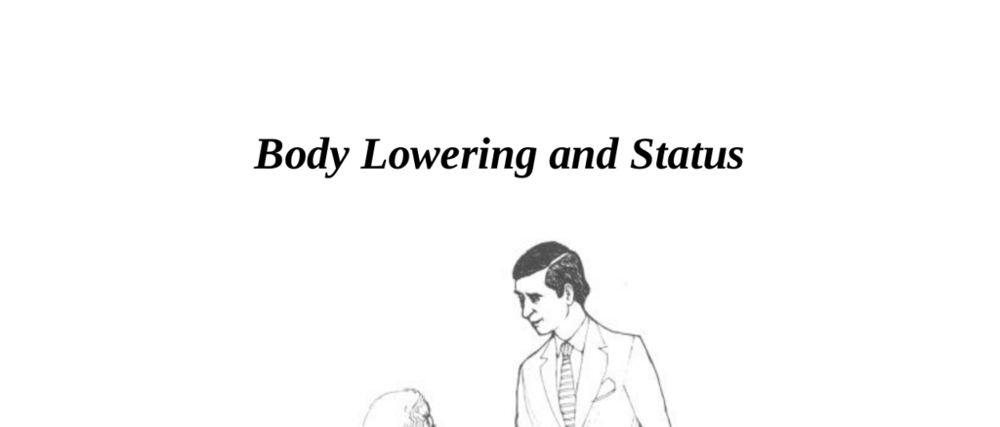

- **Historical Uses of Body Lowering and Status**
  - **Royalty and Social Hierarchies**
    - The term "Your Highness" originates from associating height with superior status.
    - Social classes are often described as "upper" and "lower," indicating status differences.
    - Protest speakers and judges use physical height to assert authority.
    - For further reading, see [The Power of Posture](https://www.psychologytoday.com/us/blog/cutting-edge-leadership/201712/the-power-posture).
  - **Height and Authority**
    - Taller individuals generally command more authority in social interactions.
    - Height can be a disadvantage in one-on-one communication requiring equal footing.
    - Eye-level conversations promote better interpersonal communication.
    - Related concepts appear in [Height and Social Perception](https://www.ncbi.nlm.nih.gov/pmc/articles/PMC5625000/).

- **Non-Verbal Gestures of Submission and Respect**
  - **Submissive Body Language**
    - Women curtsey and men bow or remove hats to appear smaller before royalty.
    - The modern salute evolved from physical body lowering gestures.
    - Lowering the body signals humility or subordinate status.
    - The historical context is analyzed in [Nonverbal Communication: Origins and Functions](https://www.sciencedirect.com/science/article/abs/pii/S0191886910001775).
  - **Business and Social Labels**
    - Employees who constantly show subservience get derogatory labels like "bootlickers."
    - Such behaviors reflect exaggerated displays of submission to authority.
    - This dynamic influences organizational culture as explained in [Workplace Power and Status](https://hbr.org/2015/05/the-power-of-respect).

- **Practical Applications of Height and Body Language**
  - **De-escalating Police Encounters**
    - Exiting the car and approaching the officer’s vehicle respects the officer’s territory.
    - Stooping the body lowers perceived threat and increases chances of leniency.
    - Acknowledging one’s fault raises the officer’s status and reduces conflict.
    - Reports show this technique helps avoid tickets over 50% of the time.
    - Additional guidance available at [Effective Police Interaction Strategies](https://www.apa.org/monitor/2018/01/police-interactions).
  - **Managing Irate Customers**
    - Leaving one’s territory (behind the counter) and showing open palms calms customers.
    - Lowered posture and proximity reduce anger and improve communication.
    - The same principles used with police officers apply effectively in retail.
    - For customer conflict resolution, see [Retail Customer Service Techniques](https://www.forbes.com/sites/forbesbusinesscouncil/2020/02/28/how-to-handle-angry-customers-effectively/).
  - **Dominance Through Informality**
    - Slouching in a visitor’s home while the owner stands signals dominant status.
    - Comfortable posture on someone else’s territory signals informal dominance or aggression.
    - Territoriality affects social power regardless of posture alone.
    - Territorial influence is discussed in [Space and Power Dynamics](https://www.psychologytoday.com/us/blog/the-social-thinker/201803/territoriality-and-power).

- **Territoriality and Status**
  - **Home Territory Advantage**
    - People are always dominant and superior in their own homes.
    - Submissive behavior is effective to gain favor on another’s territory.
    - Territory control strongly influences power relations and status.
    - See [Territory and Status in Social Psychology](https://www.journals.uchicago.edu/doi/10.1086/674565) for further insights.
