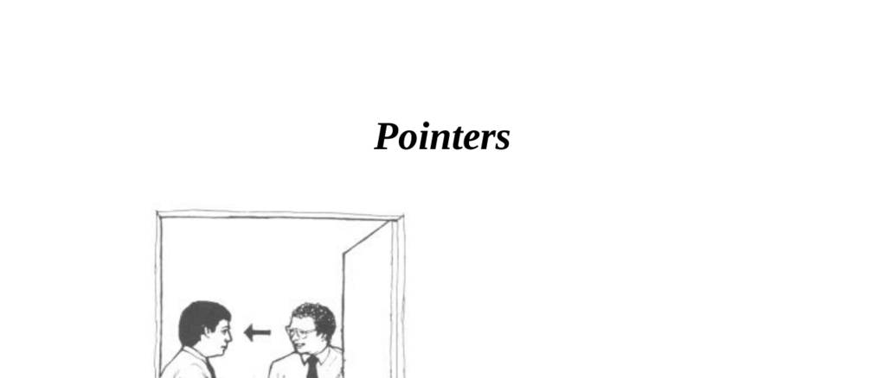

- **Pointers**
  - **Head and Body Orientation**
    - People’s head may face conversational partner while their body points elsewhere, indicating desire to leave or be somewhere else.  
    - The torso and feet direction signal preferred movement or focus.  
    - Recognizing these signals during encounters allows controlling or ending conversations strategically.  
    - See also nonverbal communication in [Beyond Words](https://www.psychologytoday.com/us/articles/200410/beyond-words).
  - **Angles and Triangles**
    - The orientation angles between people’s bodies reveal intimacy and conversational inclusion/exclusion.  
    - A 90-degree open angle forms a triangle inviting a third person of similar status to join.  
    - Closed formations around 0 degrees indicate intimacy, privacy, or non-verbal challenges.  
    - Further insight available at [Nonverbal Communication and Relations](https://www.sciencedirect.com/topics/psychology/nonverbal-communication).
    - **Open Formation**
      - People in English-speaking cultures form a 90-degree torso angle in casual social interaction.  
      - This triangular arrangement serves as a non-verbal invitation for others to join conversation.  
      - Equal posture and gesture reflect similar status among participants.  
    - **Closed Formation**
      - Torso angles close from 90 to 0 degrees to express intimacy or privacy.  
      - Closed formation is common in courtship and can signify hostility as a non-verbal challenge.  
      - Distance between individuals is less in closed formations compared to open ones.  
  - **Inclusion and Exclusion Techniques**
    - Open triangle formations include third parties; closed formations exclude them.  
    - Turning head only while holding closed torso formation signals recognition but non-invitation.  
    - Triangular formation shifts indicate acceptance of new participants; closed pairs exclude others.  
    - See group dynamics concepts in [The Social Psychology of Groups](https://books.google.com).
  - **Seated Body Pointing**
    - Crossing knees towards another person signals acceptance or interest.  
    - Mutual crossing of knees and mirrored gestures indicate increased involvement and exclusion of others.  
    - Breaking closed formations requires repositioning to create open triangles for inclusion.  
  - **Interviewing Two People**
    - When answering one talkative person (A), alternate gaze between A and silent person (B) to include B nonverbally.  
    - This gaze technique helps maintain rapport and produces inclusion in triangular seating arrangements.  
  - **Foot Pointing**
    - Feet not only show intended movement direction but also indicate interest in people.  
    - Men pointing their feet toward an attractive woman non-verbally display interest at social functions.  
    - The neutral foot position and sideways glance by the woman signal her evaluating interest.  
    - Additional information on body language of attraction at [The Definitive Book of Body Language](https://www.sciencedaily.com/releases/2010/04/100428141853.htm).  
  - **Seated Body Formations**
    - Counseling success involves strategic use of chair positioning and body angles to exert control or reduce pressure.  
    - The boss should sit in a swivel chair with arms to maintain control and hide own gestures.  
    - The subordinate should use a fixed chair to allow reading of body language.  
    - **Open Triangular Formation**
      - This formation fosters informal, relaxed counseling interactions.  
      - Mimicking subordinate’s gestures communicates non-verbal agreement.  
    - **Direct Body Point**
      - Facing subordinate directly signals demand for direct, truthful answers.  
      - Combines with business gaze and reduced gestures to increase non-verbal pressure.  
      - Can be reinforced with verbal challenges.  
    - **Right Angle Position**
      - Sitting at a right angle reduces pressure and encourages open, honest answers.  
      - Useful for delicate or sensitive questioning.  
  - **Summary**
    - Triangular positions facilitate rapport and inclusion; direct body pointing exerts non-verbal pressure.  
    - Right angle positions allow independent thought without pressure.  
    - Mastery of body pointing and swivel chair techniques enhances social influence.  
    - Positive non-verbal gestures (open arms, visible palms, leaning forward) enhance company and influence.  
    - For deeper understanding of these principles see [Body Language in Business](https://www.forbes.com/sites/travisbradberry/2013/06/10/10-ways-to-read-someones-body-language/).
