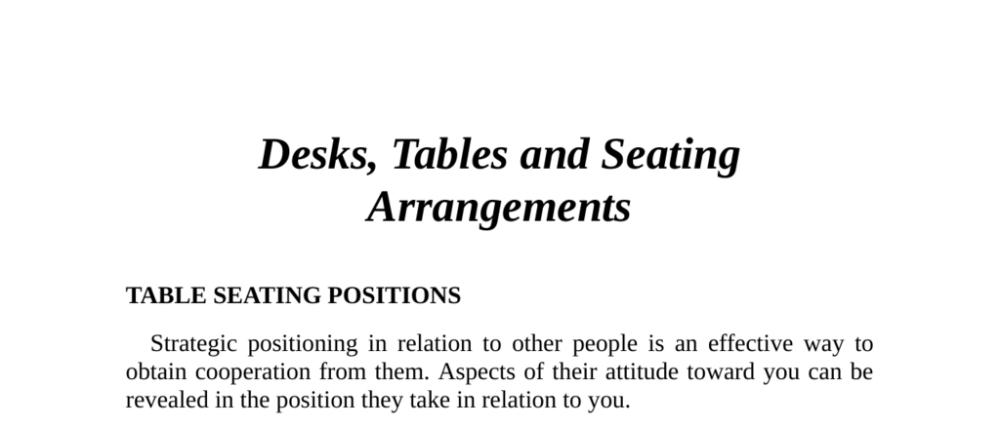

- **Table Seating Positions**
  - **Overview of strategic seating**
    - Seating position reveals attitudes and affects cooperation.  
    - Environmental factors can influence chosen seating.  
    - Study referenced involved white middle-class Americans in different venues.  
    - Seating is interpreted primarily in office environments with rectangular desks.  
    - For further insights, see [Nonverbal Communication in Human Interaction](https://www.apa.org/pubs/books/4316003).  
  - **Person B seating positions relative to person A**
    - Four main positions: Corner (B1), Co-operative (B2), Competitive-Defensive (B3), Independent (B4).  

- **The Corner Position (B1)**
  - Used for friendly, casual conversation with unlimited eye contact.  
  - Provides a partial barrier to reduce threat perception.  
  - Avoids territorial division of the desk surface.  
  - Optimal for sales presentations to new customers to relieve tension.  
  - See research on nonverbal coaching techniques for negotiation at [The Center for Nonverbal Studies](https://www.center-for-nonverbal-studies.org).  

- **The Co-operative Position (B2)**
  - Taken when people are mutually oriented or collaborating on tasks.  
  - Highly effective for presenting and gaining acceptance of a case.  
  - Requires care to not invade the other’s territory.  
  - Effective strategy includes positioning a third party (e.g., technical expert) opposite A.  
  - Commonly called "siding with the opposition" to put client at ease.  

- **The Competitive-Defensive Position (B3)**
  - Sitting directly opposite creates defensive and competitive atmosphere.  
  - Table acts as a solid barrier reinforcing territorial division.  
  - Often used in reprimand or superior/subordinate contexts.  
  - Desk presence affects comfort; absence increases patient ease (doctor’s office study cited).  
  - Territorial invasion triggers discomfort and resistance, demonstrated in restaurant table test.  
  - Competitive position shortens conversations and reduces cooperation.  
  - Negotiations are more successful when avoiding this position unless strategically planned.  

- **The Independent Position (B4)**
  - Chosen when individuals avoid interaction, e.g., in library or park bench.  
  - Signifies disinterest and can be interpreted as hostile if territorial boundaries breached.  
  - Should be avoided if open discussion is required.  

- **Square, Round, Rectangular Tables**
  - **Square Table (Formal)**
    - Creates competitive or defensive relationships, especially among equals.  
    - Short, to-the-point conversations are typical.  
    - Most cooperation comes from persons seated to the right.  
    - Directly opposite seat produces most resistance.  
  - **Round Table (Informal)**
    - Promotes relaxed informality and equal territorial claim.  
    - Ideal for discussions among equals but hierarchy affects power distribution.  
    - King Arthur’s Round Table illustrates proximity influences power dynamics.  
    - Round tables foster informal persuasion, often used in business settings.  
  - **Rectangular Tables**
    - Position A holds most influence if not with back to door.  
    - Next authority follows order: B, C, D.  
    - Seat assignments can strategically structure power dynamics in meetings.  

- **The Dining Table at Home**
  - Table shape reflects family dynamics: round for open families, square for closed, rectangular for authoritative.  

- **Getting a Decision Over Dinner**
  - Relaxed and low-tension environment increases likelihood of favorable decisions.  
  - Humans have ancient social eating origins around campfires, influencing modern behavior.  
  - Seating with back to solid wall or screen enhances comfort and reduces stress markers.  
  - Dim lighting and muffled background music improve atmosphere.  
  - Use of round tables and visual barriers encourages a captive and relaxed audience.  
  - Restaurants utilize these principles to enhance customer spending and romantic ambiance.  
  - See related concepts at [The Psychology of Dining](https://www.psychologytoday.com/us/blog/brain-food/201005/the-psychology-dining).
