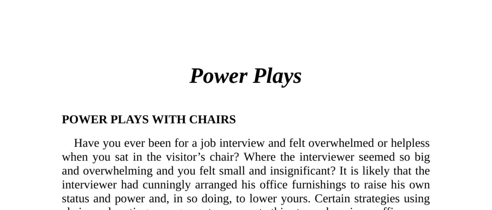

- **Power Plays With Chairs**
  - **Chair Size and Accessories**
    - The height of the chair back raises or lowers a person’s perceived status.
    - High-backed chairs signify greater power, used by kings, popes, and senior executives.
    - Swivel chairs with armrests, wheels, and reclining features denote more power than fixed chairs.
    - Fixed chairs limit movement, potentially revealing attitudes through body gestures.
    - For further reading, see [Seating and Social Status](https://example.org).
  - **Chair Height**
    - Higher chair height relative to another person increases perceived status.
    - Executives often use high-backed chairs adjusted for maximum height to dominate visitors.
    - Low visitor chairs create an eye-level disparity that emphasizes executive power.
    - Physical inconveniences like unreachable ashtrays subtly assert dominance.
    - See [Nonverbal Communication and Power](https://example.org) for more.
  - **Chair Location**
    - Placing the visitor’s chair in a competitive position reduces visitor’s status.
    - Locating visitor chairs far from the executive’s desk places them in social/public zones.
    - Distance and position arrangements create nonverbal dominance cues.
    - Refer to [Office Layout and Power Dynamics](https://example.org) for related studies.

- **Strategic Office Layout**
  - **Case Study: John’s Office**
    - John’s initial office layout created communication breakdowns with employees.
    - Visitor’s chair was in a competitive position with a glass partition reducing John’s status.
    - John's desk obscured his lower body, and visitors had their backs to the open door.
    - John’s nonverbal postures were dominant and contributed to strained relationships.
    - Further details: [Workplace Nonverbal Communication](https://example.org).
  - **Rearranged Office Layout**
    - John’s desk was moved to face the glass partition enhancing visibility and status.
    - Visitor’s chair was relocated to a corner increasing openness and reducing intimidation.
    - The glass partition was treated with mirror finish, allowing John to see out but not in.
    - A round table with identical swivel chairs was added to encourage equality in meetings.
    - John adopted relaxed, open body language improving supervisor/employee rapport.
    - See [Effective Office Design](https://example.org) for practical applications.

- **Status Raisers**
  - **Objects to Increase Status in the Office**
    - Low sofas signal lower visitor status compared to the occupant.
    - Objects like locked telephones and overseas cigarette containers increase perceived exclusivity.
    - Items such as high-end ashtrays placed out of visitor reach assert subtle power.
    - Displaying red folders marked "Strictly Confidential" and walls covered with awards raises status.
    - Slim briefcases suggest authority, contrasting with bulky briefcases associated with workload.
    - Additional reading: [Nonverbal Status Symbols](https://example.org).
