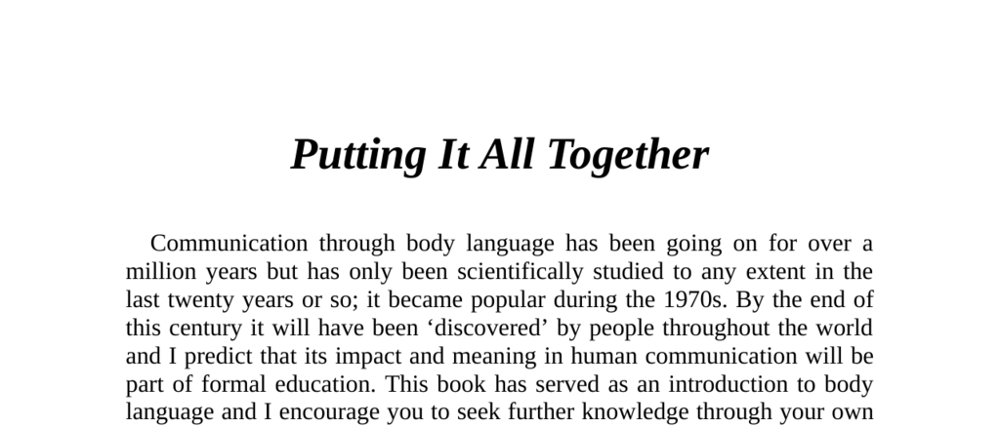

- **Putting It All Together**
  - **Introduction to Body Language**
    - Body language has been communicated for over a million years and scientifically studied mostly in the last twenty years.
    - It gained popularity in the 1970s and is predicted to become part of formal education by the end of the century.
    - Conscious observation of self and others is the best way to understand human communication through body language.
    - Further reading: [The Definitive Book of Body Language](https://www.goodreads.com/book/show/1929.The_Definitive_Book_of_Body_Language)

  - **Clusters, Circumstances, and Gestures in Daily Encounters**
    - **Figure 165: Openness Cluster**
      - Open palms, spread fingers, neutral head position, and limbs apart communicate submissiveness and non-threat.
      - The posture enhances the impact and clarity of the submissive message.
      - Further reading: [Body Language Basics](https://www.psychologytoday.com/us/basics/body-language)

    - **Figure 166: Classic Deceit Cluster**
      - Eye rubbing, looking downwards, raised eyebrows (disbelief), head turned away, and insincere smile signal deceit.
      - These gestures collectively indicate negative attitude and insincerity.
      - Further reading: [Detecting Lies](https://www.psychologytoday.com/us/articles/200102/detecting-lies)

    - **Figure 167: Inconsistency of Gestures**
      - Confident smile paired with hand playing with watch creates mixed signals, showing uncertainty.
      - Partial arm barrier suggests discomfort despite outward confidence.
      - Further reading: [Mixed Messages in Body Language](https://www.healthline.com/health/mental-health/mixed-messages)

    - **Figure 168: Disapproval Cluster**
      - Sideways glance with head slightly down, downward eyebrows, full arm-crossing, and downturned mouth corners express disapproval and defensiveness.
      - Lack of head or body orientation toward the subject indicates distancing.
      - Further reading: [Body Language of Disapproval](https://www.betterhelp.com/advice/body-language/signs-of-disapproval-body-language/)

    - **Figure 169: Dominance and Territoriality**
      - Hands-on-head and feet-on-desk gestures, plus a high-status chair and locked telephone, show superiority and territorial claims.
      - The overall defensive and competitive positioning reinforces high status communication.
      - Further reading: [Power Poses](https://hbr.org/2013/01/power-poses)

    - **Figure 170: Child’s Threatening Gesture**
      - Hands-on-hips to appear larger, protruding chin, and open mouth exposing teeth mimic animal threat displays to signal defiance.
      - These gestures convey an attempt to seem threatening despite small size.
      - Further reading: [Nonverbal Aggression](https://www.sciencedirect.com/topics/psychology/physical-aggression)

    - **Figure 171: Defensive and Suspicious Appearance**
      - Folder barrier, folded limbs, buttoned coat, hidden eyes behind sunglasses, and obscured face by beard indicate nervousness, defensiveness, and suspicion.
      - First impressions heavily influenced by such negative body language.
      - Further reading: [First Impressions and Body Language](https://www.psychologytoday.com/us/blog/spycatcher/201412/first-impressions-count)

    - **Figure 172: Aggressive Readiness Gestures**
      - Hands-on-hips and thumbs-in-belt denote aggression and readiness.
      - Body orientation and facial expressions clarify relative aggressiveness between two men.
      - Further reading: [Aggression and Posture](https://www.ncbi.nlm.nih.gov/pmc/articles/PMC2682108/)

    - **Figure 173: Dominance and Frustration in a Discussion**
      - Chair straddling and direct body pointing denote control attempts.
      - Hands-behind-head and figure 4 leg lock display superiority and competitiveness.
      - Defensive body language and low-status seating signify hostility and disengagement.
      - Further reading: [Group Dynamics and Power](https://www.apa.org/education/k12/groups-power)

    - **Figure 174: Courtship Gestures**
      - Foot pointing forward, hand-on-hip combined with thumb-in-belt, exposed wrist, and smoke blown upward convey sexual readiness and interest.
      - Reciprocal gestures between man and woman confirm mutual courtship signals.
      - Third party’s negative and territorial gestures express disapproval.
      - Further reading: [Courtship Nonverbal Signs](https://www.ncbi.nlm.nih.gov/pmc/articles/PMC2441778/)

    - **Figure 175: Superiority, Defensiveness, and Exclusion**
      - Eye block, head tilt, tightly held knees, and use of wine glass as barrier project arrogance and defensiveness.
      - Third man’s aloof posture and crotch display reinforce superiority and exclusion.
      - Ready-to-leave body orientation and negative facial expressions indicate disapproval.
      - Further reading: [Body Language of Exclusion](https://www.psychologytoday.com/us/blog/words-matter/201907/nonverbal-signs-rejection)

    - **Figure 176: Closed Body Formation and Defensive Responses**
      - Closed body posture marks exclusion of middle man from conversation.
      - Lapel grasping with thumb signals superiority mixed with ridicule.
      - Defensive gestures with crossed legs and palm-in-pocket express unwillingness to engage.
      - Further reading: [Social Exclusion Signals](https://www.sciencedaily.com/releases/2015/03/150324103410.htm)

    - **Figure 177: Tense Group Atmosphere**
      - Maximum physical distance reflects tension.
      - Nose touching by speaker signals deceit; arm crossing indicates defensiveness.
      - Listener’s disapproval and self-restraint gestures convey disagreement and hesitation.
      - Further reading: [Detecting Tension through Body Language](https://www.psychologytoday.com/us/blog/reading-body-language/202009/how-tell-when-someone-agitated)

    - **Figure 178: Mirroring and Negative Third-Party Attitude**
      - Mirroring gestures like exposed wrists and leg crossing toward each other show mutual interest.
      - Third man’s defensive posture and negative facial gestures reveal disapproval.
      - Defensive clustering highlights social division.
      - Further reading: [Mirroring and Rapport](https://www.psychologytoday.com/us/blog/the-moment-youth/201903/how-mirroring-builds-connection-and-trust)

    - **Figure 179: Openness and Communication Failure**
      - Openness cluster includes exposed palms, foot forward, smiling, arms and legs apart, and leaning forward.
      - Defensive and hostile gestures from listener indicate lack of receptiveness.
      - Raised steeple and figure 4 leg position suggest competitive confidence in observer.
      - Further reading: [Barriers to Effective Communication](https://www.mindtools.com/pages/article/newCS_99.htm)

  - **Party Scene: Defense, Aggression, and Courtship Gesture Clusters**
    - **Figure 180: Initial Defensive Postures**
      - Folded arms and legs, bodies oriented away, indicate unfamiliarity among individuals.
      - Interest is seen through foot pointing and sideways glance combined with raised eyebrows and smile.
      - Further reading: [Body Language in New Social Settings](https://www.psychologytoday.com/us/blog/spycatcher/201606/body-language-new-social-settings)

    - **Figure 181: Changing Attitudes and Courtship Display**
      - Uncrossing legs and deliberate foot pointing signal increased interest.
      - Thumbs-in-belt gesture serves dual roles of aggression or sexual signaling depending on recipient.
      - Intimidation is communicated by erect stance and disapproving glance.
      - Further reading: [Courtship and Competition in Social Settings](https://www.ncbi.nlm.nih.gov/pmc/articles/PMC6462841/)

    - **Figure 182: Established Courtship and Exclusion**
      - Increased firmness of thumbs-in-belt shows intensified courtship.
      - Exposed cleavage, hair touching, and positive facial expressions confirm female interest.
      - Hands-on-hips of third man signals displeasure and aggressive readiness.
      - Further reading: [Nonverbal Indicators of Courtship](https://www.psychologytoday.com/us/blog/the-social-thinker/201501/5-steps-secret-signaling-flirtation)
