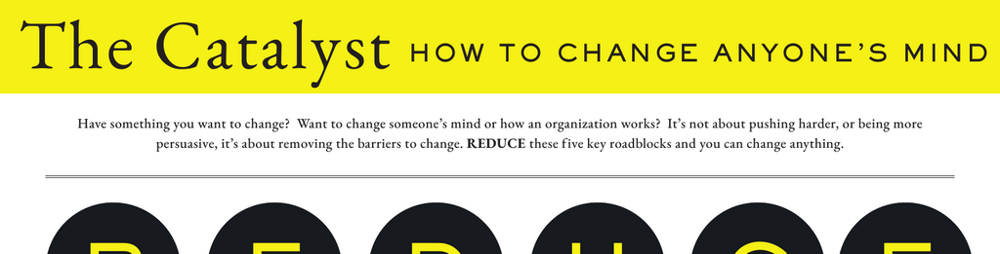

- **Introduction**
  - Have something you want to change by influencing a person or an organization.
  - Changing minds is less about pushing harder and more about removing barriers to change.
  - Reducing five key roadblocks is critical to successfully changing anything.
  - For further details, see [JonahBerger.com](https://jonahberger.com).

- **R: Reactance**
  - People push back when they feel pushed or coerced.
  - Change efforts should avoid direct commands or overt persuasion.
  - Catalysts enable agency and encourage self-persuasion.
  - Techniques to allow agency include truth campaigns, providing choices, or highlighting gaps.

- **E: Endowment**
  - People are attached to the status quo and what they currently do.
  - To ease endowment, surface the costs of inaction.
  - Strategies include symbolic acts such as "burning the ships" and reframing new options as regaining losses.
  - Examples referenced include Gloria Barrett, Cortes, and Brexit issues.

- **D: Distance**
  - Perspectives that are too far away enter a region of rejection and are discounted.
  - Starting with smaller requests or "less" can help find unsticking points.
  - Using an unsticking point is a tactic to switch perspectives effectively.
  - Silvia Branscom and Deep Canvassing are cited as sources.

- **U: Uncertainty**
  - Change involves uncertainty that makes people pause and hesitate.
  - To overcome uncertainty, increase trialability and reduce upfront costs.
  - Employ freemium models, low or no-cost trials, and discovery driving experiences.
  - Examples include Dropbox (freemium), Zappos (reduced upfront costs), and Acura Experience (discovery).

- **C: Corroborating Evidence**
  - Sometimes a single person’s evidence is insufficient to enable change.
  - More proof from multiple sources is necessary for reinforcement.
  - Evidence should be concentrated close in time.
  - Determine whether to deliver evidence in a large burst ("firehose") or more gradually ("sprinkler").
  - Mike Loverde is cited in relation to these ideas.
