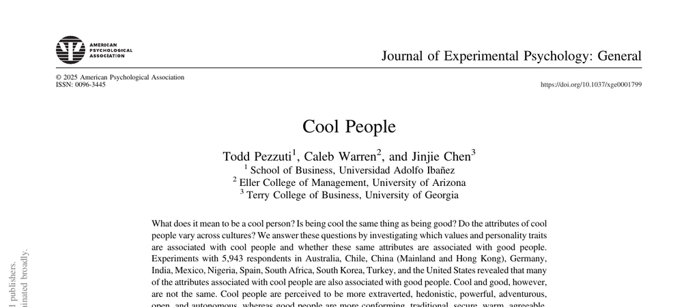

- **Abstract**
  - Experiments with 5,943 respondents across 13 countries examine attributes linked to cool versus good people.
  - Cool people are described as extraverted, hedonistic, powerful, adventurous, open, and autonomous.
  - Good people are more conforming, traditional, secure, warm, agreeable, universalistic, conscientious, and calm.
  - The pattern of coolness attributes is stable across countries, suggesting a global crystallized meaning.
  - The study advances theory on coolness's role in social hierarchies and cultural norms.

- **Introduction**
  - Investigates what it means to be cool and how cool differs from good.
  - Addresses whether cool attributes vary across cultures or maintain a universal form.
  - Highlights cool as socially constructed and influential in social status.
  - Discusses existing research on coolness and its overlap with positivity.
  - References prior work and theories on coolness origins and meanings.

- **Is Cool Different Than Good?**
  - Shows high overlap between cool and good but establishes they are distinct constructs.
  - Lexical hypothesis supports that cool conveys a socially relevant difference from good.
  - Discusses attributes like autonomy and emotional restraint as candidates for distinguishing coolness.
  - Previous studies indicate cool traits include rebellion, hedonism, and autonomy.
  - Posits coolness is not simply positivity or likability.

- **What Attributes Are Distinctly Cool?**
  - Early theories associated coolness with emotional restraint and mastery.
  - Experimental data suggest inexpressiveness is not a requirement for coolness.
  - Autonomy is a key attribute enhancing perceived coolness.
  - Other possible cool attributes include youth, rebellion, hedonism, power, and spontaneity.
  - Prior methods had limitations including cultural scope and lack of control conditions.

- **Is Cool Stable Across Cultures?**
  - Cool is used worldwide and often retained phonetically in non-English languages.
  - Two hypotheses: cool varies by local culture or represents a universal social construct.
  - Study uses samples across WEIRD and non-WEIRD cultures to investigate stability.
  - Expectation that distinct attributes would differ if coolness reflected local values.
  - Considers culture's impact on values like autonomy and power in coolness perception.

- **Method**
  - Data collected from 4,261 respondents in 13 countries spanning six continents.
  - Participants nominated known non-famous individuals as cool, not cool, good, or not good.
  - Personality and value traits of nominated individuals were assessed via established scales.
  - Measures included Schwartz’s Portrait Values Questionnaire and Big Five Personality traits.
  - Surveys translated and back-translated; sample sizes aimed to detect small-to-medium effect sizes.

- **Sample**
  - Respondents from United States, Australia, Germany, Spain, Turkey, Mexico, Chile, India, Hong Kong, China, South Korea, South Africa, and Nigeria.
  - Diverse cultures represent various degrees of individualism, power distance, tightness, and human development.
  - Recruitment involved online platforms and university subject pools.
  - Ensured participants were familiar with slang meaning of "cool."
  - Demographic details and cultural indexes presented in Table 1.

- **Design**
  - 2 × 2 between-subjects design: characteristic type (cool, good) × characteristic presence (is, is not).
  - Participants thought of a specific liked, non-famous person matching assigned condition.
  - Instructions emphasized choosing individuals fitting cool/good or not cool/not good criteria.
  - Additional replications removed the "like" requirement to verify robustness.
  - Attempts made to minimize confounding target person differences.

- **Measures**
  - Personality assessed via 5-factor scale; values measured with Portrait Values Questionnaire.
  - 15 key attributes evaluated, including adventurousness, autonomy, hedonism, power, and warmth.
  - Neuroticism reversed and labeled calm to maintain positive valence.
  - Attributes previously validated and culturally recognized.
  - Manipulation checks and demographics included for control and exploratory analyses.

- **Transparency and Openness**
  - Data collected over 5 years, with several preregistered studies.
  - All data and analysis syntax publicly available on the Open Science Framework.
  - Multiple preregistrations listed for various countries and supplemental experiments.
  - Followed Transparency and Openness Promotion Guidelines.
  - Extensive reporting on manipulations, exclusions, and demographic checks.

- **Results**
  - Mixed linear models showed a clear distinction between cool and good on 14 of 15 attributes.
  - Six attributes identified as distinctly cool: extraverted, hedonistic, powerful, adventurous, open, autonomous.
  - Cool people rated higher on these six traits than good people.
  - The remaining attributes were either associated with good or equally with both.
  - Figures 1 and 2 illustrate differences and stability across WEIRD and non-WEIRD cultures.

- **Is Cool Stable Across Cultures?**
  - Minimal differences found between WEIRD and non-WEIRD samples in attributes linked to coolness.
  - Human Development Index (HDI) analyses showed similar patterns across high and low development countries.
  - Individual country analyses reveal broadly consistent cool attribute patterns.
  - Both student and adult samples demonstrated these stable effects.
  - Supplemental figures confirm uniformity of results across regions.

- **Robustness Checks**
  - Gender, age, and education of participants did not moderate the main findings.
  - Cool attributes remained distinct across males and females.
  - The effect sizes for gender and age interactions were negligible.
  - Both highly educated and less educated participants showed similar results.
  - Supplemental studies manipulating instructions validated original patterns.

- **Cool Versus Favorable**
  - Supplemental experiment replaced "good" with "favorable" to rule out ambiguity of "good."
  - Results replicated key findings on coolness attributes.
  - Cool people rated higher on extraversion, hedonism, power, adventurousness, openness, and autonomy than favorable people.
  - Indicates coolness is distinct from general favorability.
  - Supports construct validity beyond semantic overlap.

- **Cool but Not Good**
  - Replication using "cool but not good" versus "good but not cool" paradigm.
  - Cool-only people rated higher on distinctly cool attributes.
  - Good-only people rated higher on attributes like calm and warmth.
  - Demonstrates that some good people are not cool and vice versa.
  - Validates the conceptual distinction between coolness and goodness.

- **More Cool or Less Cool**
  - Manipulated perceptions of relative coolness and goodness.
  - Targets rated as "more cool" differed significantly in the key six attributes from "less cool."
  - Interaction effects showed differences in attributes larger for coolness than for goodness.
  - Reinforces previous conclusions on attribute distinctiveness.
  - Confirms findings using better-defined, less negatively connoted manipulations.

- **General Discussion**
  - Cool people globally share distinctive traits differing from good people.
  - Six core attributes of coolness are stable despite cultural differences.
  - Coolness likely operates as an alternative status hierarchy rewarding innovation.
  - Suggests a social function motivating cultural change and creativity.
  - Raises implications for understanding social perception, status, and culture.

- **Boundary Conditions**
  - Expression context and appropriateness impact whether traits appear cool.
  - Excess effort or inauthenticity reduces perceived coolness.
  - Interactions among traits (e.g., power and adventurousness) modulate coolness.
  - Sampling focused on internet users limits generalization to rural or less connected populations.
  - Subcultural variation in cool meanings remains to be explored.

- **Building a Theory of Coolness**
  - Coolness originated in subcultures emphasizing emotional restraint and creativity.
  - Has since been commodified and mainstreamed globally.
  - May function as a status system in information economies.
  - Drives both admiration and diffusion of innovation.
  - Future research needed on coolness's prevalence across economic contexts.

- **Constraints on Generality**
  - Participants had to understand the slang meaning of "cool."
  - Samples drawn primarily from internet-connected populations with some WEIRD bias.
  - Results may not extend to isolated or rural cultures lacking similar exposure.
  - Cannot assess cultural valuation of coolness beyond attribute perception.
  - Further research needed to address these limitations.

- **References**
  - Lists all cited works supporting conceptual framing, methodology, and interpretations.
  - Includes foundational works on culture, personality measurement, social status, and consumer behavior.
  - Provides sources for scales used and theoretical background.
  - Contains studies on cross-cultural similarities and the concept of cool in marketing and psychology.
  - References are current, supporting comprehensive interdisciplinary insights.
