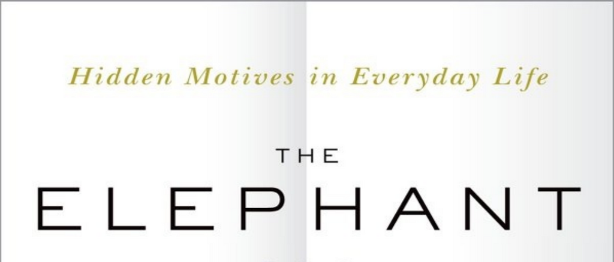

- **Advance Praise for The Elephant in the Brain**
  - The book reveals that much of human behavior serves social consumption, focusing on appearing good over making good decisions.
  - Several experts praise its scope, insight, and writing style, highlighting its examination of hidden motives and self-deception.
  - It is described as thought-provoking, controversial, and influential in understanding human psychology and institutions.
  - For further insight, see [The Elephant in the Brain reviews](https://www.oxfordpres.com/book/9780190495992).

- **Preface**
  - The book emerged from an informal collaboration resembling a doctoral thesis on hidden motives.
  - The central thesis—that humans are strategically blind to key motives—has ancient roots but remains underexplored in modern scholarship.
  - Authors acknowledge the difficulty of confronting selfish motives and predict resistance to acceptance of the thesis.
  - Gratitude is expressed to numerous colleagues, friends, and family for feedback and support.
  - For background, consult [Oxford University Press Author Pages](https://global.oup.com/academic/).

- **Introduction**
  - The "elephant in the brain" metaphor signifies selfishness and hidden motives humans hesitate to acknowledge.
  - Robin’s initial insight came from anomalies in healthcare consumption, revealing medicine’s social signaling role.
  - Kevin observed social competition and status-seeking behavior in Silicon Valley contexts, masked by euphemistic language.
  - The central thesis states humans deceive themselves to better deceive others, suppressing awareness of selfish motives.
  - Four strands of research support the thesis: microsociology, cognitive psychology, primatology, and economic puzzles.
  - The book aims to illuminate hidden agendas within social institutions and promote clearer understanding.
  - Readers are cautioned that confronting these truths is uncomfortable but necessary for insight.
  - For more on self-deception and evolution, see [Robert Trivers on Self-Deception](https://www.ncbi.nlm.nih.gov/pmc/articles/PMC1664862/).

- **Part I: Why We Hide Our Motives**
  - This part explores the evolutionary and psychological reasons individuals conceal true motives due to social incentives.
  - It aims to directly confront the self-deceptive instincts that shape human thinking and behavior.

  - **1. Animal Behavior**
    - Social grooming in primates serves both hygienic and political alliance functions, exceeding hygienic needs.
    - Grooming time correlates with social group size rather than body size, highlighting its political significance.
    - Arabian babblers compete aggressively to perform altruistic behaviors, gaining prestige and mating advantages.
    - Animals may not consciously hide motives, but self-deception can aid in competitive interactions.
    - For further study, see [Robin Dunbar’s social grooming research](https://www.dunbar.uk.com/grooming/).

  - **2. Competition**
    - Human intelligence evolved largely through intra-species social competition, including for mates, status, and political influence.
    - Sex, social status, and politics represent major competitive social games with overlapping goals.
    - Signals and signaling, often honest due to costs (handicap principle), mediate judgments and self-presentation.
    - Competitive arms races drive extravagant human behaviors like art, science, and social displays.
    - The social brain hypothesis explains large brains as adaptations to complex social competition.
    - For additional reading, see [Steven Pinker on Machiavellian Intelligence](https://iai.tv/articles/are-humans-machiavellian-intelligent-auid-1090).

  - **3. Norms**
    - Norms are shared behavioral standards enforced collectively to suppress selfish competition and enable cooperation.
    - Human egalitarian forager societies enforce norms rigorously to prevent domination and maintain social order.
    - Collective enforcement and coalition punishment differentiate human norms from other animals’ behaviors.
    - Cultural flexibility allows the adaptation of norms for different environments and societal structures.
    - Weapons play a key role by leveling power disparities and enabling coalition enforcement.
    - For more, see David Graeber’s *Debt* and [Christopher Boehm’s work on reverse dominance hierarchies](https://www.journals.uchicago.edu/doi/10.1086/710011).
