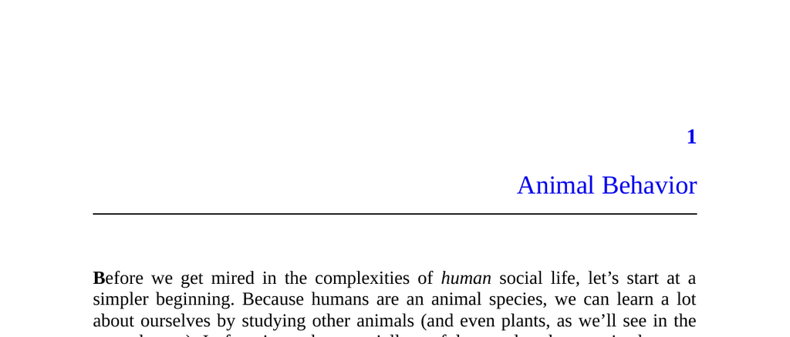

- **Animal Behavior**
  - **Social Grooming**
    - Primates groom each other to remove dirt, debris, and parasites that self-grooming cannot reach.  
    - Social grooming exceeds hygienic needs and correlates with social group size, not body fur amount.  
    - Grooming builds alliances, conveys trust, and strengthens political relationships among primates.  
    - Higher-ranked primates receive more grooming, which correlates with increased sharing and support in conflict.  
    - For further reading, see [Robin Dunbar’s research on social grooming](https://en.wikipedia.org/wiki/Robin_Dunbar).
  - **Competitive Altruism**
    - Arabian babblers live in groups with dominance hierarchies and perform seemingly altruistic acts.  
    - Males compete to perform helpful tasks to gain prestige, mating opportunities, and reduced eviction risk.  
    - Prestige signals strength and usefulness, influencing social dynamics beyond simple altruism.  
    - Interference among rivals in altruistic acts suggests self-interest drives such behavior.  
    - For further reading, see Amotz Zahavi’s work on [Competitive Altruism](https://en.wikipedia.org/wiki/Amotz_Zahavi).
  - **Human Behaviors**
    - Animal motives are not psychologically hidden but can be misunderstood without context.  
    - Natural selection favors instincts that feel rewarding, even without conscious awareness of political motives.  
    - Self-deception and camouflage may aid in competition but are less developed in nonhuman primates than humans.  
    - Misinterpretations often arise from anthropomorphic projections such as “the good of the species.”  
    - For further reading, see [Darwin’s theory of natural selection](https://en.wikipedia.org/wiki/Natural_selection).
