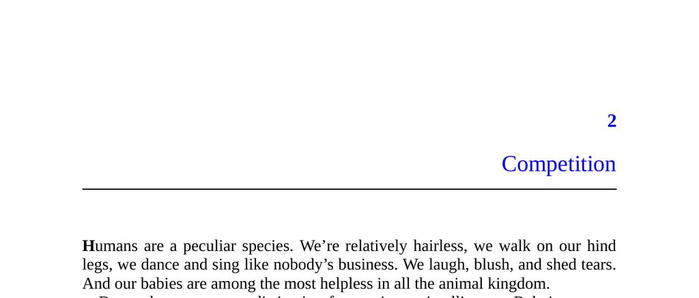

- **Competition**
  - **Humans and Intelligence**
    - Humans have unusually large brains relative to body size, making them the most behaviorally flexible creatures.
    - Archaeological evidence is biased toward durable objects, limiting insights into brain tissue and behaviors like vocalizations.
    - Theories explaining human intelligence often focus on ecological challenges (environmental adaptation) or social challenges (intra-species competition).
    - For further details on human evolution, see [de Miguel and Henneberg 2001](#figure-2).
  - **Bias in Evolutionary Interpretation**
    - Researchers tend to favor cooperative explanations of human intelligence due to social desirability bias.
    - Competitive social dynamics such as mating rivalry and office politics are underemphasized despite their evolutionary importance.
    - This bias complicates the study of human intelligence’s origins and requires consciously focusing on competitive aspects.
  - **Parable of the Redwoods**
    - Coastal redwoods grow extremely tall due to intense competition for sunlight within their species.
    - Vertical growth is costly but necessary to outcompete conspecifics in dense forests.
    - The analogy illustrates that humans evolved intelligence primarily through intra-species competition rather than solitary superiority.
  - **Social Brain Hypothesis**
    - Human intelligence evolved largely to manage complex social competition within small tight-knit groups.
    - This hypothesis is supported by primatologist insights and works by Matt Ridley, Steven Pinker, Paul Bloom, and Robert Trivers.
    - Arms races arise from challenges like deception and lie detection in social contexts.
    - For more see [The Red Queen by Ridley](https://en.wikipedia.org/wiki/The_Red_Queen_(book)) and Pinker & Bloom’s 1990 article.
  - **Focus on Competitive Games**
    - Emphasis is placed on three main competitive areas shaping human behavior: sex, social status, and politics.
  - **Sex**
    - Reproduction, not mere survival, is the central force of natural selection.
    - Human mating involves local zero-sum competition for a limited pool of mates.
    - Both sexes use signaling to advertise fitness, leading to evolutionary arms races, e.g., peacock tails and human displays in art and humor.
    - Geoffrey Miller’s *The Mating Mind* discusses the role of intelligence as a courtship display.
  - **Social Status**
    - Social status includes dominance (intimidation-based) and prestige (admiration-based) forms.
    - Dominance involves force and fear, often ruthless and zero-sum; prestige involves voluntary deference based on admirable traits.
    - Prestige can be understood as a "price" in the friendship market; competition for prestige drives many social behaviors.
    - Competition for status can generate positive cultural outputs like art and innovation.
  - **Politics**
    - Politics arises from dominance hierarchies enriched by coalition-building among individuals.
    - Coalition politics add complexity beyond simple dominance hierarchies, involving alliance formation and maintenance.
    - Humans exhibit unparalleled political complexity compared to other species.
    - Historical perspectives include Machiavelli’s *The Prince* and Castiglione’s *The Book of the Courtier*, reflecting harsh and subtle political strategies.
  - **Structural Similarities of Competitive Games**
    - Sex, social status, and politics share zero-sum competitive structures requiring evaluation and attraction of partners.
    - Skills for judging and advertising traits are crucial across all three domains.
    - Success requires standing out to win attention from mates, friends, or allies.
    - Competition fosters evolutionary arms races analogous to the redwoods' height race.
  - **Signals and Signaling**
    - Signals communicate traits and intentions; honest signals reliably indicate underlying qualities.
    - The handicap principle explains costly signals as credible proofs of fitness.
    - Human behaviors like art and loyalty acts function as honest signals.
    - Countersignaling creates complexity in social signaling hierarchies.
    - Examples of signaling range from health indicators to social gestures among friends.
  - **Looking Ahead**
    - Intra-species competition can be wasteful, as exemplified by redwoods’ excessive height.
    - Coordination could reduce resource waste, but natural selection favors competitive defection.
    - Humans’ capacity for foresight and norm enforcement sets them apart, enabling potential restraint and cooperation.
    - The concept of norm enforcement will be explored in subsequent discussions.
