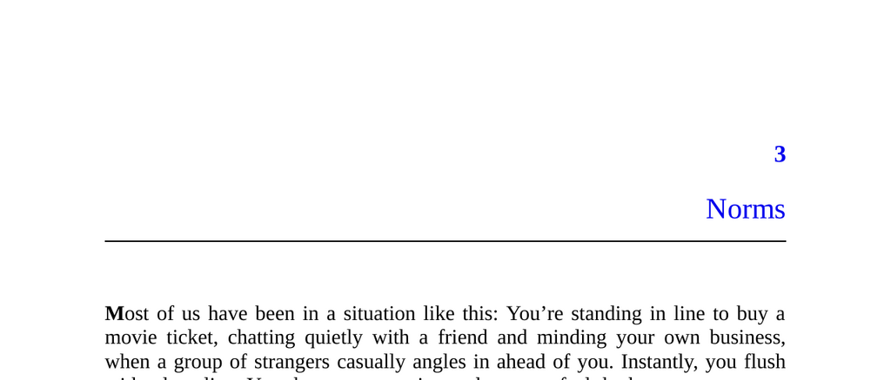

- **Norms**
  - **Everyday Norm Conflicts**
    - Humans experience physiological stress when witnessing norm violations such as cutting in line.
    - People weigh risk and principle when deciding whether to confront norm violators.
    - For further context, see [The Social Psychology of Norm Violations](https://www.annualreviews.org/doi/10.1146/annurev-psych-113011-143745).
  - **Definition and Range of Norms**
    - Norms are community rules ranging from informal guidelines to strict laws.
    - Examples include manners, sportsmanship, maritime law, and tax codes.
    - Norms can be subverted or ignored, often leading to self-deception.
  - **Function and Enforcement of Norms**
    - Norms primarily promote cooperation by suppressing wasteful competition.
    - Enforcement ranges from social disapproval to legal penalties, always requiring credible threat.
    - Thomas Hobbes emphasized enforcement as essential: “Covenants...without the sword, are but words.”
  - **Historical Example: Maori and Norm Enforcement**
    - The story of Tei Reinga illustrates high-stakes norm enforcement related to food-sharing.
    - Norms can provoke strong communal responses, including extreme punishment.
    - For more on cultural enforcement of norms, see [Debt by David Graeber](https://www.penguinrandomhouse.com/books/133456/debt-by-david-graeber/).
  - **Gradations of Norm Enforcement**
    - Minor violations result in soft sanctions like disapproving looks or polite requests.
    - Serious violations provoke escalations in sanctions or formal punishment.
    - Norm enforcement is a spectrum dependent on context and severity.

- **Our Forager Ancestors**
  - **Foraging Lifestyle Overview**
    - Foragers lived nomadically in bands of 20–50 people relying on gathering supplemented by hunting/fishing.
    - Survival depended on cooperation; freeloading was not tolerated.
    - See [Foraging and Human Evolution](https://www.nature.com/articles/nature19532) for scientific context.
  - **Social Organization and Norms**
    - Forager societies were fiercely egalitarian and avoided overt hierarchies.
    - Leaders were voluntary and consensus-based rather than authoritarian.
    - Vigilance against dominance and bullying was a core norm.
  - **Group Mobility and Property**
    - Bands moved frequently and had minimal property.
    - Territory was not personally owned; decisions were made collectively.
  - **Gender Roles and Relationships**
    - Patrilocal residence patterns were common; women moved at maturity.
    - Relationships were serially monogamous with shared child-rearing.
  - **Leisure and Social Life**
    - Foragers enjoyed abundant leisure time spent in social and cultural activities.
    - This contrasts with the more labor-intensive lives of farmers.

- **Why Norms?**
  - **Evolutionary Origins of Norms**
    - Humans uniquely developed norms thanks to language and social complexity.
    - Norms require collective enforcement including sanctions from third parties.
  - **Coalition Enforcement and Reverse Dominance**
    - Norms are enforced by coalitions rather than individuals, forming “reverse dominance hierarchies.”
    - This collective power restrains the strongest individuals.
  - **Role of Weapons in Norm Enforcement**
    - Weapons leveled power imbalances, enabling weaker individuals to enforce norms collectively.
    - Projectile weapons facilitated coalition attacks and expanded political complexity.
    - For more, see the section "Box 3: Weapons" and [Human Weapon Use](https://www.sciencedaily.com/releases/2014/05/140505130211.htm).
  - **Universal and Variable Norms**
    - Some norms like prohibitions on rape and murder are universal.
    - Others vary by society and are culturally transmitted.
  - **Limitations on Norm Enforcement**
    - Norm enforcement is difficult without formal institutions.
    - Most enforcement relies on peer behavior and social sanctions.

- **Gossip and Reputation**
  - **Gossip as a Social Tool**
    - Gossip functions as a mechanism to curtail bad behavior and coordinate punishment.
    - It can damage reputations, acting as an indirect form of enforcement.
  - **Case Study: Workplace Bully**
    - Gossip allowed a team to collectively recognize and remove a workplace bully.
    - Collective social pressure can be effective where individual action is risky.
  - **Reputation and Punisher Incentives**
    - Standing up to cheaters can boost a person’s reputation and social capital.
    - Public observation incentivizes norm following and sanctioning.
  - **Broader Implications**
    - Gossip, while sometimes abused, is a fundamental aspect of norm regulation.
    - For more on gossip and social control, see [Why Gossip Matters](https://www.psychologytoday.com/us/blog/ulterior-motives/201309/why-gossip-matters).

- **Box 4: The Meta-Norm**
  - **Punishment of Non-Punishers**
    - Norm enforcement requires punishing those who fail to punish violators.
    - Robert Axelrod’s game theory model showed this “meta-norm” stabilizes cooperation.
  - **Incentivizing Enforcement**
    - Communities must create incentives to encourage norm enforcement.
    - Punishment need not be negative; positive rewards can also maintain meta-norms.
  - **Empirical Support**
    - Laboratory and field studies support the prevalence of meta-norm enforcement.
    - Example: legal obligation in the U.S. to report crimes witnessed.
    - See [Cooperation and Punishment in Social Games](https://www.pnas.org/content/98/6/3273).

- **Subtle but Important Norms**
  - **Focus on Intentions**
    - Some norms regulate intentions, not just actions, making violations harder to detect.
    - This allows precise control of problematic behaviors without overly broad restrictions.
  - **Bragging**
    - Modest bragging is tolerated or praised in some contexts but excessive bragging is socially punished.
    - Bragging threatens egalitarian norms by signaling dominance.
  - **Currying Favor**
    - Efforts to gain high-status allies must avoid sycophancy, bribery, or illegitimate means.
    - Legitimate respect comes from genuine qualities, not manipulation.
  - **Subgroup Politics**
    - Open political behavior is often taboo in small groups to maintain unity.
    - Covert political behavior violates these norms but is common.
  - **Norm Against Selfish Motives**
    - Society expects prosocial motives rather than selfish intentions.
    - People commonly conceal selfish reasons for their actions.

- **Getting Our Bearings**
  - **Tension Between Competition and Norms**
    - Norms limit wasteful competition which should reduce evolutionary incentives for big brains.
    - Despite this, human brains expanded due to complex social interactions enabled by norms.
  - **Implications for Cognitive Evolution**
    - Norms increased social complexity, requiring greater intelligence to navigate.
    - This complexity explains the co-evolution of norms and brain size.
  - **Lead-in to Next Topic**
    - The upcoming discussion will focus on cheating as a vital aspect of this evolutionary dynamic.
