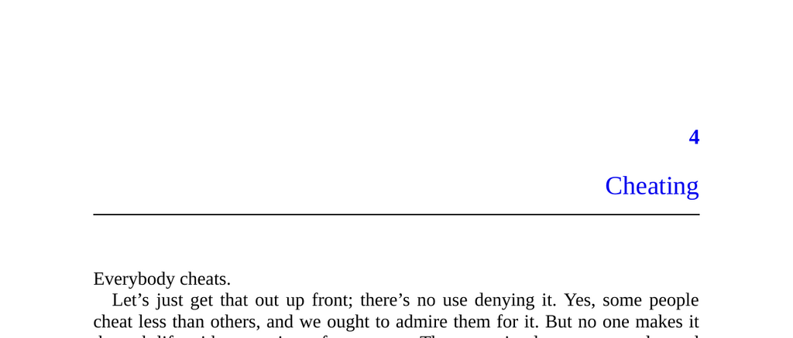

- **Cheating**
  - **Overview of cheating behavior**
    - Everyone cheats to some degree, primarily violating small and middling norms rather than major laws.
    - Cheating enables individuals to reap benefits without incurring usual costs or inconveniences.
    - Evolutionary psychology shows humans evolved to detect cheaters due to ancestral arms races of cheating and detection.
    - [The Evolution of Cooperation](https://www.sciencedirect.com/science/article/pii/0022103179900177) by Robert Axelrod offers insight into cooperation and cheating dynamics.
  - **Mechanisms to avoid detection**
    - Humans use discretion, such as avoiding being seen, to evade norms and cheating detection.
    - Experimental evidence shows people cheat less when they feel observed, including by symbolic watchers like cartoon eyes or activation of religious concepts.
    - The emotion of shame motivates people to refrain from cheating or hide their violations to prevent social degradation.
    - [The Social Psychology of Guilt, Shame, and Embarrassment](https://doi.org/10.4324/9780203489603) explores shame's role in social behavior.
  - **Open cheating vs. concealed cheating**
    - Some cheating occurs openly but with minimal discretion, such as public drinking concealed by a paper bag which discourages enforcement due to social norms.
    - Law enforcement may tolerate subtle cheating to avoid backlash from communities or constituents.
    - The brown paper bag serves as a modest pretext that reduces common knowledge and social pressure for enforcement.
    - [Norms and Social Control](https://www.annualreviews.org/doi/abs/10.1146/annurev-soc-073014-112315) discusses informal social control mechanisms.
  - **Common knowledge**
    - Common knowledge requires everyone to know a fact, know others know it, and so on recursively.
    - Without common knowledge, individuals may privately know of wrongdoing but hesitate to act or speak openly.
    - Examples include the emperor’s new clothes story where no adult admits the emperor is naked due to fear of social ridicule.
    - Common knowledge influences law enforcement willingness to act and social enforcement of norms.
    - [Common Knowledge and Coordination](https://www.jstor.org/stable/2109947) by Robert Aumann elaborates on common knowledge in game theory.
  - **When a little discretion goes a long way**
    - Minor acts of discretion, such as scalpers pretending to buy tickets, impede norm enforcement by disguising violations.
    - Norm enforcers face incentives and constraints such as overwork and potential criticism influencing enforcement decisions.
    - Successful prosecution requires turning detection into common knowledge and convincing others of violation.
    - Discretion can take the form of pretexts, discreet communication, norm-skirting, or subtlety.
  - **Pretexts: ready-made excuses**
    - Pretexts provide plausible justifications that complicate prosecution of norm violations.
    - Historical example: King Henry VIII used a pretext to annul his marriage and initiate religious reform.
    - Modern examples include euphemistic explanations for job resignations and environmental campaigns serving financial interests.
    - [Political Pretexts and Social Justification](https://doi.org/10.1177/0893318908316026) discusses uses of pretexts in politics.
  - **Discreet communication**
    - Discreet communication involves cryptic, ambiguous, or nonverbal signals to share illicit intentions without creating common knowledge.
    - Examples include body language, slang, euphemisms, symbolism, and informal speech.
    - Discretion minimizes the risk of social sanction by limiting knowledge dissemination and maintaining deniability.
    - This mechanism allows individuals to engage in norm violations while preserving social face.
    - [The Functions of Language in Society](https://doi.org/10.1177/0957926501005001002) elaborates on indirect communication and social contexts.
  - **Skirting norms**
    - Gray areas in norms allow individuals to push boundaries without clearly violating established standards.
    - Ambiguous definitions and subjective enforcement create opportunities to evade sanctions.
    - Cultural examples include media censorship and subtle reference to taboo subjects.
    - Skirting involves exploiting ambiguity to maintain plausible deniability while engaging in questionable conduct.
    - [Norm Ambiguity and Social Control](https://doi.org/10.2307/2780132) analyzes the role of vagueness in social norms.
  - **Minor sins**
    - Everyday individuals and celebrities alike engage in norm evasion, differing mostly in degree rather than kind.
    - People tend to avoid flaunting selfish or questionable conduct by using subtle or indirect methods.
    - Self-serving actions such as bragging, political maneuvering, and gossip are usually cloaked in justifications appealing to group interests.
    - Norm evasion is widespread but typically conducted with discretion to avoid social backlash.
    - [The Social Psychology of Power and Status](https://doi.org/10.1146/annurev-soc-073018-022457) discusses social dynamics influencing behavior.
  - **Getting our bearings**
    - Cheating requires cleverness to navigate partial norm enforcement and detection.
    - Norm enforcement and evasion constitute a cognitive arms race demanding sophisticated mental abilities.
    - Subsequent focus on self-deception aims to explain unconscious motives behind cheating behavior.
    - [Self-Deception and Human Behaviour](https://doi.org/10.1093/acprof:oso/9780199267329.001.0001) provides foundational perspectives on self-deception.
