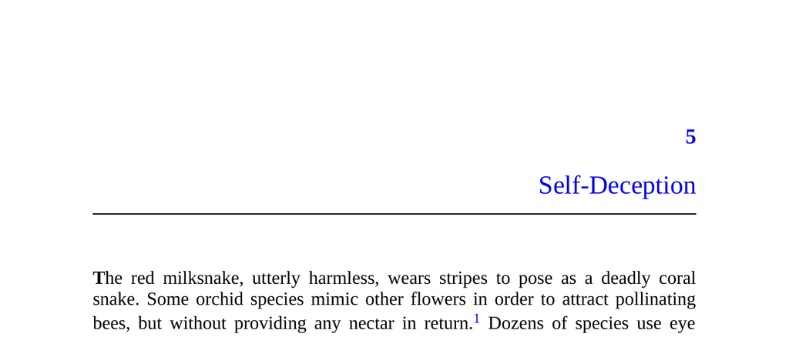

- **Self-Deception**
  - **Introduction**
    - Many species use deception for survival, including harmless animals mimicking dangerous ones and parasites disguising themselves.  
    - Deception is a fundamental feature of life, occurring at multiple biological levels.  
    - Humans deceive themselves by distorting information, often counterproductively.  
    - Further reading: [The Folly of Fools](https://www.basicbooks.com/titles/robert-trivers/the-folly-of-fools/9780465020850/).

  - **Old School: Self-Deception as Defense**
    - Freud and others viewed self-deception as a defense mechanism protecting the ego by repressing painful truths.  
    - Defense mechanisms reduce anxiety and preserve self-esteem by denying or rationalizing distressing information.  
    - This approach faces a key objection: evolution would favor more efficient anxiety or self-esteem regulation, not distortion of reality.  
    - Further reading: [The Interpretation of Dreams](https://www.gutenberg.org/ebooks/19033).

  - **New School: Self-Deception as Manipulation**
    - New School psychology sees self-deception as outward-facing and manipulative, aimed at influencing others' beliefs or actions.  
    - Inspired by game theory and Thomas Schelling’s insights into mixed-motive games and strategic self-sabotage.  
    - Examples of strategic behavior include limiting own options, strategic ignorance, and adopting false beliefs publicly.  
    - Further reading: [The Strategy of Conflict](https://www.hup.harvard.edu/catalog.php?isbn=9780674840317).

  - **Why Do We Believe Our Own Lies?**
    - Lying is cognitively demanding and risks exposure via behavioral “tells.”  
    - Self-deception helps convincingly project false beliefs by genuinely believing them, reducing signs of deceit.  
    - Others monitor our mental state to detect deception; self-deception conceals truth from both self and observers.  
    - Further reading: [Why Everyone (Else) Is a Hypocrite](https://www.penguinrandomhouse.com/books/317680/why-everyone-else-is-a-hypocrite-by-robert-kurzban/).

  - **Self-Deception in Practice**
    - Self-deception appears in four archetypes: Madman, Loyalist, Cheerleader, and Cheater.  
    - The Madman intimidates opponents by signaling extreme commitment (e.g., Nixon’s Madman Theory).  
    - The Loyalist demonstrates unwavering allegiance by holding irrational beliefs to earn trust.  
    - The Cheerleader spreads confidence and propaganda by overtly promoting beliefs beneficial if widely accepted.  
    - The Cheater hides true motives to avoid social or legal repercussions by convincing self and others of purity.  
    - Further reading: [The Folly of Fools](https://www.basicbooks.com/titles/robert-trivers/the-folly-of-fools/9780465020850/).

  - **Modularity**
    - The brain consists of multiple modules that can hold conflicting information simultaneously.  
    - Some brain parts know the truth while others maintain self-deceptive beliefs for social impression management.  
    - Evidence includes blindsight, where patients can respond to visual stimuli without conscious awareness.  
    - Different brain systems mediate conscious beliefs and automatic behaviors, allowing hypocritical or contradictory states.  
    - Further reading: [The Happiness Hypothesis](https://basicbooks.com/titles/jonathan-haidt/the-happiness-hypothesis/9780465028028).

  - **Self-Discretion**
    - Self-discretion entails subtly downplaying damaging information rather than blatant self-deception or ignorance.  
    - The mind allocates less attention to shameful information and prioritizes positive, self-flattering memories.  
    - This selective processing protects the conscious ego and helps manage social impressions discreetly.  
    - Further reading: [Society of Mind](https://mitpress.mit.edu/books/society-mind).

  - **Getting Our Bearings**
    - Self-deception enables success in social games by hiding norm violations from consciousness and others.  
    - The main risk is poorer decision-making from acting on false or incomplete information.  
    - Self-deception is especially relevant to misconstruing one’s own motives, which has major social implications.  
    - Further reading: [Why Everyone (Else) Is a Hypocrite](https://www.penguinrandomhouse.com/books/317680/why-everyone-else-is-a-hypocrite-by-robert-kurzban/).
