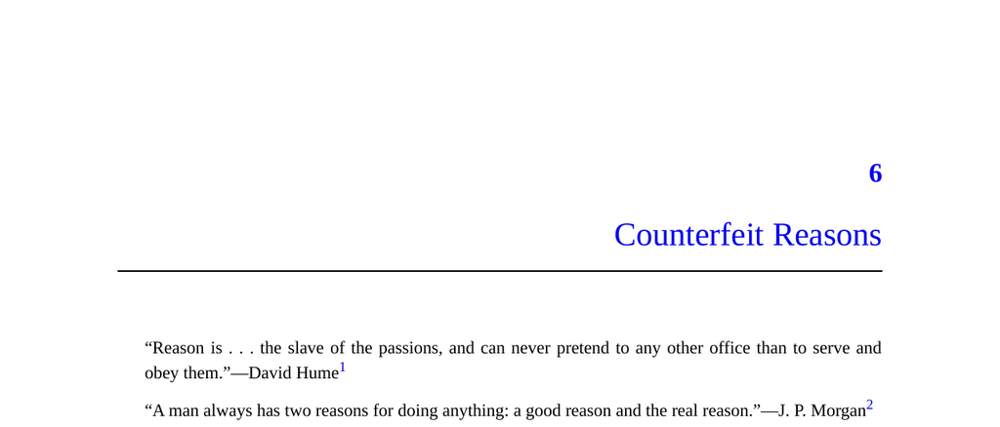

- **Counterfeit Reasons**
  - **Introduction to Rationalization**
    - Rationalization is the unconscious fabrication of reasons to explain one's behavior without intent to deceive.  
    - The phenomenon is highlighted through experiments with split-brain patients who confabulate explanations.  
    - Rationalization serves to protect social image and hide selfish motives as part of self-deception.  
    - See [Robert Trivers' theory of self-deception](https://en.wikipedia.org/wiki/Self-deception_(psychology)) for further reading.  
  - **Split-Brain Experiments**
    - Split-brain patients have severed connections between left and right hemispheres, causing each side to act independently.  
    - The left hemisphere generates plausible explanations for actions initiated by the right hemisphere despite lacking true knowledge.  
    - These fabricated stories demonstrate the brain’s tendency to rationalize and produce counterfeit reasons.  
    - Nobel Laureate Roger Sperry and Michael Gazzaniga led foundational research in this area.  
  - **Disability Denial Cases**
    - Patients with right-hemisphere strokes sometimes deny paralysis in a limb and rationalize its immobility with fabricated excuses.  
    - These confabulations persist despite contrary evidence and rational scrutiny, highlighting the brain’s deep commitment to rationalizations.  
    - Cases emphasize how rationalization functions even when facing obvious contradictory facts.  
    - V. S. Ramachandran provides detailed clinical observations of this phenomenon.  
  - **Definition of “Motives” and “Reasons”**
    - Motives are underlying causes of behavior, conscious or unconscious.  
    - Reasons are verbalized explanations individuals give for their behaviors.  
    - Reasons can be truthful, false, or selectively constructed from partial truths.  
  - **The Brain's Interpreter Module (Press Secretary)**
    - The interpreter module constructs coherent stories to explain experience and behavior to internal and external audiences.  
    - The module balances plausible explanations with strategic ignorance of unflattering motives.  
    - It functions similarly to a political press secretary who rationalizes and defends policies without full disclosure.  
    - Dan Dennett and Jonathan Haidt have extensively discussed this analogy.  
  - **Implications for Conscious Self**
    - The conscious self acts more as a defender of decisions than the original decision-maker.  
    - Introspection often fails to reveal true motives because of the adaptive unconscious generating much of thought and behavior.  
    - Timothy Wilson’s work on the “adaptive unconscious” underlines humans’ limited access to internal causal processes.  
    - Individuals often operate as outsiders within their own minds, relying on constructed narratives.  
  - **Experimental Approaches to Detect Rationalization**
    - Studies use misdirection and deception to show that people fabricate reasons for behaviors they did not consciously choose.  
    - Examples include manipulating visual choices, product packaging, and evaluations to reveal fragile awareness of true motives.  
    - Statistical methods detect inconsistencies between stated reasons and behavior patterns.  
    - Richard Nisbett and Timothy Wilson’s 1977 study demonstrated systematic rationalization in social judgments.  
  - **Rationalization in Everyday Life**
    - Rationalizations manifest in common social behaviors such as children stalling bedtime or adults exaggerating excuses.  
    - People tend to emphasize socially acceptable motives and minimize selfish or inconvenient reasons.  
    - Examples include parents’ stated motives for enforcing bedtimes, workers avoiding meetings, and justifications for copyright infringement.  
    - Personal anecdotes illustrate how half-truths and selective honesty shape self-explanations.  
  - **Challenges of Studying Hidden Motives**
    - Hidden motives are difficult to conclusively prove due to the plausibility of rationalizations.  
    - Common sense and lived experience support widespread use of counterfeit reasons.  
    - Recognizing this tendency requires skepticism of overt explanations and awareness of social incentives influencing self-presentation.  
    - Further reading includes research on social desirability bias and self-perception theory.  
  - **Setting the Stage for Further Inquiry**
    - The book aims to examine varied behaviors and social institutions to reveal hidden motives behind apparent reasons.  
    - Subsequent chapters address specific domains such as body language, laughter, conversation, consumption, and religion.  
    - The authors acknowledge limitations, seeking to show hidden motives are common and impactful despite incomplete evidence.  
    - Readers are encouraged to critically evaluate the claims and explore relevant literature on behavioral and social psychology.
