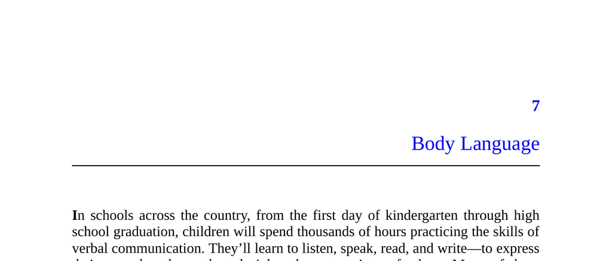

- **Body Language**
  - **Definition and Scope**
    - Body language refers broadly to all forms of nonverbal communication, including facial expressions, eye behaviors, touch, use of space, and vocal qualities beyond words.  
    - It conveys emotions and social attitudes such as trust, pride, anxiety, and intimacy.  
    - Coordinated nonverbal behaviors are essential in making friends, romantic relationships, and social hierarchies.  
    - For further insights see [Nonverbal Communication](https://en.wikipedia.org/wiki/Nonverbal_communication).  
  - **Early Importance**
    - Ability to read emotions nonverbally correlates with social popularity in children.  
    - Nonverbal skills facilitate selecting activity partners and social integration.  
    - These findings are supported by empirical studies on emotional reading in children.  
  - **Unconscious Processing**
    - Most nonverbal signaling and perception happen automatically and outside conscious awareness.  
    - Consciousness is too slow and narrow to handle the demands of real-time body language processing.  
    - Unawareness of body language helps preserve spontaneous social interactions and avoid appearing forced.  
    - See Leonard Mlodinow’s *Subliminal* for an in-depth exploration of unconscious signaling.  
  - **Strategic Blindness**
    - Humans are strategically unaware of body language because it can reveal base, selfish motivations.  
    - Awareness of such signals challenges social self-images, as noted by Pentland and Heibeck.  
    - This strategic ignorance allows individuals to maintain plausible deniability in sensitive social signaling.  
  - **Signals versus Cues**
    - Signals are honest behaviors intended to influence others and benefit both sender and receiver.  
    - Cues are information-bearing behaviors benefiting only the receiver and are often unintentional "tells".  
    - Examples of cues include sweaty palms and anxious neck rubbing.  
    - Distinguished in biology and relevant for fields like poker and interrogation.  
    - For comparison, see [Animal Communication: Signals vs. Cues](https://en.wikipedia.org/wiki/Animal_communication).  

- **Honest Signals: Why Actions Speak Louder Than Words**
  - Body language is functionally connected to its meaning, unlike arbitrary spoken words.  
  - Nonverbal signals like excitement or interest have universal cross-cultural expressions.  
  - Honest signaling theory explains why body language is costly or risky to fake, ensuring reliability.  
  - Examples include open postures signaling comfort and mating calls in koalas as differentially expensive signals.  
  - The principle of honest signaling is foundational in evolutionary biology and social interaction studies.  
 
- **Sex**
  - Body language plays a primary role in coordinating sexual behavior and courtship.  
  - Sexual modesty norms necessitate discreet, nonverbal communication like flirting and suggestive dressing.  
  - Eye contact intensity and complementary body language signal attraction and openness.  
  - Courtship behaviors include mirroring posture, invasion of personal space, and escalating touch.  
  - Sexual jealousy and mate-guarding involve nonverbal "tie-signs" to signal pair bonds to rivals.  
  - Pheromones may subconsciously influence attraction, supported by studies on immune system complementarity.  
  - For more on pheromones and human attraction, see [Pheromone](https://en.wikipedia.org/wiki/Pheromone).  

- **Politics**
  - Nonverbal behaviors such as proximity, touch, and posture facilitate alliance-building and coalition formation.  
  - Social grooming analogues in humans include affectionate touch and haircare cliques.  
  - Defensive and open body postures reflect threat perception and trust respectively.  
  - Eye behaviors regulate social recognition, threat assessment, and leader-following dynamics.  
  - Greeting rituals encode political messages—handshakes signify equality, hand-kisses denote submission.  
  - Gossip nonspeech cues (e.g., leaning in, lowered voice) signal discretion and trustworthiness.  
  - Political nonverbal communication is deeply rooted in primate social behavior and human culture.  
  - Further exploration in Joe Navarro’s *What Every Body Is Saying*.  

- **Social Status**
  - Status affects body language with high-status individuals showing open postures and dominant gaze patterns.  
  - Lower-status individuals exhibit vigilance, deference, and defensive body language.  
  - Aposematism explains status signaling through conspicuous acts calling attention to oneself.  
  - Status negotiation is a coordinated process where both high and low status actors adjust behaviors.  
  - Vocal tone accommodation correlates with perceived social status and can predict political outcomes.  
  - Dominance and prestige are distinct status forms with different body language: dominance evokes avoidance in others, prestige evokes approach.  
  - Eye contact rules vary by dominance (aggressive stare) versus prestige (attentive gaze) contexts.  
  - Visual dominance ratio (eye contact while speaking/listening) quantitatively measures social dominance levels.  
  - See [Dominance and Prestige Theory](https://en.wikipedia.org/wiki/Prestige_and_dominance).  

- **Why We’re Unaware of Body Language**
  - Social norms in sex, politics, and status govern body language, leading to intentional ambiguity in signals.  
  - Ambiguity allows individuals to communicate sensitive messages with plausible deniability.  
  - Body language enables covert pursuit of selfish agendas while minimizing social risk.  
  - People often remain unconscious of their own politically or sexually motivated body language to avoid self-incrimination.  
  - Nonverbal signals are less quotable and harder to document for social criticism or gossip than verbal statements.  
  - Awareness of taboo body language induces self-consciousness and discomfort, evidencing hidden motives.  
  - The strategic unawareness supports social coordination while preserving individual deniability.  
  - For a psychological perspective, see [Social Signaling Theory](https://en.wikipedia.org/wiki/Signaling_theory).
