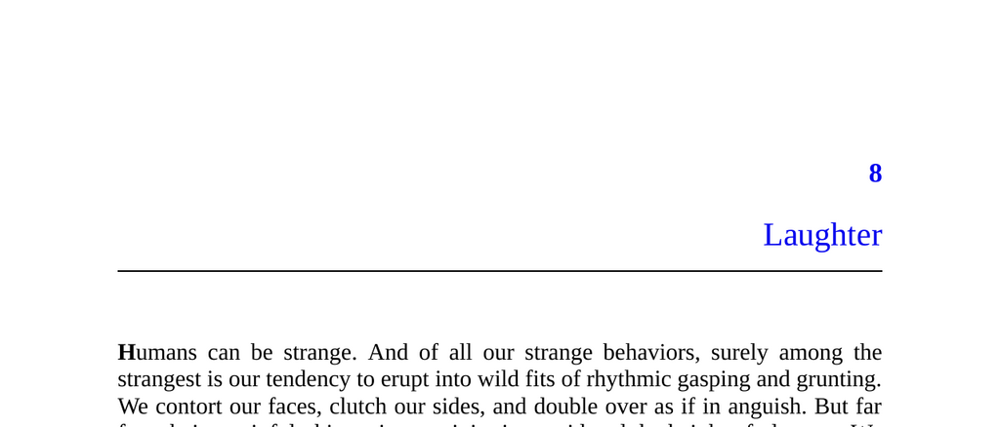

- **Laughter**
  - Laughter is an innate and universal behavior that begins early in life, even in infants born blind and deaf.  
  - It is an involuntary social behavior used for flirting, bonding, mocking, probing social norms, and marking group boundaries.  
  - Historical theories of laughter (superiority, relief, incongruity) are partially true but insufficient to fully explain laughter’s social and biological nature.  
  - More information in Robert Provine’s research and the book [Inside Jokes](https://press.uchicago.edu/ucp/books/book/chicago/I/bo23013061.html).

- **The Biology of Laughter**
  - Laughter occurs predominantly in social settings, about 30 times more often than when alone, indicating it is optimized for social communication.  
  - Laughter is a vocalization that functions as active communication, with speakers laughing more than listeners.  
  - Laughter exists in all five great apes, originated 12-18 million years ago, supporting its evolutionary basis.  
  - Robert Provine’s empirical studies provide key insights into laughter’s social and biological functions.

- **Laughter is a Play Signal**
  - Laughter signals playful intent, marking the boundary between seriousness and play in human and primate interactions.  
  - Play is nonfunctional activity undertaken in safe settings, and laughter serves as a reassurance that interactions are non-threatening.  
  - Animals use specific play signals, like dogs’ play bow and chimps’ play faces, with laughter among humans serving a similar communicative purpose.  
  - Laughter distinguishes playful from serious moods and functions to manage perceived threats during social play.  
  - See animal play behavior studies and Gregory Bateson’s work on play signals.

- **The Dark Side of Laughter**
  - Laughter reveals social boundaries concerning norms and psychological distance, often exposing hidden or taboo attitudes.  
  - Norm violations provoke laughter as a form of exploratory play, with humor reflecting shifting and context-dependent social boundaries.  
  - Laughing at others’ misfortunes correlates with psychological distance and perceived pain severity, affecting empathy levels.  
  - Teasing functions as a social tool that can be either relationship-strengthening or damaging depending on intent and context.  
  - Laughter automatically gauges social relationships and elicits both bonding and exclusion.

- **Deniability**
  - Laughter offers plausible deniability, allowing expression of taboo or sensitive subjects humorously without explicit verbalization.  
  - It is relatively honest yet easy to disclaim, providing a “safe harbor” for exploring social norms and boundaries.  
  - Comedians use laughter's deniability to address difficult topics candidly while avoiding direct accountability.  
  - Laughter facilitates indirect communication about social taboos, revealing unspoken truths while preserving social harmony.  
  - Relevant insights can be found in works by Bill Burr and literary quotes such as Oscar Wilde’s on humor and truth.
