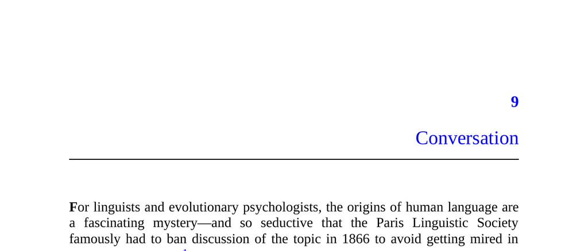

- **Conversation**
  - **Sharing Information**
    - Humans spend roughly 20% of waking life engaged in conversation performing diverse speech acts.
    - The primary function of language is sharing information, encompassing facts, theories, stories, and gossip.
    - Nonverbal pointing in infants serves as a precursor to information sharing.
    - Language evolved to fulfill biologically relevant goals in ancestral survival and reproduction.
    - For further reading, see [The Evolution of Language](https://plato.stanford.edu/entries/language-evolution/).
  - **Costs and Benefits**
    - Listening has low costs and offers benefits like vicarious learning from others' experiences.
    - Speaking incurs opportunity costs by sharing exclusive information and costs for acquiring information.
    - Speakers face risks when broadcasting hard-won information to others.
    - Geoffrey Miller and Jean-Louis Dessalles provide key insights applying economics and game theory to conversation.
    - See Geoffrey Miller’s *The Mating Mind* for deeper exploration.
  - **The Benefits of Speaking: Reciprocity?**
    - Reciprocal-exchange theory posits information sharing as quid pro quo but fails to explain key puzzles.
    - Puzzle 1: People do not keep formal accounts of conversational debts.
    - Puzzle 2: People show eagerness to speak rather than just listen.
    - Puzzle 3: Conversations follow a criterion of relevance restricting abrupt topic shifts.
    - Puzzle 4: People avoid discussing the most important personal information in initial meetings.
  - **Resolution: Sex and Politics**
    - Speaking functions partly as showing off to impress an audience and raise social value.
    - Miller views conversation as mating displays; Dessalles emphasizes alliance-building.
    - The "backpack" analogy illustrates information sharing as displaying a range of useful "tools" signaling ally value.
    - Conversation conveys both explicit content (text) and implicit self-presentation (subtext).
    - For more context, see [Why We Talk](https://www.amazon.com/Why-We-Talk-Jean-Louis-Dessalles/dp/0198842377).
  - **Puzzles Revisited**
    - The "showing off" model explains eagerness to speak and absence of conversational debt tracking.
    - Relevance ensures speakers demonstrate flexible, on-demand intellectual competence rather than rote trivia.
    - Listeners reward speakers by respect, not by measured informational exchange.
    - This model explains why deception and undervaluing information in conversation are rare.
  - **Prestige**
    - Prestige equates to one's value as an ally, which conversation helps build.
    - People gain prestige by directly impressing and through association with other prestigious individuals.
    - Modern media expands opportunities for prestige acquisition beyond face-to-face settings.
    - Prestige also motivates listeners to affiliate with high-value speakers.
    - Further reading: [Status and Power](https://www.cambridge.org/core/books/status-and-power-shifted-steps-advanced-introduction/65B4B1E0B31B27E7C80B5CEDC9824F51).
  - **News**
    - Humans have long been captivated by news, beyond practical information needs.
    - News consumption serves social functions like preparing for conversations and affiliation with prestigious sources.
    - Voters prioritize candidate popularity over detailed policy knowledge in elections.
    - Consumers value engaging and prestigious pundits rather than accuracy.
    - Refer to Mitchell Stephens’ *A History of the News* for comprehensive background.
  - **Academic Research**
    - Academia is driven primarily by desires for prestige rather than purely the pursuit of knowledge.
    - Researchers ascend by associating with prestigious mentors and institutions.
    - Consumers of research similarly prioritize prestige over intrinsic research value.
    - Peer review often favors works by prestigious insiders and pays attention to superficial polish.
    - Reforms such as blind review could improve quality but are resisted due to prestige dynamics.
    - See Robert Trivers’ work on evolutionary psychology for insights on scientific behavior.
  - **The Elephant in the Book**
    - Authors openly acknowledge their work aims to impress and gain prestige.
    - Academic incentives influence the length, language, and publishing format choices.
    - Prestige-seeking affects decisions often at the expense of maximum reader value.
    - This candid admission reframes academic publishing within conversational prestige motivations.
    - For related discussion, see [The Professor Is In](https://theprofessorisin.com/about/).
