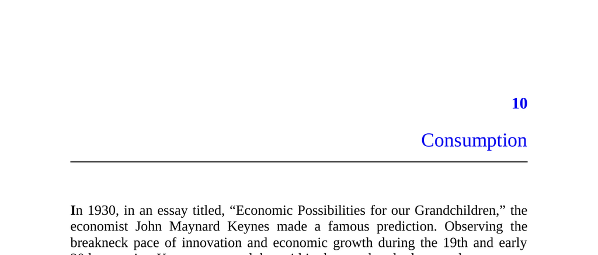

- **Consumption and Work Patterns**
  - **Keynes’s Prediction of Leisure Society**
    - Keynes predicted by 2030 economic growth would allow workweeks under 15 hours.
    - Material needs would be cheaply and easily met, enabling leisure-focused lives.
    - This prediction remains unmet despite significant economic growth.
  - **Current Work Hours and Quality of Life**
    - Modern workers still work nearly as many hours as their ancestors did 100 years ago.
    - Even some of the poorest today live better materially than historical royalty.
    - The persistence of long working hours contradicts Keynes’s vision of leisure.
  - **The Rat Race and Competitive Signaling**
    - Working hard continues due to competition for limited social status and sexual opportunities.
    - Earning and spending money remain key ways to compete socially.
    - This dynamic is grounded in the concept of competitive signaling as explained in earlier sections.
  
- **Conspicuous Consumption**
  - **Definition and Historical Context**
    - Conspicuous consumption is buying goods primarily to display wealth and status.
    - The concept dates back to Thorstein Veblen’s 1899 book *The Theory of the Leisure Class*.
    - Many consumer behaviors are influenced by signaling rather than purely personal enjoyment.
  - **Examples and Perspectives**
    - Ostentatious purchases like mansions and luxury cars often serve social signaling roles.
    - Consumption viewed through others’ lenses can reveal conspicuousness unnoticed by oneself.
    - Relative consumer habits differ significantly across socioeconomic contexts.
  - **Signaling Beyond Wealth**
    - Consumers also signal traits like environmentalism, subcultural loyalty, trendiness, and intelligence.
    - Purchases and the stories told about them convey complex social messages.
    - Experiences such as travel and cultural consumption serve as signals not easily conveyed by material goods.
  - **Subtle Social Pressures**
    - Deviations from social and self-image norms cause discomfort related to signaling expectations.
    - Everyday consumption is carefully curated to maintain consistent social impressions.
    - This pressure shapes a wide range of consumption decisions.

- **Inconspicuous Consumption and Thought Experiment**
  - **Obliviation Scenario**
    - An alien device erases humanity’s ability to perceive others’ possessions socially but not individually.
    - Immediate habits persist, but long-term social signaling consumption would vanish.
    - Consumers would retain personal enjoyment of goods but cease status-driven purchases.
  - **Impact on Product Categories**
    - Products primarily for showing off (e.g., jewelry, luxury cars) would disappear or decline sharply.
    - Multi-use products like cars and clothes would be chosen based on function and comfort alone.
    - Socially motivated product variety would collapse into standardized, functional models.
  - **Changes in Housing and Lifestyle**
    - People would prefer smaller, cheaper, and less decorative homes without regard for guest impressions.
    - Yards and living spaces would be maintained only for utility rather than status display.
  - **Product Variety Reduction**
    - Uniform clothing and products would replace fashionable or unique items.
    - Individuality expressed through product variation is a form of signaling eliminated by Obliviation.
    - Economies of scale and lower costs would be enabled by standardization.
  - **Reallocation of Resources**
    - Savings from reduced consumption signaling would likely be redirected to experiences, sports, education, and charity.
    - Social competition would continue through non-material channels.
    - See Geoffrey Miller’s *Spent* for additional insights on signaling and consumption.

- **Advertising and Signaling**
  - **Advertising Mechanisms**
    - Ads inform consumers about product features, availability, and price for rational decisions.
    - Brand promises establish expectations and incentivize companies to maintain reputations.
    - Lifestyle advertising links products to culturally relevant images or emotions, often without direct facts.
  - **Lifestyle Advertising and Pavlovian Associations**
    - Ads create positive emotional associations with brands to influence unconscious preferences.
    - These associations mimic classical conditioning but function within social contexts.
    - Example: Corona associates its beer with the relaxing beach lifestyle.
  - **The Third-Person Effect**
    - Consumers often believe that media influences others more than themselves.
    - Ads may influence purchasing by altering peer perceptions rather than direct individual appeal.
    - Individuals buy products with image value to manage social impressions within groups.
  - **Predictions and Evidence of Lifestyle Advertising**
    - Lifestyle ads target social products over personal products.
    - Effectiveness increases with larger, shared audiences (e.g., Super Bowl ads).
    - Some ads target non-buyers to shape broader social perceptions and status hierarchies.
  - **Examples and Implications**
    - Luxury car ads target both buyers and non-buyers to heighten brand status.
    - Public health ads leverage peer pressure by influencing normalizing behaviors.
    - Arbitrary images in ads can positively or negatively influence consumer choices.
  - **Summary and Cultural Role of Ads**
    - Ads function socially by embedding products in shared cultural vocabularies.
    - They extend beyond individual preferences to collective social signaling.
    - For further reading on advertising’s social impact, see Michael Chwe’s work on signaling and major TV events.
