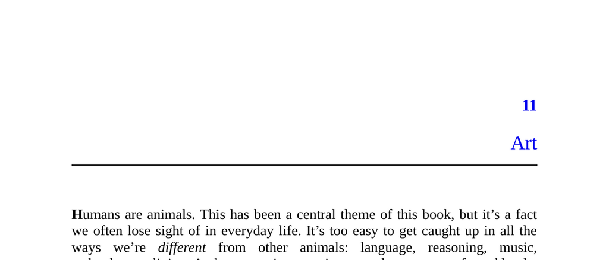

- **Humans as Animals**
  - Humans share evolutionary origins and biological imperatives with other animals.
  - Natural and sexual selection shaped human behaviors, including art.
  - For more on evolution and behavior, see [The Selfish Gene](https://en.wikipedia.org/wiki/The_Selfish_Gene).

- **Art in Human History and Culture**
  - Humans have created art for at least 15,000 to 100,000 years across various cultures globally.
  - Art is a human universal expressed in diverse forms such as painting, music, and body decoration.
  - Early examples include European cave art, Indonesian rock art, and South African ocher engravings.
  - See [Art: A Brief History](https://www.metmuseum.org/toah/hd/art/hd_art.htm) for historical context.

- **Challenges of Art for Evolutionary Theory**
  - Art is costly in time and energy but does not directly aid survival or reproduction.
  - Natural selection typically disfavors costly, impractical behaviors.
  - Understanding art’s evolutionary role requires explaining its biological benefits.

- **Definition and Scope of Art**
  - Art includes visual, performing, language, body, and domestic arts.
  - Art is characterized by embellishments made “special” for human attention beyond practical function.
  - Ellen Dissanayake’s definition of art as anything “made special” guides the chapter.
  - Consult [Dissanayake’s Art and Intimacy](https://press.uchicago.edu/ucp/books/book/chicago/A/bo3681188.html) for deeper insight.

- **Evolutionary Explanation of Art**
  - Geoffrey Miller’s theory argues that sexual selection favors displaying costly traits, including art.
  - Wasteful displays signal survival surplus like health and energy to mates.
  - Art operates as a costly, honest signal in sexual and natural selection contexts.
  - Details appear in Miller’s book [The Mating Mind](https://www.ncbi.nlm.nih.gov/pmc/articles/PMC2658128/).

- **Adaptation vs. Byproduct Debate**
  - Art is likely an adaptation maintained by natural selection given its universality and cost.
  - Some thinkers, e.g., Steven Pinker, view art as a byproduct rather than an adaptation.
  - Fitness benefits of art explain its persistence despite high costs.
  - See Pinker’s critique in [How the Mind Works](https://en.wikipedia.org/wiki/How_the_Mind_Works).

- **Parable of the Bowerbird**
  - Male bowerbirds build and ornament elaborate bowers to attract mates.
  - Bower construction is a costly behavior that signals male fitness.
  - Females exhibit discernment by visiting multiple bowers before mating.
  - This illustrates the handicap principle and honest signaling.
  - For more, see [Handicap Principle](https://en.wikipedia.org/wiki/Handicap_principle).

- **Art in Humans: Parallels and Differences**
  - Both human males and females create and enjoy art; it is not sex-limited.
  - Human art serves multiple fitness display functions beyond mating, including alliance-building and intimidation.
  - Artists and consumers act on conscious or unconscious motives related to fitness display.
  - Examples include Scheherazade’s storytelling and poetry performances like Maya Angelou’s.
  - More on social functions of art: [The Artful Species](https://www.hup.harvard.edu/catalog.php?isbn=9780674024877).

- **Intrinsic vs. Extrinsic Properties of Art**
  - Intrinsic properties: perceptual qualities within the artwork itself, e.g., colors, textures.
  - Extrinsic properties: external factors like artist identity, effort, originality, and cost.
  - Conventional views emphasize intrinsic properties; fitness-display theory emphasizes extrinsic properties.
  - The difference explains why replicas and perfect copies lack the value of originals.
  - See Jesse Prinz and Angelika Seidel’s research on art valuation.

- **Importance of Extrinsic Properties**
  - Extrinsic factors like effort and skill validate the artist’s fitness beyond form and beauty.
  - Originality and handcrafted imperfection increase art’s perceived value.
  - Live performances are valued over recorded ones due to difficulty and demonstration of skill.
  - Constraints in art forms are appreciated as they showcase virtuosity.
  - See Walter Benjamin’s [The Work of Art in the Age of Mechanical Reproduction](https://www.sfu.ca/~decaste/Owen/Benjamin.pdf) for related analysis.

- **When Extrinsic Factors Change**
  - Changes in availability, manufacturing, and cultural knowledge alter aesthetic value.
  - Examples include lobster shifting from low-class to delicacy, and changing preferences for skin tone in Europe.
  - The Industrial Revolution altered standards from realism to valuing imperfection and authenticity.
  - Consumers prefer handcrafted over mass-produced objects due to perceived rarity and effort.
  - Brutalism’s reevaluation illustrates knowledge deepening appreciation.
  - For more, see Thorstein Veblen’s [The Theory of the Leisure Class](https://en.wikipedia.org/wiki/The_Theory_of_the_Leisure_Class).

- **Why Art Is Impractical**
  - Impracticality signals surplus resource availability needed for survival.
  - Art’s costliness and lack of functionality distinguish it from necessities like clothing.
  - Fashion and haute cuisine exemplify luxury through impractical embellishments.
  - Wasteful artistic effort communicates the artist’s confidence and status.
  - Alison Lurie’s work on fashion elaborates on impracticality as status display.

- **Discernment**
  - Artistic discernment allows consumers to evaluate the fitness signaled by art effectively.
  - It prevents admiration of low-quality or less fit artists.
  - Discernment requires exposure to diverse artistic works for calibration.
  - Appreciation skills themselves function as fitness displays.
  - This skill parallels the bowerbird female’s mate selection process.
